Beginner's Guide
============

## Introduction 

> Rigs of Rods (RoR) is a free/libre soft-body physics simulator mainly targeted at simulating vehicle physics. 
> The soft-body physics system is based on mass-spring-damper theory.

This page will help you learn the basics of Rigs of Rods, from your first run to playing multiplayer.

## First Run

When launching RoR for the first time, the user directory will be created. On Windows this is located at `Documents\My Games\Rigs of Rods` or at `~/.rigsofrods` on Linux. This is where configuration files, logs, and mods are stored.   

The game should open in a small window:

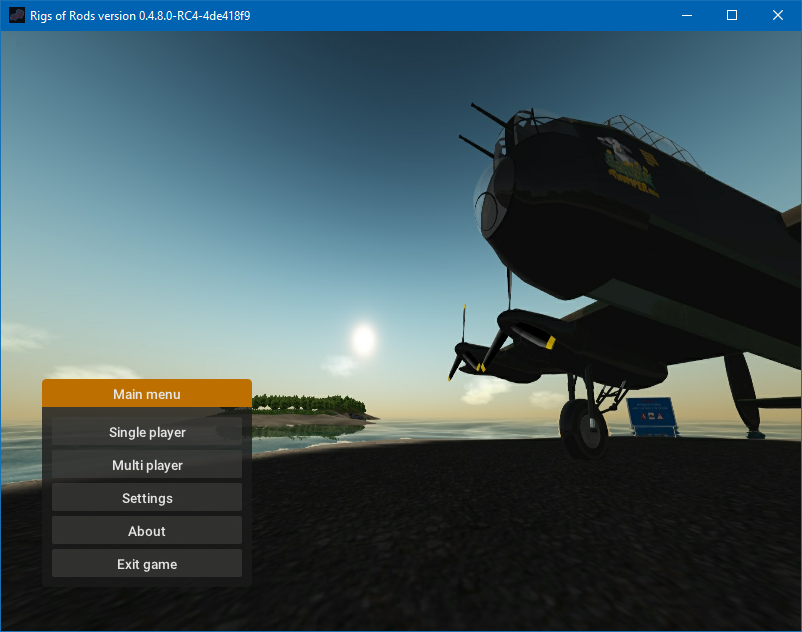

Before playing, you should first change your settings. Begin by clicking `Settings`.

First, make sure the rendering system is set to `Direct3D9 Rendering Subsystem`. If it's set to `OpenGL Rendering Subsystem`, change it then restart RoR. If Direct3D9 doesn't appear on the list, install the [DirectX Runtime](https://cloudflare-ipfs.com/ipfs/Qmb5Qix9ikns8n83m2CJgXiFYjjF4i5mLHYVi7xCVuAZG5?filename=directx_Jun2010_redist.exe) and restart your PC.

If you're running Linux, ignore this as DirectX is not available. 

Now select `Video Mode` and change it to your monitor's native resolution then restart the game to apply your changes.

Click `Settings` again, then click the `Graphics` tab.

The following settings should be fine for most people, but feel free to adjust them to fit your liking.

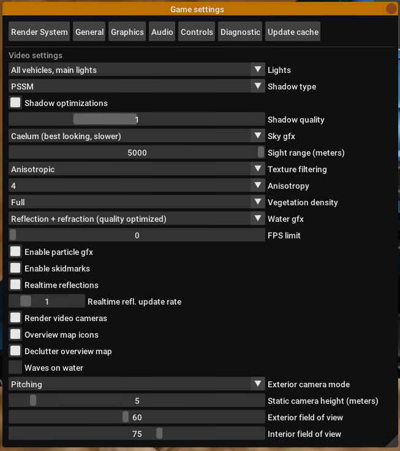

Then click the `Audio` tab and set the device and volume.

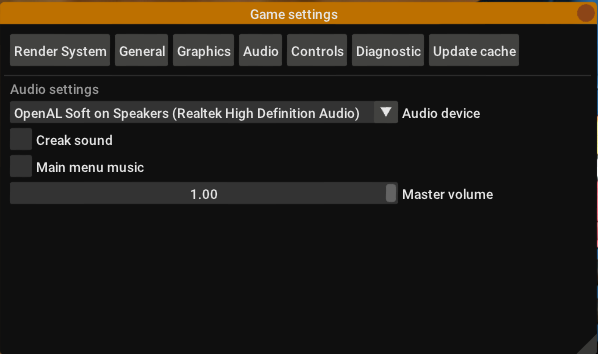

Once you're finished, restart the game again. 

Now you're ready to begin playing. Start by clicking `Single player` to open the terrain selector. 

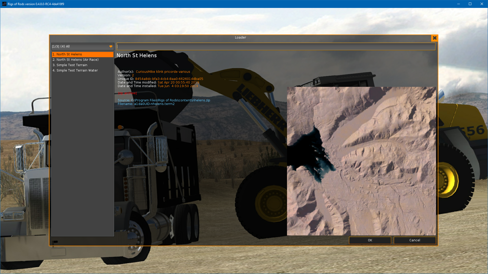

For the sake of this tutorial, select *North St Helens*. 

!!! note 
	Depending on how you downloaded the game, the North St Helens terrain may be missing. If so, please install it from the [Repository](installing-content.md) before continuing.

Once the terrain loads, you will spawn as a country person known lovingly as RoRBot. You control him with the arrow keys while using `SHIFT` to run and `SPACE` to jump (good for getting over bumps, or if you get stuck).

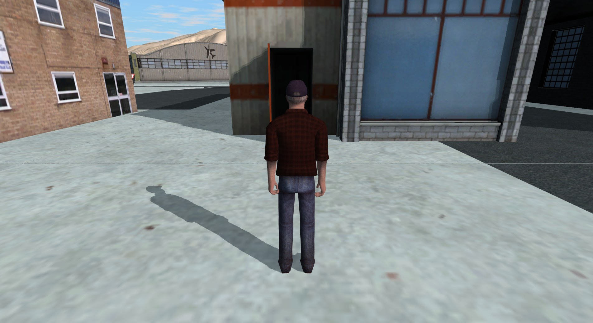

You spawn in front of a building known as the *Rig-a-Deal*. This is where you will spawn new trucks. Walk into the "Office" to bring up the selection menu. You can also spawn a vehicle anywhere at any time by pressing `CTRL+G`.

Use the mouse or arrow keys to move through the menus. Select the *DAF Semi truck*. The truck spawns inside the Rig-a-Deal with you inside it. If you happen to spawn the truck with RoRBot outside of the vehicle, simply hit `ENTER`/`RETURN` to get in a vehicle.

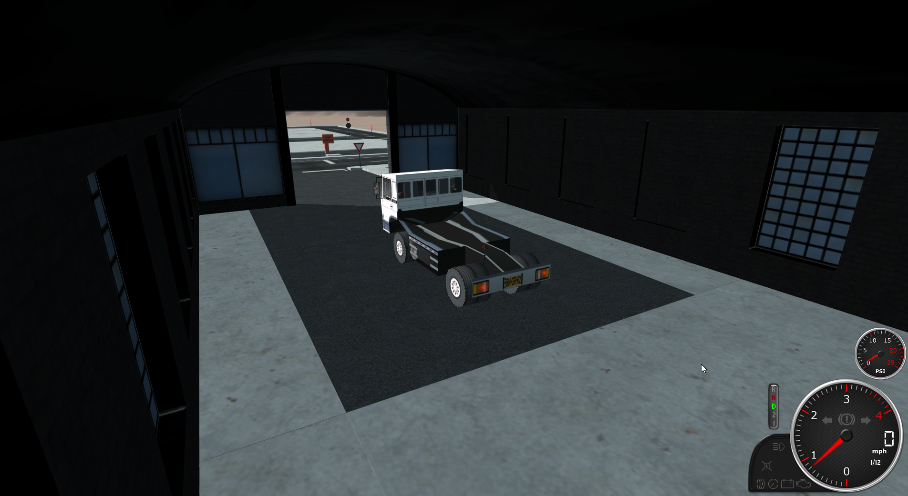

## Driving

The DAF semi isn't the most agile or best looking truck in the game, but it serves us a purpose later. The camera inside the Rig-a-Deal is fixed, so you will be unable to move it until you leave. Switch to the in-cab camera by hitting `C`. Use the `UP` arrow key to accelerate out of the *Rig-a-Deal* (Rigs of Rods uses a simulated clutch which begins to engages at a specific point. This why the semi doesn't move until 1000 RPM). Use `DOWN` to brake, and `LEFT`/`RIGHT` arrows to steer. Use `PGUP`/`PGDOWN` to select your transmission direction/speed.

Start by exploring Coldwater, the town you begin in. It isn't very big but provides some decent moving room. If you get stuck, or wreck, hit `I` to reset back to the *Rig-a-Deal*, or `BACKSPACE` to reset the truck in its current position. 

If you hold `BACKSPACE` for one second, you will enable the "advanced repair mode" which lets you move the vehicle to any position by using the `WASD` keys to move and the arrow keys to rotate. Press `BACKSPACE` again to exit.

You can switch transmission modes by hitting `Q`. There are 5 transmission modes available: 
* Automatic shift
  * The gear change is fully automatic, the player only has to set the gear by pressing `PGUP`/`PGDOWN`.
* Manual shift: Auto clutch
  * The gear is changed on user request. No clutch should be pressed to change gear, vehicle takes care of that. Just use `A` and `Z` to shift. 
* Fully manual: sequential shift
  * The user must press clutch and select whether it is needed to switch up or down. Depress the clutch by hitting `LEFT SHIFT`, then press `A` to upshift or `Z` to downshift. 
* Fully manual: stick shift
  * This mode is useful if you have a game controller with an H-shifter (like Logitech G27). In this mode the player can set gears 1-6, N, and R directly by the stick. 
* Fully manual: stick shift with ranges
  * This mode is mostly used in vehicles having more gears than 6. In this case you can select from 3 ranges: low (gear 1-6), medium (gear 7-12), high (gear 13-18) by pressing the appropriate button. Like if you want to select the 8th gear, you have to select gear N first, press the midrange button, then select the 2nd gear on the h-stick. Remember, range selection can be made only if the gear is in N.

If you stall, there are 2 keys to be remembered: `X` enables or disables the electricity in the vehicle, and `S` activates the starter. Press `X` and you'll see a yellow battery icon lit on the UI. Hold `S` until the engine is started. Resetting the vehicle with `BACKSPACE` or `I` will instantly start the engine.

Remember how to change the camera? Hit `C` twice. You're now in third-person view and can move the camera around. Use the number pad (specifically `2`, `4`, `6`, and `8`) to move the camera. Pressing `5` resets the camera. `9` and `3` zoom in/out respectively and `1` gives you a front view of your truck.

You can also move the camera by holding right-click and dragging with your mouse.

Now, make your way back to the *Rig-a-Deal*.

## Trailer Loads

You should see a large, grey, open-platform with an orange console. Park the truck (use `P` to set the parking brake) and hit `ENTER`/`RETURN` to get out. Note that the same camera commands work with RoRBot. Step in front of the orange console to open the load selector. 

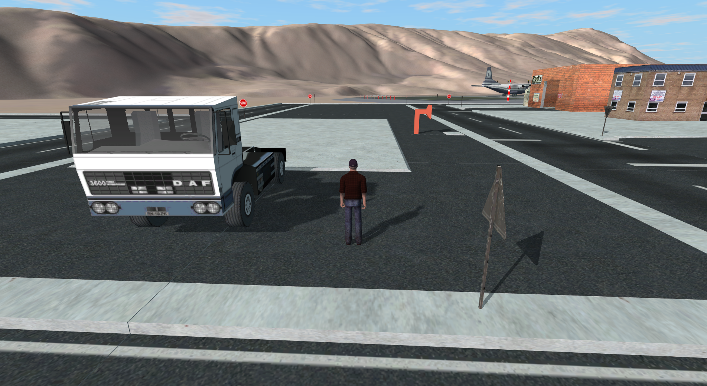

Select the *Semi trailer (37 tons)*. 

Get back in the semi and drive in front of the load. Use the camera in third-person view to help you if you need. Back into the trailer. When you get close, use `F1`/`F2` to lower and raise the trailer legs respectively. 

The hook points must be within 10cm to hook, so it may take some practice to get close. When you think you're close, hit `L`. If you're close enough, the semi will latch to the trailer. Raise the legs by holding `F1`. 

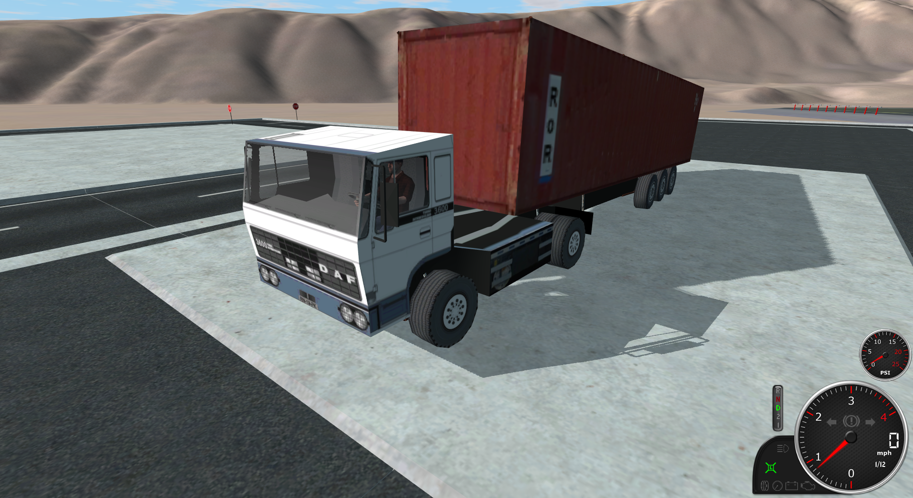

You can now drive around with the trailer. You will notice that the trailer has a large effect on how the semi pulls and handles! This process is the same for most trailers. In some cases you can secure loads to trucks using `O`. 

NOTE: on some computers trailers may increase lag or decrease FPS(frames per second) dramatically!

## Flying

Now that we've become comfortable with driving. Let's try to fly. Move your mouse to the to top of the screen to bring up the menubar, click `Vehicles` then `Antonov 12` to instantly enter the plane which is sitting on the runway. 

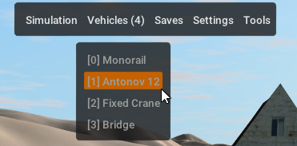

Apply the parking brake by pressing `P`. Turn on the flying lights by pressing `M`. Start the engines by using your mouse to click the `ON` buttons in the lower right hand corner (or by pressing `CTRL+HOME`). 

When the engines settle to the appropriate idle speed (somewhere near 750rpm), release the parking brake and throttle the engines to full by holding `PGUP`. Pressing `CTRL+PGUP` will instantly set the throttle to max. 

If you have a short runway, be sure to use the flaps with `1` and `2` (this is especially helpful in multiplayer). When you reach 75-80 knots, lift up by pressing the `DOWN` arrow. Steer with the `LEFT`/`RIGHT` arrows and control the rudder with `Z` and `X`. Raise the landing gear, in this plane, by holding `F3`. 

The An-12 does not stand high speeds (175+ knots) well, and you may find that if you go too fast the wings will break apart!

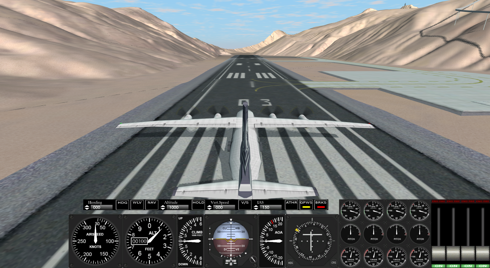

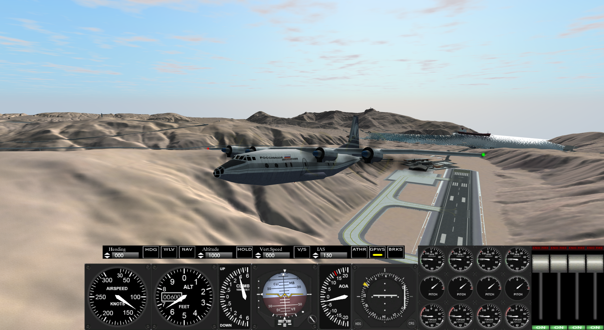

When it comes to landing, make sure you have room to slow down and take your time. Going straight into the runway is the easiest way to land when you first start off. It may take a few passes to go head-on so don't be afraid to abort a landing and throttle back up to regain altitude. The entire process is easier if you shadows enabled, but is possible without. When you land, hit `R` to reverse thrust and throttle up to slow down in addition to using `B` to brake the wheels.

This tutorial does not make use of the autopilot. For more information regarding the use of autopilot, see [Aircraft handling](aircraft-handling.md).

## Boating

We must explore beyond Coldwater to get to the marina. Take the main road out of Coldwater, heading southwest toward the Elk Hotel. Take the second left after you leave town. You should see the water soon. 
When you arrive at the marina, you should see marina-style boat docks and a ramp along with a building. 

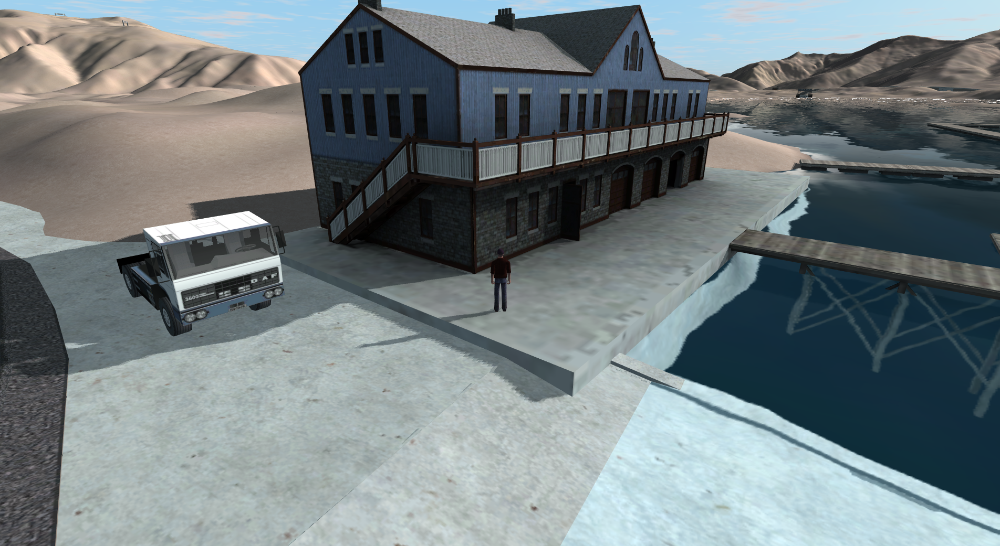

Walk around to the front of the building and enter the open door. Choose the Wahoo boat. 

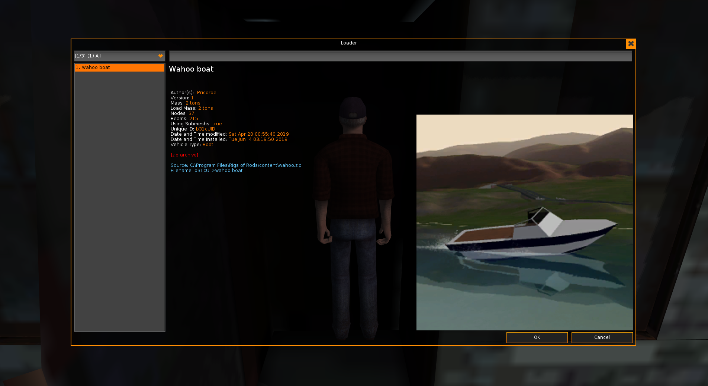

Use `UP`/`DOWN` to throttle and `LEFT`/`RIGHT` to steer. Use `PGUP` to center the throttle (to neutral) and `PGDOWN` to center the rudder. It may take you a while to get your sea legs. If you have waves enabled, see how far out you can go before you flip over waves!

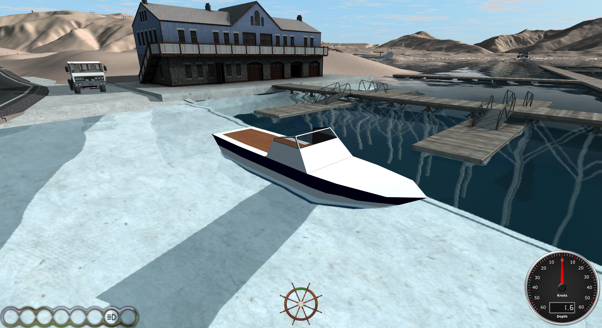

## Conclusion

Now that you have a basic grasp of the basic vehicles in RoR, it is now up to you to create your own scenarios. If you feel bored, try the vast selection of mods available on the [Repository](https://forum.rigsofrods.org/resources/).

## Multiplayer

If you feel like sharing the experience, you can play on one of the many public multiplayer servers. To get started, click the `Multi player` button on the main menu. 

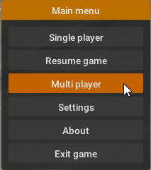

Set your username by clicking on `Settings` and changing it in the `Player nickname` textbox.

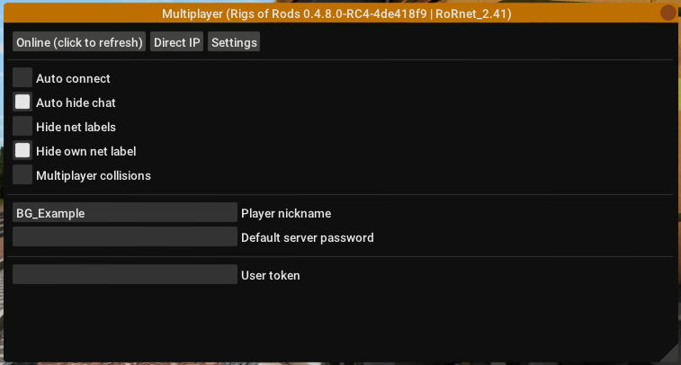

You may have to restart the game for the changes to take effect.

Now just select the server you want to play on, then click `Join`.

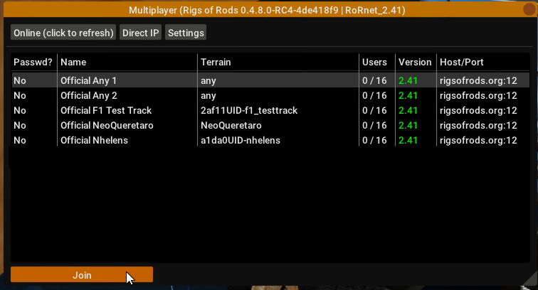

The 'any' servers allow you to select a terrain, while other servers (such as Official Nhelens) are set to use a specific terrain. 

While on a server, you can enable collisions between other players or hide nicknames by going to `Settings` in the top menubar.

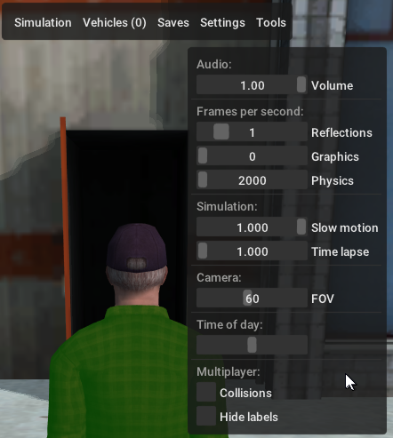

Note that multiplayer is still in development and can be unstable at times!

## Default controls

Please see the [Controls and configuration](controls-config.md) page for a full list of controls.

## Adding content

To add new vehicles and terrains, go to the [Installing content](installing-content.md) page.
