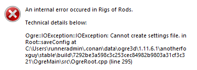
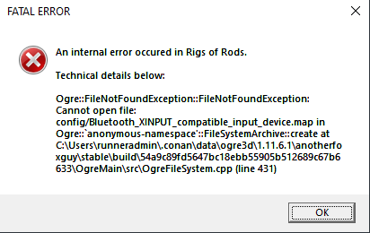
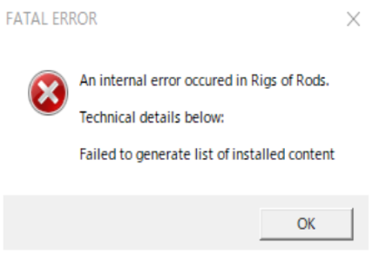
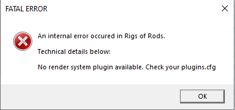
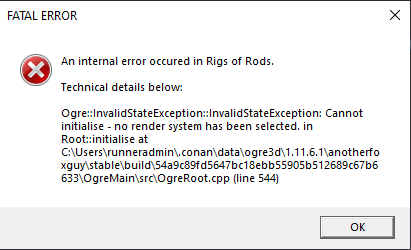
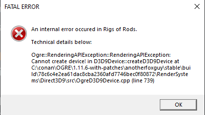
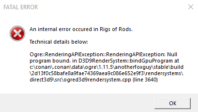
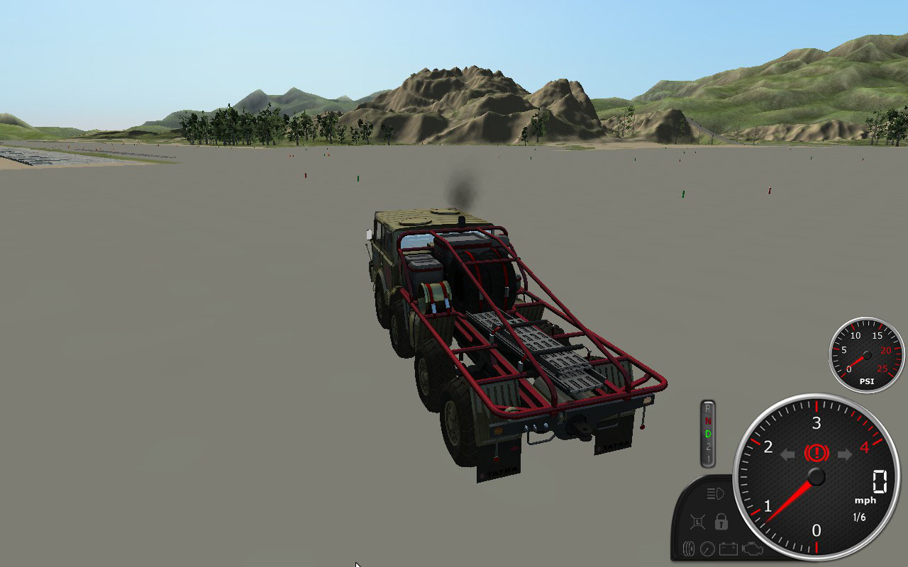
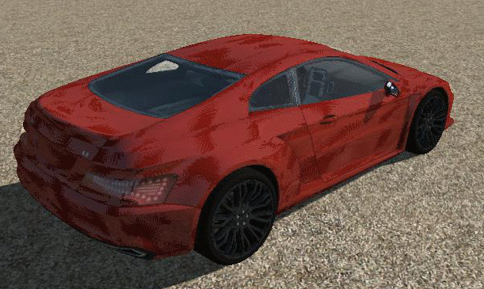
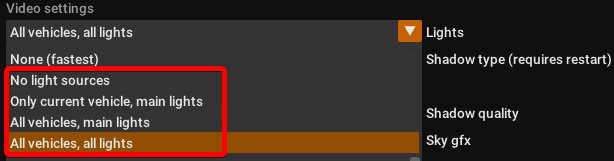

Common issues
============

This page explains the most common problems players may experience with Rigs of Rods and provides instructions on how to fix them.

## Failure writing settings file

When attempting to launch RoR or change game settings, you may receive one of these errors or a variation of them:

### Causes

#### Controlled folder access 

On Windows 10/11, Windows Security (Defender) has a "Controlled folder access" feature. When enabled, it blocks applications such as RoR from accessing your Documents folder. 

See this tutorial ([Windows 10](https://www.tenforums.com/tutorials/113380-how-enable-disable-controlled-folder-access-windows-10-a.html)/[Windows 11](https://www.elevenforum.com/t/enable-or-disable-controlled-folder-access-for-microsoft-defender-antivirus-in-windows-11.4013/)) for instructions on how to disable it.

#### Unicode characters

Another common cause of these errors is having [Unicode](https://en.wikipedia.org/wiki/Unicode) characters in the path to the `Documents\My Games\Rigs of Rods` folder, typically caused by the Windows (Name of the folder in `C:\Users`, **NOT** the display name!) username (e.g. `René`).  

There are three workarounds to this problem. Fix #2 is recommended if you don't want to run RoR as administrator.

##### Fix #1
1. Inside the installation directory, where RoR.exe is (usually `C:\Program Files\Rigs of Rods`) create a folder named `config`  
2. Right click `RoR.exe` and click `Properties`  
3. Under the `Compatibility` tab, check the `Run this program as administrator` box, then click `Apply` and close the window.   

##### Fix #2
1. Move any mods out of the `Documents\My Games\Rigs of Rods\mods` folder if you have any installed 
2. Uninstall RoR from Windows settings, then remove the `Documents\My Games\Rigs of Rods` folder if required 
3. Download the zipped release from [Itch.io](https://rigs-of-rods.itch.io/rigs-of-rods) and extract `rigs-of-rods-windows.zip` into any directory that isn't in Program Files or the users folder (Documents, Downloads, etc).  
Example: `C:\Games`  
4. Inside the extracted folder, create a folder named `config`  
5. Launch the game by double clicking `RoR.exe`. You can optionally create a shortcut by right clicking. 

Following either method will result in RoR now using the `config` folder instead of the default `Documents\My Games\Rigs of Rods` location to store user data.

If you installed the content packs, you will have to move the `*.zip` files from `Documents\My Games\Rigs of Rods\mods` to `config\mods`. New mods are also installed there.

##### Fix #3
The last solution is simply to create a new Windows user account without any special characters or reinstall Windows.

## No render system plugin available

If you downloaded RoR using the zip file, you may receive these errors. This is caused by the DirectX 9 Runtime not being installed. Install it from [Microsoft's website](https://www.microsoft.com/en-us/download/details.aspx?id=8109) then restart your PC.

## Visual C++ DLLs missing

When launching RoR, you may receive a MSVCP140.dll/MSVCP110.dll/MSVCP100.dll not found error.

This is caused by the required 64-bit Visual C++ Redistributable not being installed. 

Install the correct version that matches the `.dll` name in the error then restart your PC.

Latest release:

- [MSVCP140.dll](https://learn.microsoft.com/en-us/cpp/windows/latest-supported-vc-redist?view=msvc-170#visual-studio-2015-2017-2019-and-2022)  (Select the x64 version)

Older versions:

- [MSVCP110.dll](https://www.microsoft.com/en-us/download/details.aspx?id=30679)

- [MSVCP100.dll](https://www.microsoft.com/en-us/download/details.aspx?id=26999)

## Full screen crash (Cannot create device)

 

This error is usually caused by enabling full screen with the wrong resolution (video mode) set. 

1. Browse to `Documents\My Games\Rigs of Rods` and delete the `config` folder inside.
2. Start RoR, the game will be in a small window. Click Settings -> Render system and change the Video Mode setting to your monitor's **native resolution** (e.g. 1920x1080). Enable full screen if you want.
3. Restart RoR.

If this doesn't fix your error, then your GPU is likely too old to run RoR. 

## Null program bound

This error occurs with some Intel integrated graphics chips. Unfortunately there's currently no fix.

More info: [GitHub issue](https://github.com/RigsOfRods/rigs-of-rods/issues/2385)

## Low resolution terrain textures

On AMD graphics cards under Linux (OpenGL), terrain textures may appear low resolution:

This is caused by shadows, you will need to disable them (Settings -> Graphics -> Set shadows to "None" -> Restart RoR).

Alternatively you can play the Windows version through [Wine](https://www.winehq.org/).

## Flickering vehicle shadows

!!! note
	This issue does not occur as of version 2022.12+

With some GPUs (mainly integrated), shadows on vehicles may flicker: 

This is caused by your GPU not supporting self-shadowing (Shadows from other objects casting onto the vehicle). Please try one of the following workarounds:

### Fix #1: Disable shadows 

The simplest workaround is to just disable shadows. (Settings -> Graphics -> Set shadows to "None" -> Restart RoR).

### Fix #2: Enable classic materials

!!! note
	As of version 2022.12, the "classic materials" option isn't available as it is now enabled by default.
 
In versions 2020.01 to 2022.04, an option to enable classic (0.38-era) material shaders is available. This can be found under Settings -> Graphics -> Classic material shaders. 

Currently they do not support self-shadowing, so the glitch is not present using these.

### Fix #3: Disable self-shadowing from default materials 

If you prefer to use the default materials instead, do the following: 

1. Browse to where RoR is installed. This is usually `C:\Program Files\Rigs of Rods` by default. 

2. Open the `resources` folder, followed by the  `managed_materials` folder. 

3. Copy the `managed_mats_vehicles.material` file onto your Desktop. 

4. Open the file with Notepad (Right click -> Open with -> Notepad)

5. Add `//` to the beginning of the first line: `//import * from "shadows.material"`

6. Save the file, then copy it back to `resources\managed_materials`, overwriting the original file. Allow administrator permission when prompted.

## Airplane spawning crash

If the game crashes when spawning an aircraft, change the Lights setting (Graphics tab) to anything that isn't `None (fastest)`:

