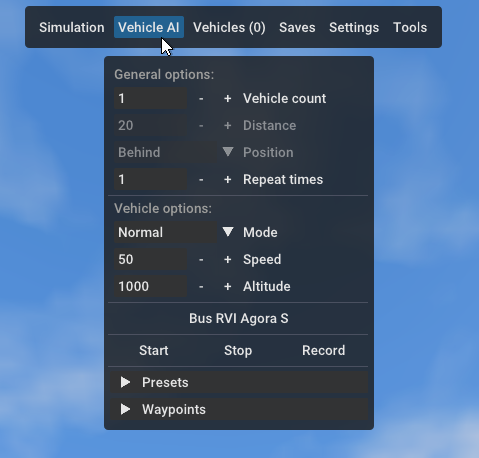
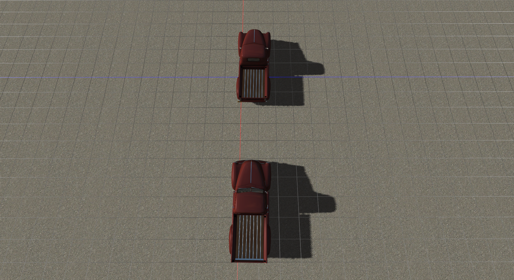
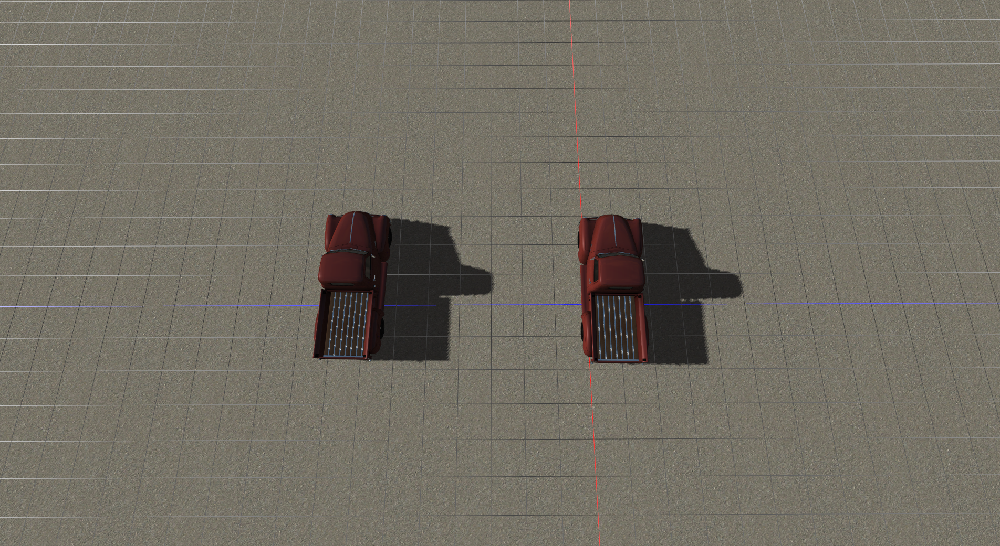
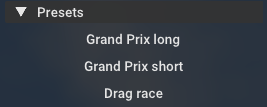
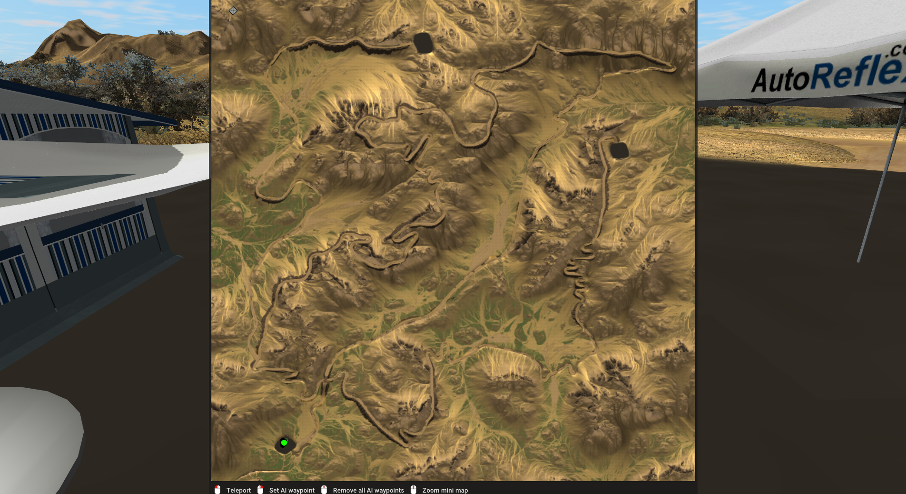
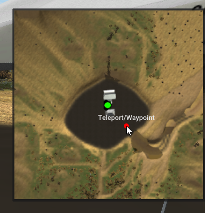
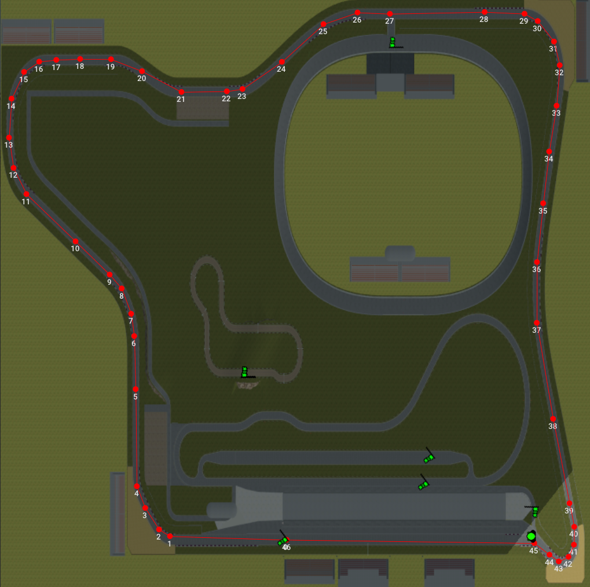
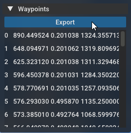

Vehicle AI
============

## Introduction

Introduced in version 2022.12, AI vehicles now can be controlled and customized through the "Vehicle AI" section of the top menu:




Only available in single player, disabled in multiplayer to prevent abuse. 

This page serves as a guide on how to use this new feature, along with explaining its [limitations](#limitations). 

Video demo:

<iframe width="560" height="315" src="https://www.youtube.com/embed/UCVH_pWRXSI" frameborder="0" allowfullscreen></iframe>

## General options 

### Vehicle count

How many vehicles should be spawned. The distance and position values are only used with more than one vehicle.

### Distance

The distance between each vehicle. Make sure to not set too low of a value, otherwise the vehicles may spawn inside of each other!

### Position

Whether the vehicles will spawn behind or next to each other. 

Behind:



Parallel:



### Repeat times 

How many times to loop the path. Useful if you want a vehicle to drive multiple laps. 

## Vehicle options

### Modes 

Currently there are five modes available. Each mode defines how the AI vehicle will behave. 

#### Normal

The default mode. AI vehicle will modify its speed for turns, and will slow down/stop if other vehicles or the player character is blocking the path. 

A demo video of this mode can be seen above. 

#### Race 

Sets the AI vehicle to always drive at the defined speed. 
Currently this mode will not slow down to make turns, as a result the vehicle may miss sharp turns.

Demo video:

<iframe width="560" height="315" src="https://www.youtube.com/embed/MVCcmG_p69c" frameborder="0" allowfullscreen></iframe>

#### Drag Race 

Sets up two parallel vehicles which will accelerate at full speed. Best used with a drag strip such as [Rock Falls Raceway](https://forum.rigsofrods.org/resources/rockfalls-raceway.968/).

Demo video:

<iframe width="560" height="315" src="https://www.youtube.com/embed/WBXt5SbkHPQ" frameborder="0" allowfullscreen></iframe>

#### Crash 

Sets up two vehicles that will drive into each other. Works best with straight line paths. 

Demo video:

<iframe width="560" height="315" src="https://www.youtube.com/embed/QpGOIaR3_8w" frameborder="0" allowfullscreen></iframe>

#### Chase

Sets the AI vehicle to chase the player vehicle or character. 
Currently the AI will always try to target the player without taking other waypoints or objects into account. 
As a result this mode works best on a flat terrain, on other maps the AI will usually end up crashing. 

Demo video:

<iframe width="560" height="315" src="https://www.youtube.com/embed/lNFmuAaX3oI" frameborder="0" allowfullscreen></iframe>

### Speed 

Sets the speed of the AI vehicle in km/h for cars and trucks and knots for boats and airplanes.

### Altitude

Sets the height airplanes will climb to after take off. Currently planes will remain at the set altitude, they won't ascend or descend to reach a checkpoint.

### Vehicle name

The vehicle the AI will use. Default is the 'Bus RVI Agora S', a standard vehicle included with RoR. Just click on the name to open a selector menu. 
If the chosen vehicle has [sections](/vehicle-creation/fileformat-truck/#sections) and/or [skins](/vehicle-creation/alternate-skins/), AI will use the selected section/skin as well. 

## Presets menu 

After setting up the above options, click the `Presets` drop down menu:



On a supported terrain, the presets that are available for the terrain will be displayed. If not a list of supported terrains will be shown instead.

Presets are automatically downloaded from the [ai-waypoints GitHub repository](https://github.com/RigsOfRods-Community/ai-waypoints).

## Start/Stop/Record 

After selecting the preset, click the `Start` button to spawn the AI vehicle(s). Click `Stop` at any time to remove the AI. You can press `Start` multiple times to spawn more vehicles.

The `Record` button allows you to place waypoints by recording the vehicle/character movement.
This feature is mostly meant for fun, it is not recommended to use this to create presets.

### Creating waypoint presets 

Creating a new waypoint preset is simple. Just open the enlarged overview map (press `TAB` key twice):



#### Controls

At the bottom of the map you'll find the following mouse controls:

Teleport - Left click 

Set AI waypoint - Right Click 

Remove all AI waypoints - Middle click 

Scroll wheel - Zoom mini map 

!!! note 
	The zoom feature only works with the small minimap:
	


#### Adding waypoints

Right click anywhere on the overview map to place a waypoint. Middle click on any waypoint to delete it.

After placing the waypoints, click the `Start` button to test drive your route. 

Your overview map should now look similar to this:



#### Exporting

Now click on the `Waypoints` drop down menu:



Coordinates of each waypoint will be displayed. Clicking on a coordinate will teleport you to the waypoint. 

When finished click the `Export` button. You should see a message which reads `X waypoints exported to RoR.log`.

Browse to where your RoR.log is located (`Documents\My Games\Rigs of Rods\logs` on Windows or `~/.rigsofrods/logs` on Linux) and open the `RoR.log` file with a text editor.

Scroll to the end of the file, you should see lines similar to these:

```
    {
        "terrain":"simple2.terrn2",
        "preset":"Preset name",
        "waypoints":
        [
            [514.403748, 0.000000, 513.201904],
            [1008.375610, 0.000000, 521.615051],
            [1007.173706, 0.000000, 25.239437],
            [9.615024, 0.000000, 24.037560],
            [15.624413, 0.000000, 993.953064],
            [998.400024, 0.000000, 995.200012],
            [320.901398, 0.000000, 514.403748],
            [495.994720, 0.000000, 513.038086]
        ]
    }
```

The waypoints are exported in JSON format. 

From here you have two options:

- Name the preset and create an issue ticket on [GitHub](https://github.com/RigsOfRods-Community/ai-waypoints/issues) with the completed preset. Someone else will add it to the `waypoints.json` file. 

- Download the `waypoints.json` file from [GitHub](https://raw.githubusercontent.com/RigsOfRods-Community/ai-waypoints/main/waypoints.json) (right click -> Save As, set file type to "All files")
and place it in the `savegames` folder. RoR will load this file instead of downloading. Edit the file with your new preset, then create a pull request with your changes.

## Limitations

The current AI is an evolution of the per-terrain based AI featured on terrains such as F1 Test Track and Bajarama V2. It has some limitations:

- You cannot set the vehicle speed per-waypoint. This also means an AI vehicle cannot stop at a waypoint (example: bus stops)

- An AI vehicle in 'normal' mode will slow down at every waypoint. For most terrains this is fine but for others (such as race tracks) the AI drives too slowly. The current 'race' mode does not fix this as that mode will always drive at the same speed and won't slow down for corners.

- As stated above, the 'chase' mode only targets the player and does not follow any other waypoints. This usually results in the chase vehicle crashing. 
 


