Building rail tracks
============

## Basic Principle 

The tracks are simple meshes that are placed on the map. 
They have a collision mesh on which all rail vehicles drive. 
The track gauge is approximately 1435mm, which is the most common in the world. 
In reality train wheels have flanges.
In RoR wheels can’t have such a geometry, so we use nodes with low friction 
to keep everything on the rail (we call them guidance nodes). 
Propulsed rail vehicles use standard wheels spanning the two rails. 
The result is a quite long wheel what may be odd on the first sight, 
but if you think about it real train wheels are basically the same. 
This also helps to keep the nodecount down. 

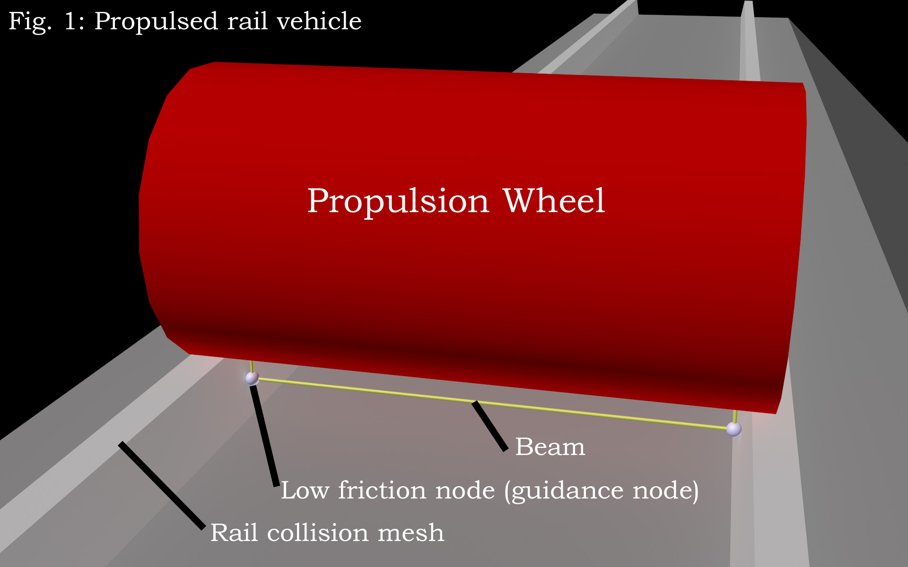

The wagons use low friction nodes instead of wheels. 
Main reason is the nodecount, e.g. on a 4 axle wagon we can save approx. 
120 nodes by doing this, what will give you a much better framerate. 

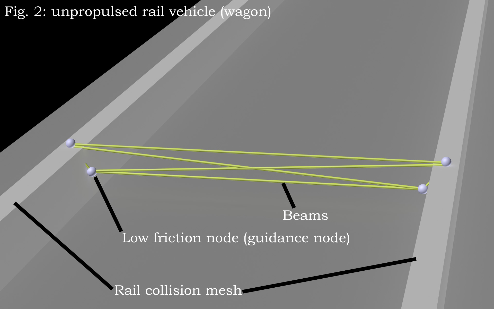

### Basic node and beam principles

To make your rail vehicle working well, you need to obtain certain principles. 

* First of all your bogie geometry needs to be exactly as shown in the picture
  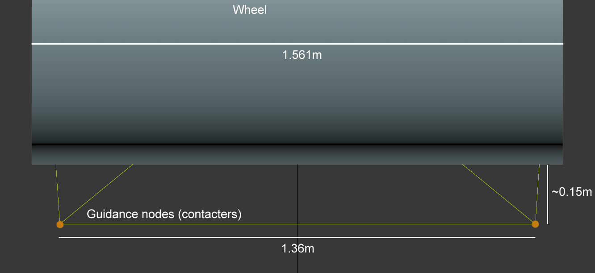 
  If you make a wagon without wheels, the low friction nodes running on the rail 
  need to be exactly where the wheel in the picture would touch the rail.
* Your guidance nodes (those running on the inner side of the rail) need to be contacters. 
  Give them a mass of 50 kilos. Give them low friction using `set_node_defaults`. 
  If you don't use a wheel, the nodes sliding on top of the rail also need low friction.
* Node 0 needs to be exactly in the middle of your vehicle and 0.5 meters below the rail. 
  Otherwise it won't spawn correctly in the train spawner.
  Don't forget to flag it with "c": don't detect ground contact.
* Make your wheels very hard using the spring and damping options.
* Make the bogie node and beam very stiff using `set_beam_defaults`.

### Building a railway line

When you want to create your track layout in a 3d modeling program (Blender, 3ds Max), 
you need to make sure the coordinates in the 3d modeling program are the same as in RoR. 
Open the terrain *.zip and search for a *.cfg file. 
Read out the size of the terrain, switch to your 3d modeling program 
and create a plane with the same size in the correct position:
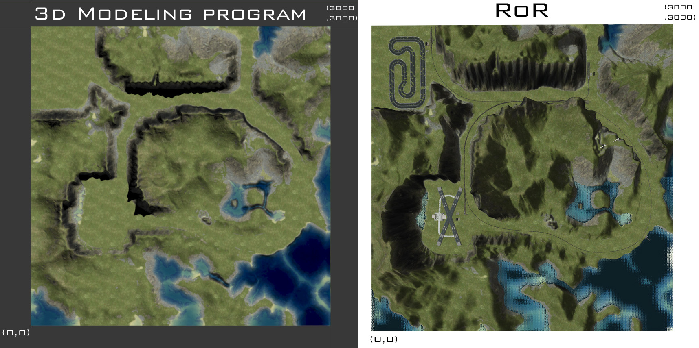

This will be our placement help.

*TODO: Fix link* [http://www.rigsofrods.com/attachment.php?attachmentid=306258&d=1333744539 Now load the tracks from the blender file] 
and start assembling them to a nice railway track. 
When finished, you need to attach all track pieces together, but DO NOT ATTACH THE SWITCHES! 
We only placed them to read out the coordinates and we will place them on the map using the terrn file. 
For that purpose, open the terrn file, click each switch in blender/3ds and copy the coordinates 
(including rotational values) over to the terrn file. Then do 
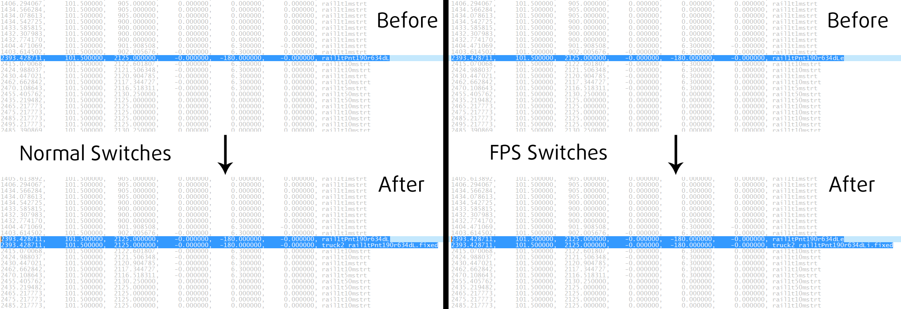
to place the node and beam. Annoying, I know ;-) 
When done, it's time to export the track layout. It should look like 
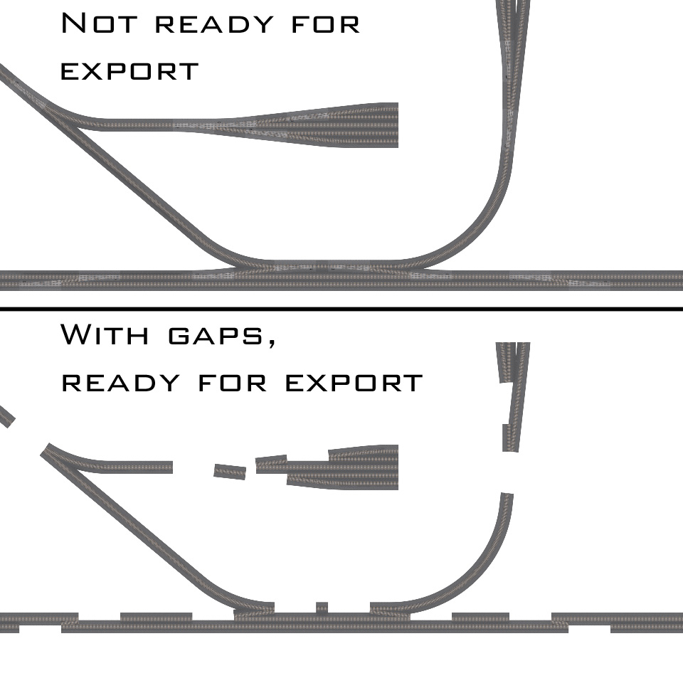
with gaps for the switches.
Move the pivot point of the track to (0, 0, 0) and export the mesh.
Now you just need to place it on (0, 0, 0) in the terrn file and probably get the angles right.
Everything should be ingame then.
 
## Making track by extracting spline from heightmap

If you choose to place your track using a 3d modeling program, you can also 
generate track from a spline

### Introduction

This tutorial is made in 3ds Max, but should also be valid for Blender. 
It will show you how to extract a Spline from a heightmap and use it for placing roads or railway lines.

### Step 1

Convert heightmap raw to bmp with [ImageMagick](http://www.imagemagick.org/script/download.php)

### Step 2

Create a plane in 3ds Max, apply a 3d displacement modifier, load your converted heightmap 
and assign the height found in the maps *.cfg there. 
Subdivide your plane to the accuracy you want
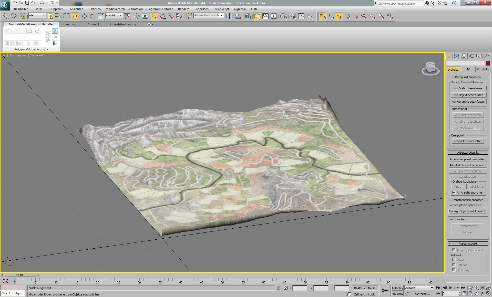

### Step 3

Create a spine representing the longitudinal track layout
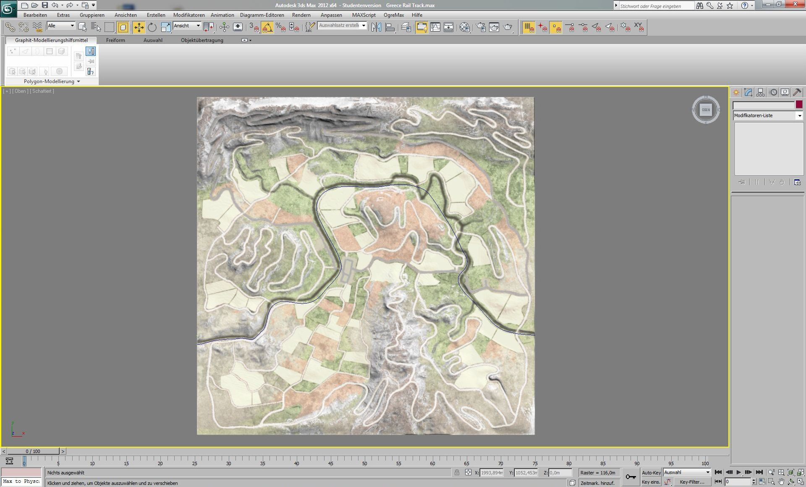

### Step 4

Convert the heightmap to a poly object

### Step 5

Extrude the spline to make it solid

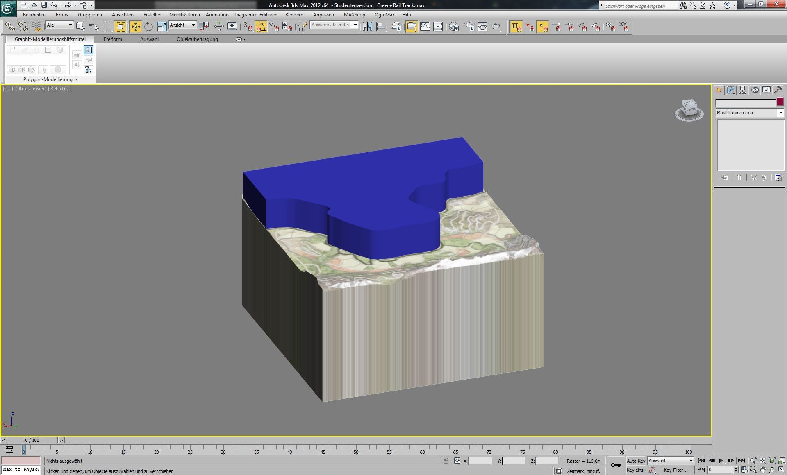

### Step 6

Choose the spline solid, add a ProBoolean modifier, check substract, choose the heightmap solid

### Step 7

Choose the outermost edge of the resulting body, right click, choose create contour ->now you have your spline following the heightmap

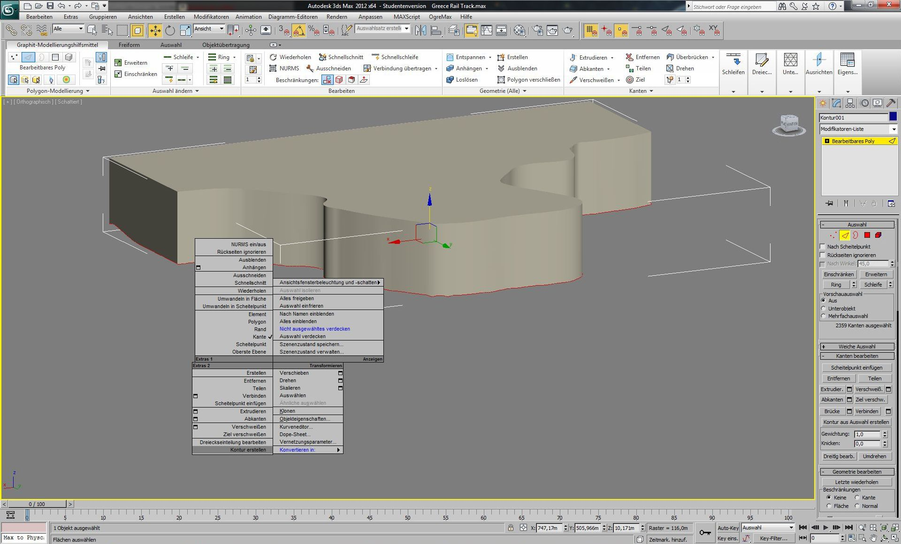
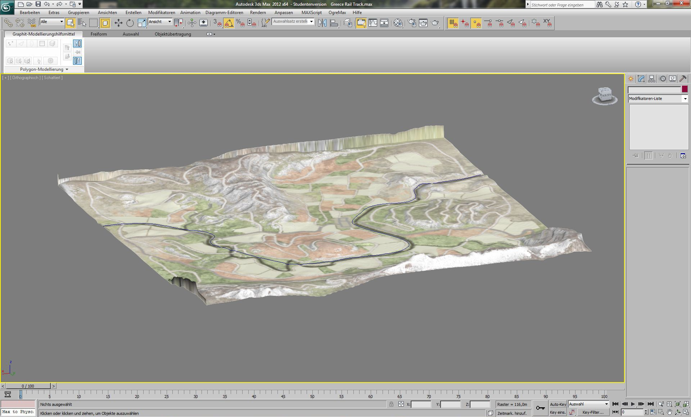

### Step 8

Use the Lofting tool to create a road or train track.
Correct your spline, twist the loft for banked curves, texture etc.
You can also use the normalize spline modifier for better accuracy or smoothness.

## See also 

If you have a question on the system, please post to 
*TODO: fix old forum link*
[http://www.rigsofrods.com/threads/88801-The-railroad-system-technical-discussion-and-mapbuilders-guideline]
