Collision meshes
============

A collision mesh is a "substitute" or "replacement" mesh for a given model. Except, this mesh does not replace the original model, it is transparent and simplifies your model. It does not simplify how it looks, but how it behaves as an object in Rigs of Rods. For example, if you want to model a log cabin with a detailed roof, drainpipes, and window frames, then the framerate/physic lag in Rigs of Rods would be a single digit. However, a collision mesh will make it behave like it is the most simple model out there. Now that you (hopefully) comprehend this concept, let's begin the tutorial.

## How to make a collision mesh

### Getting the Resources

In order to success in this tutorial/guide, you must have a modeling program with an OGRE exporter. SketchUp will be used as an example.

### Modeling the complex object

If you have a profession in SketchUp, you may know how to make some pretty nice stuff. For example, here is a complex house I made.

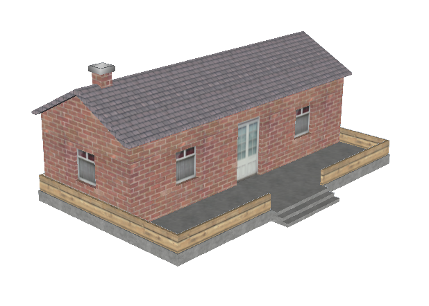

... and here it is in-game

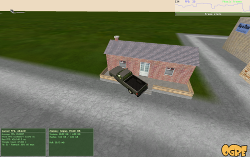

As you may see, I get ~25 frames-per-second, while I normally get ~100 around a simpler object. A collision mesh will polish up the framerate and physic lag.

### Modeling the collision mesh

You want to make the collision mesh be exactly around the model, or else it will be out of place. My best suggestion is to model over it, but snapping your model to the original model. So, here is my model:

... and here is the collision mesh I modeled.

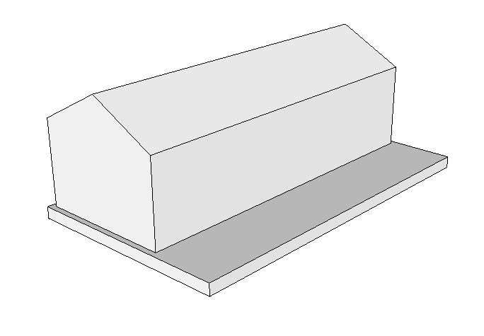

As you may see, I left out the window detail, door detail, roof detail, the stairs, the fence, and the chimney. I did this because the car won't be interacting much with those aspects of the house in the first place, so why waste the framerate on them?

Once you are done modeling it, make sure it is right around your model.

### The exporting process

Once it is put next to the model (make sure they are separate groups), select only ONE of them, and click the following...

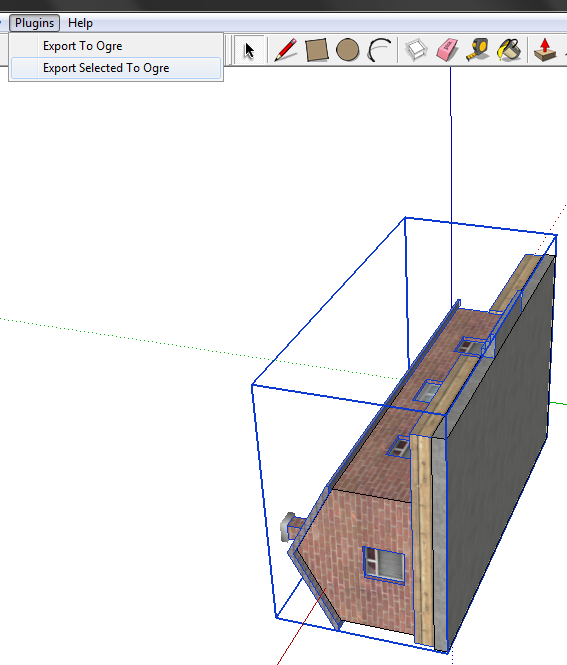

Then name your object however you like. I will name it "House".

The reason why you want it separate is because one will be the house \[appearance\] and one will be the collision mesh \[physical structure\]. Then click "OK" and a series of windows come up.

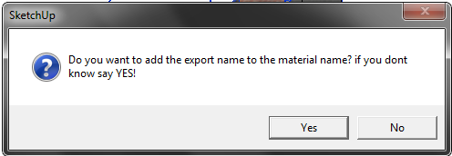

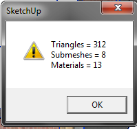

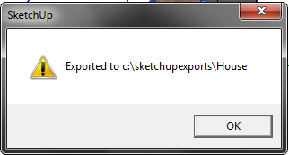

Then, separately select the collision mesh, and repeat the process. For the name, add "Collision" or "-Collision" at the end so it is easier to identify. It can even be as simple as as adding a "1" or "C" to the end. I will use the "-Collision" extension for the example.

Then the series of windows pop up.

You are done exporting!

### Editing in notepad

As a standard procedure for SketchUp, go to the following directory:

Then, go to the .MATERIAL file.

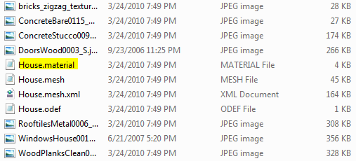

Open it, and remove the section "Material SketchUp Default" or something along those lines.

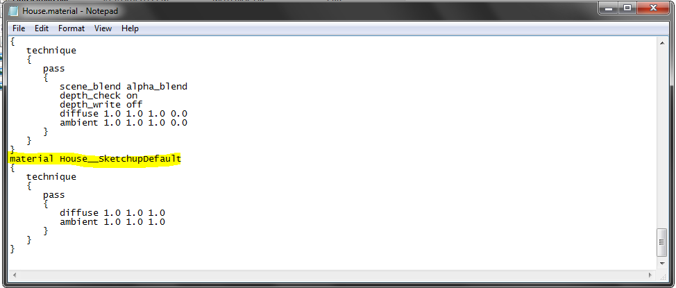

Then, go to the .ODEF file.

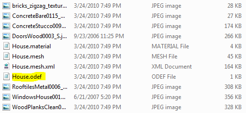

Then, target the mesh line.

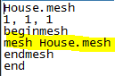

Then, replace it with the collision name of your mesh.

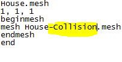

### Using the files

For objects, the necessary files are the .ODEF, the .MESH, the .MATERIAL, and any textures left behind.

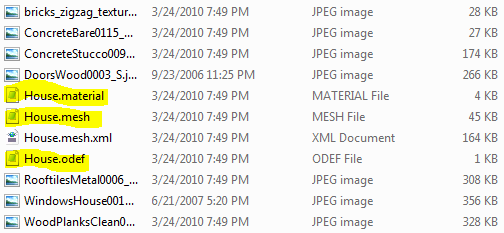

For the collision mesh, all you need is the .MESH of the collision mesh. Because it does not need a .MATERIAL file because it's invisible, and it does not need an .ODEF because it uses the .ODEF of the original house.

Then, add those to the index of the .ZIP of the terrain you will be adding the object to.

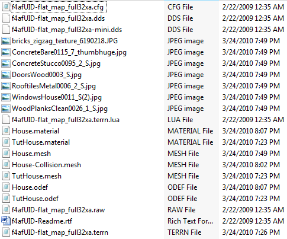

Once I placed the object, look how much better my framerate is compared to the one in Step II.

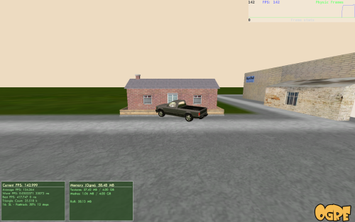

## Collision Mesh Troubleshooting

So you just made an absolutely amazing \[insert amazing, knock-your-socks-off object for RoR here\] If you're like me, the reason you've been procrastinating so much on exporting is because you don't want to deal with the complicated and irritating task of getting collision meshes to work. They never seem to work the first time, and you can't identify the problem, resulting in gray hairs, chronic anxiety, and eventual cardiac failure if the problem persists. This guide will give you some helpful hints as to fixing the problems. Please note: By "failures" I mean the truck falls through the mesh and gets stuck.

### FPS drop

**PROBLEM:** Bounding box causes huge fps drop.

**SOLUTION:** Make a simpler collision mesh.

### Random Collisions

**PROBLEM:** Seemingly random collisions into random invisible objects around the object in question/no collision with object or collision several meters below surface of object.

**SOLUTION:** Your collision mesh is either centred wrong or badly scaled. Or both. If you're modelling in Blender, hit CTRL+A in object mode to apply scale and rotation to your object before exporting so that it exports at the size that you actually see. Try to get the centres of your collision mesh and object as close together as possible. If you're using SketchUp...then figure it out yourself; I can't help you. Get a real 3D modelling program. Or add helpful info here, remember that this is a Wiki.

### Location-based collision failures

**PROBLEM:** Failures of collision mesh based on location of object.

**SOLUTION:** The collision mesh of the object is intersecting with that of another. Move the object. You could also fix the collision mesh so that it doesn't intersect.

### General collision failures

**PROBLEM:** Failures of collision mesh in general

**SOLUTION:** There are one or more faces intersecting in your mesh. Rigs of Rods doesn't like bounding faces intersecting with each other. Make it one continuous surface rather than a collection of boxes. Or, at least, make the collision mesh like this.

### Vehicles getting "sucked in" to a collision mesh

**PROBLEM:** You're driving along, testing your new mesh... then instead of crashing into it, you get sucked in. And now you can't get out.

**SOLUTION:** Your collision mesh's normals are flipped the wrong way. Flip them the right way out and you ought to be fine.
