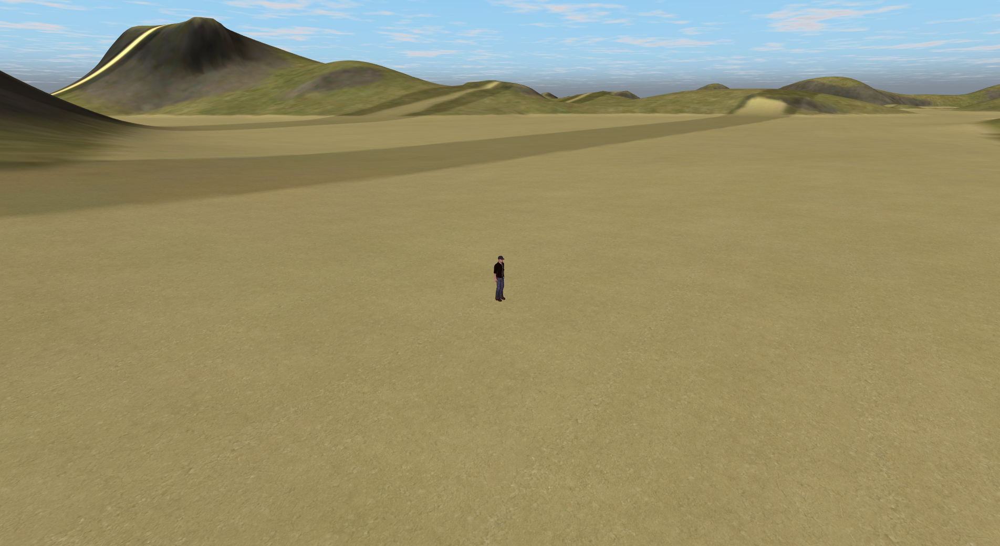
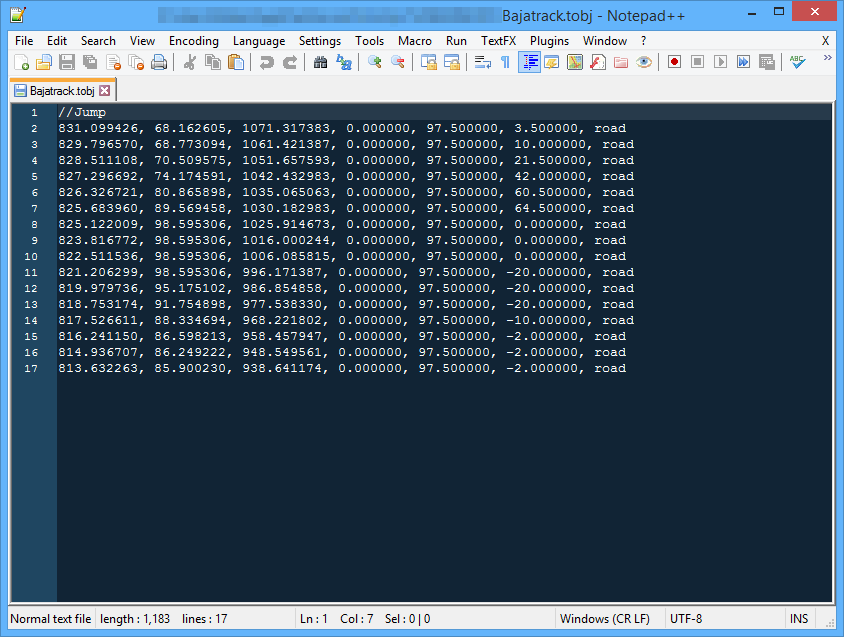
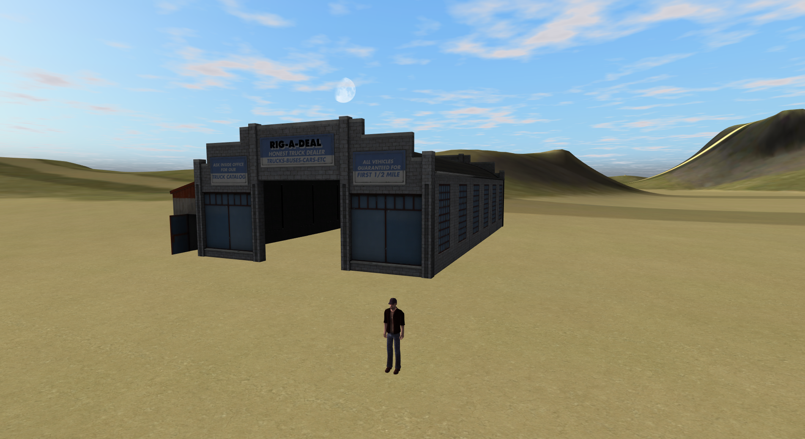
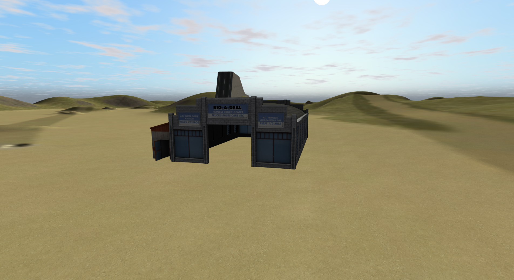
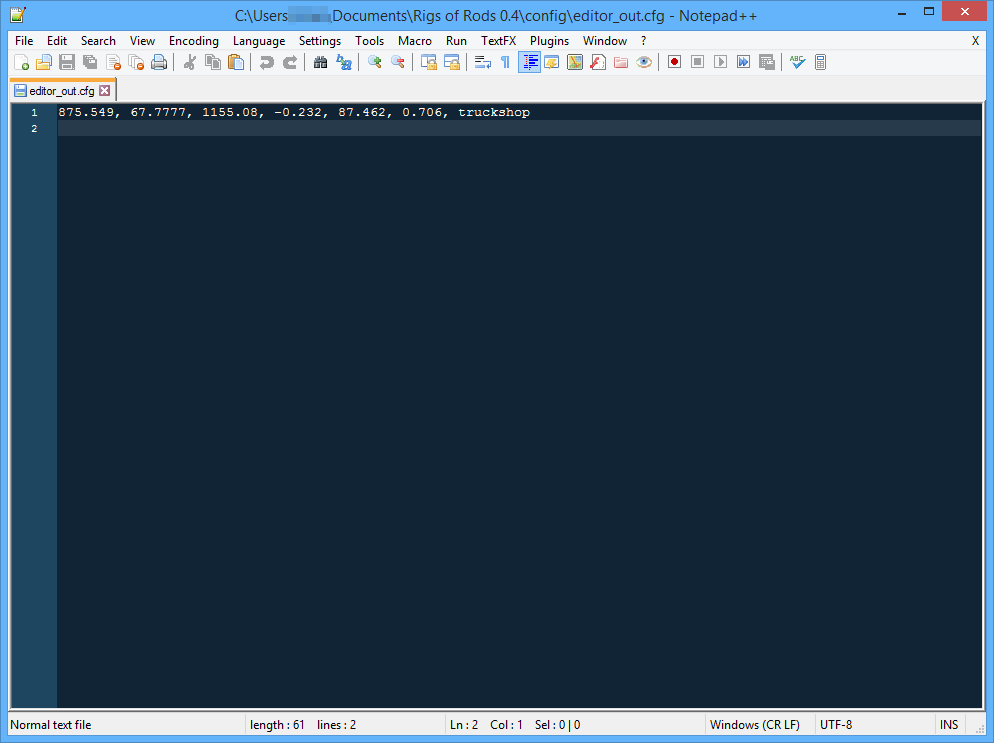

Adding/moving terrain objects
============


## Introduction

As of Rigs of Rods 0.4.x, terrain objects are stored in `.tobj` files, they contain placements for all objects/trees/grass/etc on a terrain. This page will show you how to add/move terrain objects. There are multiple ways to do this, however this page will only explain the two easiest methods.

## Adding a new object 

For this tutorial, I will be placing a Rig-A-Deal (truckshop) on [Baja Track](https://forum.rigsofrods.org/resources/baja-track.167/) using Rigs of Rods version 0.4.7.0+. 

Open Rigs of Rods and select the map you want to add an object to. 

Go to where you want the object to be without being in a vehicle, for example here:

Now press the `h` key. The current position coordinates will be written to the `RoR.log` (Located in `Documents\My Games\Rigs of Rods\logs` on Windows or `~/.rigsofrods/logs` on Linux.
Open the `RoR.log` file in any text editor and scroll down to the end of the file. You should see a line similar to this:

`Position: 875.549, 67.6607, 1155.26, 0, 366.073, 0`

This is the coordinates for your new object. Now find and open the terrain zip (Example: `Bajatrack.zip`) and open the correct `.tobj` file (Example: `Bajatrack.tobj`) It should look similar to this:



Now take the numbers from the `RoR.log` line and add them to the end of the file, like so:

```
//Jump
831.099426, 68.162605, 1071.317383, 0.000000, 97.500000, 3.500000, road
829.796570, 68.773094, 1061.421387, 0.000000, 97.500000, 10.000000, road
828.511108, 70.509575, 1051.657593, 0.000000, 97.500000, 21.500000, road
827.296692, 74.174591, 1042.432983, 0.000000, 97.500000, 42.000000, road
826.326721, 80.865898, 1035.065063, 0.000000, 97.500000, 60.500000, road
825.683960, 89.569458, 1030.182983, 0.000000, 97.500000, 64.500000, road
825.122009, 98.595306, 1025.914673, 0.000000, 97.500000, 0.000000, road
823.816772, 98.595306, 1016.000244, 0.000000, 97.500000, 0.000000, road
822.511536, 98.595306, 1006.085815, 0.000000, 97.500000, 0.000000, road
821.206299, 98.595306, 996.171387, 0.000000, 97.500000, -20.000000, road
819.979736, 95.175102, 986.854858, 0.000000, 97.500000, -20.000000, road
818.753174, 91.754898, 977.538330, 0.000000, 97.500000, -20.000000, road
817.526611, 88.334694, 968.221802, 0.000000, 97.500000, -10.000000, road
816.241150, 86.598213, 958.457947, 0.000000, 97.500000, -2.000000, road
814.936707, 86.249222, 948.549561, 0.000000, 97.500000, -2.000000, road
813.632263, 85.900230, 938.641174, 0.000000, 97.500000, -2.000000, road
//new object
// x        y        z    rx  ry rz odefname (without .odef file extension)
875.549, 67.6607, 1155.26, 0, 0, 0, truckshop
```
I recommend leaving the rotation (last 3) values to 0 for now.

Save the file and reopen Rigs of Rods. Your new object should appear roughly where you want it:



To precisely place your object, you can use the built-in "terrain/object editor" that is included with 0.4.7.0+. I'll explain how to use it below.

## Moving objects 

**Note: The editor cannot move roads/Paged Geometry trees/grass.**

First, make sure you're running RoR version 0.4.7.0 or newer.

Next, load the terrain you want to edit. While not in a vehicle, press `CTRL+Y`. A notification box should appear in the top right:


You should now be in "terrain editing mode". 

These are the controls for the editor:
```
CTRL+Y - Activates the editor
Enter - Selects nearest object based on free camera or RoRBot's position
Middle mouse click - Select object 
CTRL+[ and CTRL+] - Cycles through objects as listed in the `.tobj` file. If the terrain features a race, race checkpoints will appear first.
WASD - Movement
Arrow keys - Rotation
R - Change rotation axis
I - Reset object rotation
CTRL+Y - Exit editor and save changes 
```

In this example I will rotate the truckshop. Move RoRBot near the object and press `Enter`. The object should now be selected:


Use the keys listed above to move/rotate. You may have to switch the rotation axis using the `R` key to correctly rotate the object.

Once you have your object(s) placed where you want it press `CTRL+Y` again to exit the editor:




The changes have been saved to the `editor_out.cfg` file in the `/config` folder. Open that file in a text editor. It should look similar to this:



And finally, copy the correct placement line to your map's `.tobj` file. Example:

```
//Jump
831.099426, 68.162605, 1071.317383, 0.000000, 97.500000, 3.500000, road
829.796570, 68.773094, 1061.421387, 0.000000, 97.500000, 10.000000, road
828.511108, 70.509575, 1051.657593, 0.000000, 97.500000, 21.500000, road
827.296692, 74.174591, 1042.432983, 0.000000, 97.500000, 42.000000, road
826.326721, 80.865898, 1035.065063, 0.000000, 97.500000, 60.500000, road
825.683960, 89.569458, 1030.182983, 0.000000, 97.500000, 64.500000, road
825.122009, 98.595306, 1025.914673, 0.000000, 97.500000, 0.000000, road
823.816772, 98.595306, 1016.000244, 0.000000, 97.500000, 0.000000, road
822.511536, 98.595306, 1006.085815, 0.000000, 97.500000, 0.000000, road
821.206299, 98.595306, 996.171387, 0.000000, 97.500000, -20.000000, road
819.979736, 95.175102, 986.854858, 0.000000, 97.500000, -20.000000, road
818.753174, 91.754898, 977.538330, 0.000000, 97.500000, -20.000000, road
817.526611, 88.334694, 968.221802, 0.000000, 97.500000, -10.000000, road
816.241150, 86.598213, 958.457947, 0.000000, 97.500000, -2.000000, road
814.936707, 86.249222, 948.549561, 0.000000, 97.500000, -2.000000, road
813.632263, 85.900230, 938.641174, 0.000000, 97.500000, -2.000000, road
//new object
// x        y        z    rx  ry rz meshname (without .mesh file extension)
875.549, 67.7777, 1155.08, -0.232, 87.462, 0.706, truckshop
```

Open Rigs of Rods again and load your map, the object should be in the same place as when you moved it using the editor.

Congratulations! You have learned how to easily add/move objects.


