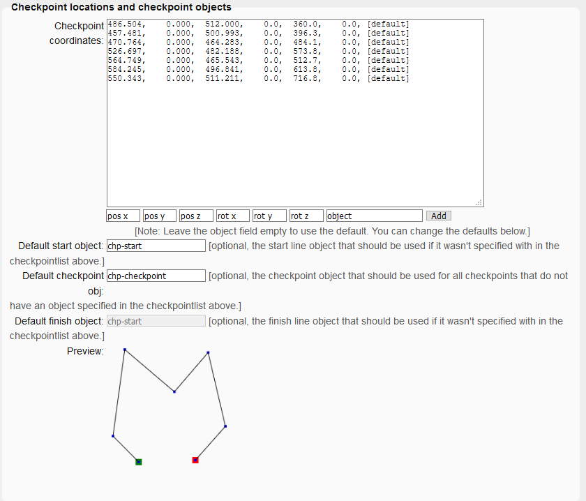
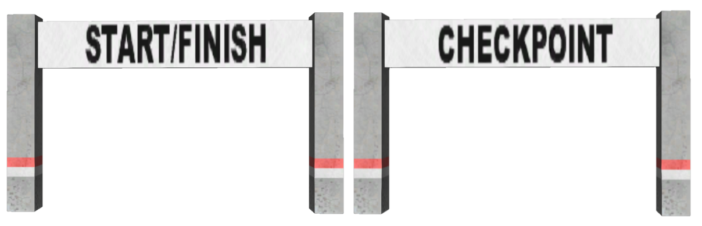
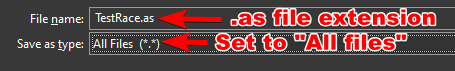
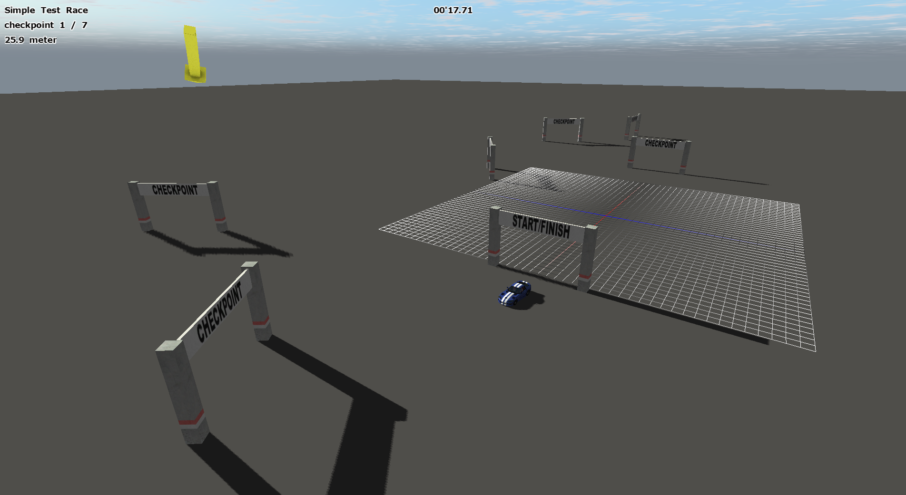
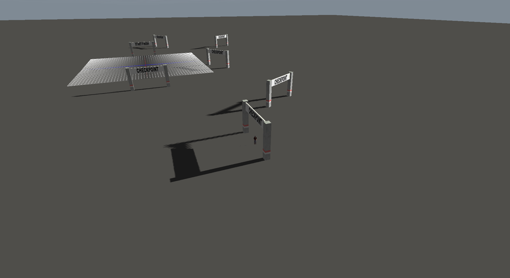

Race script generator
============

<!--
	TODO:
		- RaceCancel instead of callback (nvm, would get called too often) -> 1 callback/cancelpoint
		- Be able to read log files as checkpoints
		- Allow message/callback
		- Add ( show / hide ) to advanced options
		- Add introductory text to every fieldset
		- Add colour to fieldset width low opcacity (or only to big fieldsets)
-->

<style type="text/css">
    body, fieldset {
        min-width: 400px;
    }
	
@media (prefers-color-scheme: light) {
    .info {
        color: #3F3F3F;
        /*font-size: x-small;*/
    }
    .bigButton {
        width: 200px;
        height: 30px;
        font-weight: bold;
		background: white;
    }
	
    .smallButton {
		background: white;
    }

    .smallNumberField {
        width: 50px;
		background: white;
    }

    .shortTextField {
        width: 150px;
		background: white;
    }

    .longTextField {
        width: 428px;
		background: white;
    }
	
	.inputBox {
		background-color: white;
	}
    fieldset {
        -webkit-border-radius: 10px;
        -moz-border-radius: 10px;
        border-radius: 10px;

        background-color: #E5E5E5;
    }
}

@media (prefers-color-scheme: dark) {
    .info {
        color: #C1C1C1;
        /*font-size: x-small;*/
    }
    .bigButton {
        width: 200px;
        height: 30px;
        font-weight: bold;
		background: #191919;
    }
	
    .smallButton {
		background: #191919;
    }

    .smallNumberField {
        width: 50px;
		background: #191919;
    }

    .shortTextField {
        width: 150px;
		background: #191919;
    }

    .longTextField {
        width: 428px;
		background: #191919;
    }
	
	.inputBox {
		background-color: #191919;
	}
    fieldset {
        -webkit-border-radius: 10px;
        -moz-border-radius: 10px;
        border-radius: 10px;

        background-color: #333;
    }
}

    label {
        display: inline-table;
    }


    .intro {
        font-style: italic;
    }

    .scriptResult {
        width: 100%;
        height: 300px;
    }

    .checkpointsInputField {

        width: 100%;
        height: 300px;

        #vertical-align: top;
    }

    .closeIcon {
        float: right;
        cursor: pointer;
        text-decoration: underline;
        color: red;
    }
	
    #errorMessageField {
        margin-left: 20px;
    }

    legend {
        font-weight: bold;
    }
</style>

<script type="text/javascript">
    var free_race = 0;
    var races = new Array();
    var free_checkpoint = 0;
    var checkpointFieldFocussed = false;
    var myScriptFile = new scriptFile();
    var lastAbortMessage = '[noMessage]';
    var abortMessageHandlers = new Array();
    var free_abortMessageHandler = 0;

    function scriptFile() {
        this.errormsg = "";
        this.errors = 0;
        this.lapSelections = {
            'No laps (the first checkpoint will be the start line and the last checkpoint will be the finish line)': 'races.LAPS_NoLaps',
            '1 lap (the first checkpoint will be both the start and finish line)': 'races.LAPS_One',
            '2 laps': '2',
            '3 laps': '3',
            '4 laps': '4',
            '5 laps': '5',
            '6 laps': '6',
            '7 laps': '7',
            '8 laps': '8',
            '9 laps': '9',
            'Never ending race (unlimited amount of laps)': 'races.LAPS_Unlimited',
            'other...': '[other]'
        };
        this.scriptSections = {
            'main': '',
            'general': '',
            'RaceStart': '',
            'PenaltyEvent': ''
        }

        this.generateRace = function (id) {
            var r;
            r = this.getRaceData(id);
            if (r < 0) return;
            r = this.buildRace(id);
            if (r < 0) return;

            return 1;
        }

        this.getRaceData = function (id) {
            // NAME
            {
                // get name
                races[id].name = document.getElementById("race_" + id + "_raceName").value;
                // trim the name
                races[id].name = races[id].name.replace(/^\s+|\s+$/g, '');
                // check the name
                if (races[id].name == "") {
                    this.errormsg += fatalError("Critical error detected in race (" + id + "): No name set, cannot build race (race ignored).");
                    ++this.errors;
                    return -1;
                }
            }

            // LAPS
            {
                // get the amount of laps
                if (document.getElementById("race_" + id + "_laps").value in this.lapSelections)
                    races[id].laps = this.lapSelections[document.getElementById("race_" + id + "_laps").value];
                else {
                    this.errormsg += fatalError("Critical error detected in race " + races[id].name + " (" + id + "): Unhandled amount of laps (race ignored).");
                    ++this.errors;
                    return -2;
                }

                // if 'other...' is selected, then we'll need to get the specified value
                if (races[id].laps == '[other]') {
                    races[id].laps = parseInt(document.getElementById("race_" + id + "_lapsOther").value);
                    if (isNaN(races[id].laps)) {
                        this.errormsg += fatalError("Critical error detected in race " + races[id].name + " (" + id + "): No amount of laps set (race ignored).");
                        ++this.errors;
                        return -3;
                    }
                }
            }

            // VERSION
            races[id].version = document.getElementById("race_" + id + "_version").value.replace(/^\s+|\s+$/g, '');

            // DEFAULT CHECKPOINT OBJECTS
            {
                // Get the default checkpoint objects
                races[id].chpObjects['start'] = document.getElementById("race_" + id + "_defaultStart").value.replace(/^\s+|\s+$/g, '');
                races[id].chpObjects['chp'] = document.getElementById("race_" + id + "_defaultCheckpoint").value.replace(/^\s+|\s+$/g, '');
                races[id].chpObjects['finish'] = document.getElementById("race_" + id + "_defaultFinish").value.replace(/^\s+|\s+$/g, '');

                // check for empty objects
                if (races[id].chpObjects['start'] == '' || races[id].chpObjects['start'] == '[default]')
                    races[id].chpObjects['start'] = "chp-start";
                if (races[id].chpObjects['chp'] == '' || races[id].chpObjects['chp'] == '[default]')
                    races[id].chpObjects['chp'] = "chp-checkpoint";
                if (races[id].chpObjects['finish'] == '' || races[id].chpObjects['finish'] == '[default]')
                    races[id].chpObjects['finish'] = "chp-start";
            }

            // CHECKPOINTS
            {
                // get checkpoints
                var free_checkpoint = 0;
                var chps = document.getElementById("race_" + id + "_checkpoints").value;
                chps = chps.split(/\r?\n/);
                for (var i in chps) {
                    // trim the string
                    var line = chps[i].replace(/^\s+|\s+$/g, '');

                    // Ignore comments and empty lines
                    if (line == "" || line[0] == ';' || line[0] == '/')
                        continue;

                    // Split the line on commas
                    var lineParts = line.split(',');

                    // Length must at least be 6
                    if (lineParts.length < 6) {
                        if (chps[i].search("IGNORED") < 0)
                            chps[i] += "   <- IGNORED (syntax error: not enough parameters)";

                        this.errormsg += normalError("Syntax error detected in race " + races[id].name + " (" + id + ") at line " + (parseInt(i) + 1) + " of the checkpoints field (not enough parameters, line ignored).");
                        ++this.errors;
                        continue;
                    }

                    // check if the first 6 parts are numbers
                    var problem = false;
                    for (var k = 0; k < 6; ++k) {
                        if (isNaN(parseFloat(lineParts[k]))) {
                            if (chps[i].search("IGNORED") < 0)
                                chps[i] += "   <- IGNORED (syntax error: parameter" + (parseInt(k) + 1) + ")";

                            this.errormsg += normalError("Syntax error detected in race " + races[id].name + " (" + id + ") at line " + (parseInt(i) + 1) + " of the checkpoints field (line ignored).");
                            ++this.errors;
                            problem = true;
                            break;
                        }
                    }
                    if (problem)
                        continue;

                    // assign the numbers to the checkpoint variable
                    races[id].checkpoints[free_checkpoint] = {
                        'posx': parseFloat(lineParts[0]).toString(),
                        'posy': parseFloat(lineParts[1]).toString(),
                        'posz': parseFloat(lineParts[2]).toString(),
                        'rotx': parseFloat(lineParts[3]).toString(),
                        'roty': parseFloat(lineParts[4]).toString(),
                        'rotz': parseFloat(lineParts[5]).toString(),
                        'cobj': '[default]'
                    }

                    // Allways add commas
                    for (var k in races[id].checkpoints[free_checkpoint]) {
                        if (k != 'cobj' && k != 'cmsg_handler' && races[id].checkpoints[free_checkpoint][k].search(/\./) < 0)
                            races[id].checkpoints[free_checkpoint][k] += ".0";
                    }

                    // handle the optional object
                    if (lineParts.length > 6) {
                        var tmpArray = lineParts[6].replace(/^\s+|\s+$/g, '').split(' ');
                        if (tmpArray.length > 0)
                            races[id].checkpoints[free_checkpoint]['cobj'] = tmpArray[0];
                    }

                    // Fix empty objects
                    if (races[id].checkpoints[free_checkpoint]['cobj'] == '') {
                        races[id].checkpoints[free_checkpoint]['cobj'] = '[default]';
                    }

                    ++free_checkpoint;
                }

                // Put the checkpointlist in the textarea again
                chps = chps.join('\r\n');
                document.getElementById("race_" + id + "_checkpoints").value = chps;

                // We need at least 2 checkpoints
                if (free_checkpoint < 2) {
                    this.errormsg += fatalError("Critical error detected in race " + races[id].name + " (" + id + "): Not enough checkpoints (2 required, race ignored).");
                    ++this.errors;
                    return -4;
                }

                // Replace all default objects by the correct objects
                for (var i in races[id].checkpoints) {
                    if (races[id].checkpoints[i]['cobj'] == '[default]') {

                        if (i == 0)
                            races[id].checkpoints[i]['cobj'] = races[id].chpObjects['start'];
                        else if ((i == (free_checkpoint - 1)) && (races[id].laps == 'races.LAPS_NoLaps'))
                            races[id].checkpoints[i]['cobj'] = races[id].chpObjects['finish'];
                        else
                            races[id].checkpoints[i]['cobj'] = races[id].chpObjects['chp'];
                    }
                }
            }

            // DEFAULT ABORT OBJECTS
            {
                // Get the default checkpoint objects
                races[id].abortObject = document.getElementById("race_" + id + "_defaultAbort").value.replace(/^\s+|\s+$/g, '');

                // check for empty objects
                if (races[id].abortObject == '' || races[id].abortObject == '[default]')
                    races[id].abortObject = "trucktrigger";
            }

            // DEFAULT ABORT MESSAGE
            {
                // Get the default abort message
                var defaultAbortMessage = document.getElementById("race_" + id + "_abortMessage").value.replace(/^\s+|\s+$/g, '');

                // check for empty messages
                if (defaultAbortMessage == '' || defaultAbortMessage == '[default]')
                    defaultAbortMessage = "[noMessage]";
            }

            // ABORT POINTS
            {
                // get race abort points
                var free_raceAbort = 0;
                var chps = document.getElementById("race_" + id + "_raceAbort").value;
                chps = chps.split(/\r?\n/);

                var message = defaultAbortMessage;
                var abortMessageHander = -1;
                for (var k in abortMessageHandlers) {
                    if (abortMessageHandlers[k] == defaultAbortMessage)
                        abortMessageHander = k;
                }
                if (abortMessageHander == -1) {
                    abortMessageHandlers[free_abortMessageHandler] = defaultAbortMessage;
                    abortMessageHander = free_abortMessageHandler;
                    ++free_abortMessageHandler;
                }

                for (var i in chps) {
                    // trim the string
                    var line = chps[i].replace(/^\s+|\s+$/g, '');

                    // Ignore comments and empty lines
                    if (line == "" || line[0] == ';' || line[0] == '/')
                        continue;

                    // check for the message variable
                    if (line.substr(0, 7) == 'MESSAGE') {
                        var msg = line.substr(7);
                        msg = msg.replace(/^\s+/g, '');
                        if (msg[0] != '=') {
                            this.errormsg += normalError("Syntax error detected in race " + races[id].name + " (" + id + ") at line " + (parseInt(i) + 1) + " of the race abort points field (expected '=' after 'MESSAGE', line ignored).");
                            ++this.errors;
                            continue;
                        }
                        var msg = msg.substr(1);
                        msg = msg.replace(/^\s+/g, '');

                        if (msg == '')
                            msg = '[noMessage]';
                        else if (msg == '[default]')
                            msg = defaultAbortMessage;

                        abortMessageHander = -1;
                        for (var k in abortMessageHandlers) {
                            if (abortMessageHandlers[k] == msg) {
                                abortMessageHander = k;
                                break;
                            }
                        }
                        if (abortMessageHander == -1) {
                            abortMessageHandlers[free_abortMessageHandler] = msg;
                            abortMessageHander = free_abortMessageHandler;
                            ++free_abortMessageHandler;
                        }
                        continue;
                    }

                    // Split the line on commas
                    var lineParts = line.split(',');

                    // Length must at least be 6
                    if (lineParts.length < 6) {
                        if (chps[i].search("IGNORED") < 0)
                            chps[i] += "   <- IGNORED (syntax error: not enough parameters)";

                        this.errormsg += normalError("Syntax error detected in race " + races[id].name + " (" + id + ") at line " + (parseInt(i) + 1) + " of the race abort points field (not enough parameters, line ignored).");
                        ++this.errors;
                        continue;
                    }

                    // check if the first 6 parts are numbers
                    var problem = false;
                    for (var k = 0; k < 6; ++k) {
                        if (isNaN(parseFloat(lineParts[k]))) {
                            if (chps[i].search("IGNORED") < 0)
                                chps[i] += "   <- IGNORED (syntax error: parameter" + (parseInt(k) + 1) + ")";

                            this.errormsg += normalError("Syntax error detected in race " + races[id].name + " (" + id + ") at line " + (parseInt(i) + 1) + " of the race abort points field (line ignored).");
                            ++this.errors;
                            problem = true;
                            break;
                        }
                    }
                    if (problem)
                        continue;

                    // assign the numbers to the checkpoint variable
                    races[id].raceAbortPoints[free_raceAbort] = {
                        'posx': parseFloat(lineParts[0]).toString(),
                        'posy': parseFloat(lineParts[1]).toString(),
                        'posz': parseFloat(lineParts[2]).toString(),
                        'rotx': parseFloat(lineParts[3]).toString(),
                        'roty': parseFloat(lineParts[4]).toString(),
                        'rotz': parseFloat(lineParts[5]).toString(),
                        'cobj': '[default]',
                        'cmsg_handler': abortMessageHander
                    }

                    // Allways add commas
                    for (var k in races[id].raceAbortPoints[free_raceAbort]) {
                        if (k != 'cobj' && k != 'cmsg_handler' && races[id].raceAbortPoints[free_raceAbort][k].search(/\./) < 0)
                            races[id].raceAbortPoints[free_raceAbort][k] += ".0";
                    }

                    // handle the optional object
                    if (lineParts.length > 6) {
                        var tmpArray = lineParts[6].replace(/^\s+|\s+$/g, '').split(' ');
                        if (tmpArray.length > 0)
                            races[id].raceAbortPoints[free_raceAbort]['cobj'] = tmpArray[0];
                    }

                    // Fix empty objects
                    if (races[id].raceAbortPoints[free_raceAbort]['cobj'] == '') {
                        races[id].raceAbortPoints[free_raceAbort]['cobj'] = '[default]';
                    }

                    ++free_raceAbort;
                }

                // Put the checkpointlist in the textarea again
                chps = chps.join('\r\n');
                document.getElementById("race_" + id + "_raceAbort").value = chps;

                // Replace all default objects by the correct objects
                for (var i in races[id].raceAbortPoints) {
                    if (races[id].raceAbortPoints[i]['cobj'] == '[default]') {
                        races[id].raceAbortPoints[i]['cobj'] = races[id].abortObject;
                    }
                }
            }

            // OPTIONS
            for (var setting in races[id].options) {
                races[id].options[setting] = document.getElementById('race_' + id + '_' + setting).checked ? 'true' : 'false';
            }

            // PENALTY SECONDS
            {
                // Get the penalty seconds
                races[id].penaltySeconds = parseInt(document.getElementById("race_" + id + "_penaltySeconds").value);

                if (isNaN(races[id].penaltySeconds) || races[id].penaltySeconds < 0) {
                    this.errormsg += normalError("Error detected in race " + races[id].name + " (" + id + "): penalty seconds should be a positive integer number (using 0 seconds).");
                    ++this.errors;
                    races[id].penaltySeconds = 0
                }
            }

            // PENALTY MESSAGE
            {
                // Get the penalty message
                races[id].penaltyEventMessage = document.getElementById("race_" + id + "_penaltyMessage").value.replace(/^\s+|\s+$/g, '');

                // check for empty messages
                if (races[id].penaltyEventMessage == '' || races[id].penaltyEventMessage == '[default]')
                    races[id].penaltyEventMessage = "[noMessage]";
            }

            return 1;
        }

        this.buildRace = function (id) {
            var main = '	// MAIN SECTION ' + id + ' START\r\n';
            var general = '// GENERAL SECTION ' + id + ' START\r\n';
            var raceStart = '	// RACESTART SECTION ' + id + ' START\r\n';
            var penaltyEvent = '	// PENALTYEVENT SECTION ' + id + ' START\r\n';

            // The race ID will be a global variable
            var raceID = 'race_' + id + '_' + races[id].name.replace(/[^a-zA-Z0-9]/g, '_') + '_ID';
            general += 'int ' + raceID + ';\r\n';

            // Start adding the race
            var script = "	{VAR_RACE_ID} = races.addNewEmptyRace();\r\n";
            script += "	races.setRaceName({VAR_RACE_ID}, \"{VAR_RACE_NAME}\");\r\n";
            script += "	races.setLaps({VAR_RACE_ID}, {VAR_RACE_LAPS});\r\n";
            main += script.replace(/{VAR_RACE_ID}/g, raceID).replace(/{VAR_RACE_NAME}/g, races[id].name).replace(/{VAR_RACE_LAPS}/g, races[id].laps);

            main += '	array<array<double>> race_' + id + '_coords = {\r\n';
            for (var i in races[id].checkpoints) {
                if (i == (races[id].checkpoints.length - 1))
                    main += '		{' + races[id].checkpoints[i]['posx'] + ', ' + races[id].checkpoints[i]['posy'] + ', ' + races[id].checkpoints[i]['posz'] + ', ' + races[id].checkpoints[i]['rotx'] + ', ' + races[id].checkpoints[i]['roty'] + ', ' + races[id].checkpoints[i]['rotz'] + '}\r\n';
                else
                    main += '		{' + races[id].checkpoints[i]['posx'] + ', ' + races[id].checkpoints[i]['posy'] + ', ' + races[id].checkpoints[i]['posz'] + ', ' + races[id].checkpoints[i]['rotx'] + ', ' + races[id].checkpoints[i]['roty'] + ', ' + races[id].checkpoints[i]['rotz'] + '},\r\n';
            }
            main += '	};\r\n';
            for (var i in races[id].checkpoints) {
                main += '	races.addCheckpoint(' + raceID + ', ' + i + ', \"' + races[id].checkpoints[i]['cobj'] + '\", race_' + id + '_coords[' + i + ']);\r\n';
            }

            // set the race version
            if (races[id].version != '')
                main += '	races.setVersion(' + raceID + ', "' + races[id].version + '");\r\n';

            // penalty seconds
            if (races[id].penaltySeconds > 0)
                main += '	races.setPenaltyTime(' + raceID + ', ' + races[id].penaltySeconds + ');\r\n';

            // penalty message
            if (races[id].penaltyEventMessage != '[noMessage]') {
                penaltyEvent += '	if( raceID == ' + raceID + ' )\r\n';
                penaltyEvent += '	{\r\n';
                penaltyEvent += '		races.message("' + races[id].penaltyEventMessage + '", "lightning.png");\r\n';
                penaltyEvent += '	}\r\n';
            }

            // race abort points
            for (var i in races[id].raceAbortPoints) {
                main += '	races.addCancelPoint(' + raceID + ', \"' + races[id].raceAbortPoints[i]['cobj'] + '\", vector3(' + races[id].raceAbortPoints[i]['posx'] + 'f, ' + races[id].raceAbortPoints[i]['posy'] + 'f, ' + races[id].raceAbortPoints[i]['posz'] + 'f), vector3(' + races[id].raceAbortPoints[i]['rotx'] + 'f, ' + races[id].raceAbortPoints[i]['roty'] + 'f, ' + races[id].raceAbortPoints[i]['rotz'] + 'f)';

                if (abortMessageHandlers[races[id].raceAbortPoints[i]['cmsg_handler']] != '[noMessage]')
                    main += ', on_RaceAbort_event' + races[id].raceAbortPoints[i]['cmsg_handler'] + ');\r\n';
                else
                    main += ');\r\n';
                // main += '	races.addCancelPoint('+raceID+', \"'+races[id].raceAbortPoints[i]['cobj']+'\", vector3('+races[id].raceAbortPoints[i]['posx']+'f, '+races[id].raceAbortPoints[i]['posy']+'f, '+races[id].raceAbortPoints[i]['posz']+'f), vector3('+races[id].raceAbortPoints[i]['rotx']+'f, '+races[id].raceAbortPoints[i]['roty']+'f, '+races[id].raceAbortPoints[i]['rotz']+'f), on_RaceAbort_event'+races[id].raceAbortPoints[i]['cmsg_handler']+');\r\n';
            }

            // Tell the races script that the race is completed now
            main += '	races.finalize(' + raceID + ');\r\n';

            // set the options
            raceStart += '	if( raceID == ' + raceID + ' )\r\n';
            raceStart += '	{\r\n';
            for (var setting in races[id].options) {
                raceStart += '		races.' + setting + ' = ' + races[id].options[setting] + ';\r\n';
            }
            raceStart += '	}\r\n';

            main += '	// MAIN SECTION ' + id + ' END\r\n';
            general += '// GENERAL SECTION ' + id + ' END\r\n';
            raceStart += '	// RACESTART SECTION ' + id + ' END\r\n';
            penaltyEvent += '	// PENALTYEVENT SECTION ' + id + ' END\r\n';

            this.scriptSections['main'] += '\r\n' + main + '\r\n';
            this.scriptSections['general'] += '\r\n' + general + '\r\n';
            this.scriptSections['RaceStart'] += '\r\n' + raceStart + '\r\n';
            this.scriptSections['PenaltyEvent'] += '\r\n' + penaltyEvent + '\r\n';

            return 1;
        }

        this.generate = function () {
            var r;
            this.scriptSections['main'] = '';
            this.scriptSections['general'] = '';
            this.scriptSections['RaceStart'] = '';
            this.scriptSections['PenaltyEvent'] = '';
            abortMessageHandlers.length = 0;
            abortMessageHandlers = new Array();
            free_abortMessageHandler = 0;

            // build all the races
            for (var id in races) {
                if (races[id].used) {
                    r = this.generateRace(id);
                }
            }

            // get the terrain file setting
            var terrnFile = document.getElementById("general_terrnFilename").value.replace(/^\s+|\s+$/g, '');

            // DEFAULT ABORT MESSAGE
            {
                // Get the default abort message
                var defaultAbortMessage = document.getElementById("race_-1_abortMessage").value.replace(/^\s+|\s+$/g, '');

                // check for empty messages
                if (defaultAbortMessage == '' || defaultAbortMessage == '[default]')
                    defaultAbortMessage = "[noMessage]";
            }

            // ABORT POINTS
            {
                // get race abort points
                var free_raceAbort = 0;
                var abortObject = document.getElementById("race_-1_defaultAbort").value.replace(/^\s+|\s+$/g, '');

                // check for empty objects
                if (abortObject == '' || abortObject == '[default]')
                    abortObject = "trucktrigger";

                var raceAbortPoints = new Array();
                var chps = document.getElementById("race_-1_raceAbort").value;
                chps = chps.split(/\r?\n/);

                var message = defaultAbortMessage;
                var abortMessageHander = -1;
                for (var k in abortMessageHandlers) {
                    if (abortMessageHandlers[k] == defaultAbortMessage)
                        abortMessageHander = k;
                }
                if (abortMessageHander == -1) {
                    abortMessageHandlers[free_abortMessageHandler] = defaultAbortMessage;
                    abortMessageHander = free_abortMessageHandler;
                    ++free_abortMessageHandler;
                }

                for (var i in chps) {
                    // trim the string
                    var line = chps[i].replace(/^\s+|\s+$/g, '');

                    // Ignore comments and empty lines
                    if (line == "" || line[0] == ';' || line[0] == '/')
                        continue;

                    // check for the message variable
                    if (line.substr(0, 7) == 'MESSAGE') {
                        var msg = line.substr(7);
                        msg = msg.replace(/^\s+/g, '');
                        if (msg[0] != '=') {
                            this.errormsg += normalError("Syntax error detected at line " + (parseInt(i) + 1) + " of the general race abort points field (expected '=' after 'MESSAGE', line ignored).");
                            ++this.errors;
                            continue;
                        }
                        var msg = msg.substr(1);
                        msg = msg.replace(/^\s+/g, '');

                        if (msg == '')
                            msg = '[noMessage]';
                        else if (msg == '[default]')
                            msg = defaultAbortMessage;

                        abortMessageHander = -1;
                        for (var k in abortMessageHandlers) {
                            if (abortMessageHandlers[k] == msg) {
                                abortMessageHander = k;
                                break;
                            }
                        }
                        if (abortMessageHander == -1) {
                            abortMessageHandlers[free_abortMessageHandler] = msg;
                            abortMessageHander = free_abortMessageHandler;
                            ++free_abortMessageHandler;
                        }
                        continue;
                    }

                    // Split the line on commas
                    var lineParts = line.split(',');

                    // Length must at least be 6
                    if (lineParts.length < 6) {
                        if (chps[i].search("IGNORED") < 0)
                            chps[i] += "   <- IGNORED (syntax error: not enough parameters)";

                        this.errormsg += normalError("Syntax error detected at line " + (parseInt(i) + 1) + " of the general race abort points field (not enough parameters, line ignored).");
                        ++this.errors;
                        continue;
                    }

                    // check if the first 6 parts are numbers
                    var problem = false;
                    for (var k = 0; k < 6; ++k) {
                        if (isNaN(parseFloat(lineParts[k]))) {
                            if (chps[i].search("IGNORED") < 0)
                                chps[i] += "   <- IGNORED (syntax error: parameter" + (parseInt(k) + 1) + ")";

                            this.errormsg += normalError("Syntax error detected at line " + (parseInt(i) + 1) + " of the general race abort points field (line ignored).");
                            ++this.errors;
                            problem = true;
                            break;
                        }
                    }
                    if (problem)
                        continue;

                    // assign the numbers to the checkpoint variable
                    raceAbortPoints[free_raceAbort] = {
                        'posx': parseFloat(lineParts[0]).toString(),
                        'posy': parseFloat(lineParts[1]).toString(),
                        'posz': parseFloat(lineParts[2]).toString(),
                        'rotx': parseFloat(lineParts[3]).toString(),
                        'roty': parseFloat(lineParts[4]).toString(),
                        'rotz': parseFloat(lineParts[5]).toString(),
                        'cobj': '[default]',
                        'cmsg_handler': abortMessageHander
                    }

                    // Allways add commas
                    for (var k in raceAbortPoints[free_raceAbort]) {
                        if (k != 'cobj' && k != 'cmsg_handler' && raceAbortPoints[free_raceAbort][k].search(/\./) < 0)
                            raceAbortPoints[free_raceAbort][k] += ".0";
                    }

                    // handle the optional object
                    if (lineParts.length > 6) {
                        var tmpArray = lineParts[6].replace(/^\s+|\s+$/g, '').split(' ');
                        if (tmpArray.length > 0)
                            raceAbortPoints[free_raceAbort]['cobj'] = tmpArray[0];
                    }

                    // Fix empty objects
                    if (raceAbortPoints[free_raceAbort]['cobj'] == '') {
                        raceAbortPoints[free_raceAbort]['cobj'] = '[default]';
                    }

                    ++free_raceAbort;
                }

                // Put the checkpointlist in the textarea again
                chps = chps.join('\r\n');
                document.getElementById("race_-1_raceAbort").value = chps;

                // Replace all default objects by the correct objects
                for (var i in raceAbortPoints) {
                    if (raceAbortPoints[i]['cobj'] == '[default]') {
                        raceAbortPoints[i]['cobj'] = abortObject;
                    }
                }

                if (free_raceAbort > 0) {
                    // build the race abort points
                    this.scriptSections['main'] += '\r\n';
                    this.scriptSections['main'] += '	// MAIN SECTION GENERAL START\r\n';
                    for (var i in raceAbortPoints) {
                        this.scriptSections['main'] += '	races.addCancelPoint(-1, \"' + raceAbortPoints[i]['cobj'] + '\", vector3(' + raceAbortPoints[i]['posx'] + 'f, ' + raceAbortPoints[i]['posy'] + 'f, ' + raceAbortPoints[i]['posz'] + 'f), vector3(' + raceAbortPoints[i]['rotx'] + 'f, ' + raceAbortPoints[i]['roty'] + 'f, ' + raceAbortPoints[i]['rotz'] + 'f)';

                        if (abortMessageHandlers[raceAbortPoints[i]['cmsg_handler']] != '[noMessage]')
                            this.scriptSections['main'] += ', on_RaceAbort_event' + raceAbortPoints[i]['cmsg_handler'] + ');\r\n';
                        else
                            this.scriptSections['main'] += ');\r\n';
                    }
                    this.scriptSections['main'] += '	// MAIN SECTION GENERAL END\r\n';
                    this.scriptSections['main'] += '\r\n';
                }
            }

            // build abort point functions
            this.scriptSections['general'] += '\r\n// GENERAL SECTION GENERAL START\r\n';
            for (var i in abortMessageHandlers) {
                if (abortMessageHandlers[i] == '[noMessage]')
                    continue;

                this.scriptSections['general'] += '\r\n';
                this.scriptSections['general'] += 'void on_RaceAbort_event' + i + '(dictionary@ event)\r\n';
                this.scriptSections['general'] += '{\r\n';
                this.scriptSections['general'] += '	races.message("' + abortMessageHandlers[i] + '", "stop.png");\r\n';
                this.scriptSections['general'] += '}\r\n';
            }
            this.scriptSections['general'] += '\r\n// GENERAL SECTION GENERAL END\r\n';

            var script = "";

            if (this.scriptSections['main'] == '' && this.scriptSections['general'] == '' && this.scriptSections['RaceStart'] == '') {
                this.errormsg += fatalError("Failed to generate a script file (no races to create).");
                ++this.errors;
                script = '// Failed to generate the script.';
            } else {
                if (terrnFile != '')
                    script += "// Filename: " + terrnFile + "\r\n";
                script += "// This file was generated using the docs.rigsofrods.org race script generator.\r\n";
                script += "#include \"base.as\";\r\n";
                script += "#include \"races.as\";\r\n";
                script += "\r\n";
                script += "racesManager races();\r\n";
                script += "\r\n";
                script += this.scriptSections['general'] + "\r\n";
                script += "\r\n";

                // main
                script += "void main()\r\n";
                script += "{\r\n";
                script += "	races.setCallback('RaceStart', on_RaceStart_event);\r\n";
                script += "	races.setCallback('PenaltyEvent', on_PenaltyEvent_event);\r\n";
                script += "	races.showCheckPointInfoWhenNotInRace = " + (document.getElementById('race_-1_showCheckPointInfoWhenNotInRace').checked ? 'true' : 'false') + ";\r\n";
                script += this.scriptSections['main'] + "\r\n";
                script += "}\r\n";
                script += "\r\n";

                // on_RaceStart_event
                script += "void on_RaceStart_event(dictionary@ event)\r\n";
                script += "{\r\n";
                script += "	int raceID;\r\n";
                script += "	event.get('raceID', raceID);\r\n";
                script += "\r\n";
                script += this.scriptSections['RaceStart'] + "\r\n";
                script += "}\r\n";
                script += "\r\n";

                // on_PenaltyEvent_event
                script += "void on_PenaltyEvent_event(dictionary@ event)\r\n";
                script += "{\r\n";
                script += "	int raceID;\r\n";
                script += "	event.get('raceID', raceID);\r\n";
                script += "\r\n";
                script += this.scriptSections['PenaltyEvent'] + "\r\n";
                script += "}\r\n";
                script += "\r\n";

                // eventCallback
                script += "void eventCallback(int eventnum, int value)\r\n";
                script += "{\r\n";
                script += "	races.eventCallback(eventnum, value);\r\n";
                script += "}\r\n";
                script += "\r\n";

                // on_RaceAbort_event
                //script += "void on_RaceAbort_event(dictionary@ event)\r\n";
                //script += "{\r\n";
                //script += "	int raceID;\r\n";
                //script += "	event.get('raceID', raceID);\r\n";
                //script += "\r\n";
                //script += this.scriptSections['RaceAbort']+"\r\n";
                //script += "}\r\n";
                //script += "\r\n";
            }

            document.getElementById("scriptResult").value = script;
            if (this.errors == 0) {
                this.errormsg += noError("Build successful! (no errors occurred)");
            }
            document.getElementById("errorMessageField").innerHTML = this.errormsg;
            this.errormsg = "";
            if (this.errors > 0) {
                alert("Generated script file with " + this.errors + " errors.");
                this.errors = 0;
            }
        }
    }

    function race(id) {
        this.id = id;
        this.used = true;
        this.name = '';
        this.laps = -1;
        this.version = '';
        this.options = {
            'obligatedFinish': 'false',
            'showTimeDiff': 'true',
            'showBestLap': 'true',
            'showBestRace': 'true',
            'submitScore': 'true',
            'silentMode': 'false',
            //'allowVehicleChanging': 'false',
            //'abortOnVehicleExit':   'false',
            //'showCheckPointInfoWhenNotInRace': 'false',
            'restartRaceOnStart': 'true'
        };
        this.penaltyEventMessage = '';
        this.penaltySeconds = 0;

        this.chpObjects = {
            'start': 'chp-start',
            'chp': 'chp-checkpoint',
            'finish': 'chp-start'
        };
        this.checkpoints = new Array();

        this.abortObject = 'trucktrigger';
        this.raceAbortPoints = new Array();
        this.raceAbortMessage = '[noMessage]';
        this.lastAbortMessage = '[noMessage]';
    }


    // unused
    function on_raceCount_change(select) {
        var newRaceCount = parseInt(select.options[select.selectedIndex].value);
        var form = document.getElementById("formTemplate").innerHTML;
        var formDiv = document.getElementById("formDiv");
        var raceCount = getRaceCount

        for (var i = 1; i <= newRaceCount - raceCount; ++i) {
            formDiv.innerHTML += form.replace(/{RACE_NUMBER}/g, (i + raceCount));
        }

        /*for( var i = 1; i <= raceCount-newRaceCount; ++i )
        {
            formDiv.removeChild(document.getElementById(
            innerHTML += form.replace("{RACE_NUMBER}", (i+raceCount));
        }

        race_{RACE_NUMBER}*/

        raceCount = newRaceCount;
    }

    function on_addRace_click() {
        var form = document.getElementById("formTemplate").innerHTML;
        form = form.replace(/{RACE_NUMBER}/g, free_race);
        var formDiv = document.getElementById("formDiv");

        var newdiv = document.createElement('div');
        newdiv.setAttribute('id', 'race_' + free_race + '_containerDiv');
        newdiv.innerHTML = form;
        formDiv.appendChild(newdiv);

        //formDiv.innerHTML += form.replace(/{RACE_NUMBER}/g, free_race);
        races[free_race] = new race(free_race);
        ++free_race;
    }

    function on_option_change(name, racenum) {
        var checkObj = document.getElementById("race_" + racenum + "_" + name);
        var infoObj = document.getElementById("race_" + racenum + "_" + name + "_info");

        if (name == "obligatedFinish") {
            if (checkObj.checked)
                infoObj.innerHTML = "[Current setting: If you drive through the start checkpoint of a race while already in another race, the current race will continue and the other race start line will be ignored.]"
            else
                infoObj.innerHTML = "[Current setting: If you drive through the start checkpoint of a race while already in another race, the current race will be aborted and the other race will start.]";
        } else if (name == "showTimeDiff") {
            if (checkObj.checked)
                infoObj.innerHTML = "[Current setting: Show + or - [best time minus current time] when you pass a checkpoint.]"
            else
                infoObj.innerHTML = "[Current setting: Only show the current time when you pass a checkpoint.]";
        } else if (name == "showBestLap") {
            if (checkObj.checked)
                infoObj.innerHTML = "[Current setting: If a race is started or a new best lap is set, the best lap will be shown.]"
            else
                infoObj.innerHTML = "[Current setting: Best lap times won't be shown to the user.]";
        } else if (name == "showBestRace") {
            if (checkObj.checked)
                infoObj.innerHTML = "[Current setting: If a race is started or a new best race time is set, the best race time will be shown.]"
            else
                infoObj.innerHTML = "[Current setting: Best race times won't be shown to the user.]";
        } else if (name == "submitScore") {
            if (checkObj.checked)
                infoObj.innerHTML = "[Current setting: If the user has a new best lap time or new best race time, then this time is submitted to the master server.]"
            else
                infoObj.innerHTML = "[Current setting: Race and lap times won't be sent to the master server.]";
        } else if (name == "silentMode") {
            if (checkObj.checked)
                infoObj.innerHTML = "[Current setting: No info will be shown to the user, except for the timer.]"
            else
                infoObj.innerHTML = "[Current setting: The user will be informed about running races.]";
        } else if (name == "showCheckPointInfoWhenNotInRace") {
            if (checkObj.checked)
                infoObj.innerHTML = "[Current setting: If the user drives through a checkpoint of a race that isn't running, a message will be shown, saying \"this is checkpoint X of race myRaceName\".]"
            else
                infoObj.innerHTML = "[Current setting: If the user drives through a (not start line) checkpoint of a race that isn't running, nothing will happen.]";
        } else if (name == "restartRaceOnStart") {
            if (checkObj.checked)
                infoObj.innerHTML = "[Current setting: The race will be restarted when you pass the start line of the same race.]"
            else
                infoObj.innerHTML = "[Current setting: The race will continue to run without resetting the time when you pass the start line of the same race.]";
        }
    }

    function on_closeIcon_click(racenum) {
        var formDiv = document.getElementById("formDiv");
        var obj = document.getElementById("race_" + racenum + "_containerDiv");
        formDiv.removeChild(obj);
        races[racenum].used = false;
        reUseRaceNumbers();
    }

    function on_checkpointField_focus(obj, defaultText, defaultValue) {
        checkpointFieldFocussed = true;
        if (obj.value == defaultText)
            obj.value = defaultValue;
        obj.select();
    }

    function on_checkpointField_blur(obj, defaultText, defaultValue) {
        checkpointFieldFocussed = false;
        if (obj.value == defaultValue)
            obj.value = defaultText;
    }

    function on_checkpointField_mouseOver(obj, defaultText, defaultValue) {
        if (checkpointFieldFocussed)
            return;
        if (obj.value == defaultText)
            obj.value = defaultValue;
    }

    function on_checkpointField_mouseOut(obj, defaultText, defaultValue) {
        if (checkpointFieldFocussed)
            return;
        if (obj.value == defaultValue)
            obj.value = defaultText;
    }

    function on_fieldAdd_click(racenum, idPrefix, fieldID) {

        // check the position and rotation
        var fields = new Array('posx', 'posy', 'posz', 'rotx', 'roty', 'rotz');
        var defaults = new Array('pos x', 'pos y', 'pos z', 'rot x', 'rot y', 'rot z');
        var texts = new Array('position x', 'position y', 'position z', 'rotation x', 'rotation y', 'rotation z');
        var coords = new Array();

        for (var i in fields) {
            var cd = document.getElementById("race_" + racenum + "_" + idPrefix + '_' + fields[i]).value;
            // http://developer.loftdigital.com/blog/trim-a-string-in-javascript
            cd = cd.replace(/^\s+|\s+$/g, '')
            if (cd == defaults[i])
                cd = "0.0";
            else if (isNaN(parseFloat(document.getElementById("race_" + racenum + "_" + idPrefix + '_' + fields[i]).value))) {
                alert("Unable to add object: '" + texts[i] + "' is not a number!");
                return;
            }
            coords[i] = parseFloat(cd);
        }

        // check the checkpoint object
        var cobj = document.getElementById("race_" + racenum + "_" + idPrefix + "_cobj").value;
        // http://developer.loftdigital.com/blog/trim-a-string-in-javascript
        cobj = cobj.replace(/^\s+|\s+$/g, '');
        if (cobj == "" || cobj == "object") {
            cobj = "[default]";
        }

        var line = "\r\n";

        if (idPrefix == 'raceAbort') {
            // check the race abort message
            var cmsg = document.getElementById("race_" + racenum + "_" + idPrefix + "_cmsg").value;
            // http://developer.loftdigital.com/blog/trim-a-string-in-javascript
            cmsg = cmsg.replace(/^\s+|\s+$/g, '');
            if (cmsg == "" || cmsg == "message to show") {
                cmsg = "[default]";
            }

            var lastCmsg;
            if (racenum == -1) {
                lastCmsg = lastAbortMessage;
                lastAbortMessage = cmsg;
            } else {
                lastCmsg = races[racenum].lastAbortMessage
                races[racenum].lastAbortMessage = cmsg;
            }

            if (lastCmsg != cmsg)
                line += 'MESSAGE = ' + cmsg + '\r\n';

            if (cmsg == "[default]")
                document.getElementById("race_" + racenum + "_" + idPrefix + "_cmsg").value = "message to show";
        }

        // Add the line to the textarea
        for (var i in coords) {
            if (coords[i].toString().search(/\./) >= 0)
                line += coords[i] + ", ";
            else
                line += coords[i] + ".0, ";
        }
        line += cobj;
        document.getElementById("race_" + racenum + "_" + fieldID).value += line;

        // reset all the default values
        document.getElementById("race_" + racenum + "_" + idPrefix + "_posx").value = "pos x";
        document.getElementById("race_" + racenum + "_" + idPrefix + "_posy").value = "pos y";
        document.getElementById("race_" + racenum + "_" + idPrefix + "_posz").value = "pos z";
        document.getElementById("race_" + racenum + "_" + idPrefix + "_rotx").value = "rot x";
        document.getElementById("race_" + racenum + "_" + idPrefix + "_roty").value = "rot y";
        document.getElementById("race_" + racenum + "_" + idPrefix + "_rotz").value = "rot z";
        if (cobj == "[default]")
            document.getElementById("race_" + racenum + "_" + idPrefix + "_cobj").value = "object";

        if (idPrefix == "chpAdd")
            drawPreview(racenum);
    }

    function reUseRaceNumbers() {
        for (var i = free_race - 1; i >= 0 && races[i].used == false; --i) {
            --free_race;
        }
    }

    function init() {
        for (var i = 0; i < 200; ++i) {

        }
        on_addRace_click();
    }

    function on_generate_click() {
        myScriptFile.generate();
    }

    function on_laps_change(obj, racenum) {
        if (obj.options[obj.selectedIndex].value == "other...")
            document.getElementById("race_" + racenum + "_lapsOther").style.display = "inline-table";
        else
            document.getElementById("race_" + racenum + "_lapsOther").style.display = "none";

        if (obj.options[obj.selectedIndex].value.substr(0, 7) == "No laps")
            document.getElementById("race_" + racenum + "_defaultFinish").disabled = false;
        else
            document.getElementById("race_" + racenum + "_defaultFinish").disabled = true;
    }

    function enforceDefault(obj, defaultValue) {
        if (obj.value.replace(/^\s+|\s+$/g, '') == '')
            obj.value = defaultValue;
    }

    function drawPreview(id) {

        // get the checkpoints into an array
        var checkpoints = [];
        {
            // get checkpoints
            var free_checkpoint = 0;
            var chps = document.getElementById("race_" + id + "_checkpoints").value;
            chps = chps.split(/\r?\n/);
            for (var i in chps) {
                // trim the string
                var line = chps[i].replace(/^\s+|\s+$/g, '');

                // Ignore comments and empty lines
                if (line == "" || line[0] == ';' || line[0] == '/')
                    continue;

                // Split the line on commas
                var lineParts = line.split(',');

                // Length must at least be 6
                if (lineParts.length < 6)
                    continue;

                // check if the first 6 parts are numbers
                var problem = false;
                for (var k = 0; k < 6; ++k) {
                    if (isNaN(parseFloat(lineParts[k]))) {
                        problem = true;
                        break;
                    }
                }
                if (problem)
                    continue;

                // assign the numbers to the checkpoint variable
                checkpoints[free_checkpoint] = {
                    'posx': parseFloat(lineParts[0]).toString(),
                    'posy': parseFloat(lineParts[1]).toString(),
                    'posz': parseFloat(lineParts[2]).toString(),
                    'rotx': parseFloat(lineParts[3]).toString(),
                    'roty': parseFloat(lineParts[4]).toString(),
                    'rotz': parseFloat(lineParts[5]).toString(),
                    'cobj': '[default]'
                }

                // Allways add commas
                /*for( var k in checkpoints[free_checkpoint] )
                {
                    if( k != 'cobj' && k != 'cmsg_handler' && checkpoints[free_checkpoint][k].search(/\./) < 0 )
                        checkpoints[free_checkpoint][k] += ".0";
                }*/

                ++free_checkpoint;
            }
        }

        // Initializations
        var canvas = document.getElementById("race_" + id + "_canvas");
        var context = canvas.getContext("2d");
        context.clearRect(0, 0, 220, 220);
        var maxX = 200.00;
        var maxZ = 200.00;
        var minX = 99999.00;
        var minZ = 99999.00;

        for (var k in checkpoints) {
            if (Math.ceil(parseFloat(checkpoints[k].posx)) > maxX) {
                maxX = checkpoints[k].posx;
            }
            if (Math.ceil(parseFloat(checkpoints[k].posx)) < minX) {
                minX = checkpoints[k].posx;
            }

            if (Math.ceil(parseFloat(checkpoints[k].posz)) > maxZ) {
                maxZ = checkpoints[k].posz;
            }
            if (Math.ceil(parseFloat(checkpoints[k].posz)) < minZ) {
                minZ = checkpoints[k].posz;
            }
        }

        // Transform the positions
        for (var k in checkpoints) {
            checkpoints[k].posz -= minZ;
            checkpoints[k].posx -= minX;
        }
        maxX -= minX;
        maxZ -= minZ;

        // We need at least 1 checkpoint
        if (checkpoints.length == 0)
            return;

        // Check if the race has laps
        var raceHasLaps = false;
        if ((document.getElementById("race_" + id + "_laps").value in myScriptFile.lapSelections)
            && (myScriptFile.lapSelections[document.getElementById("race_" + id + "_laps").value] != 'races.LAPS_NoLaps')
        ) {
            raceHasLaps = true;
        }

        // Put some dots whereever a checkpoint is
        context.fillStyle = "green";
        context.fillRect((checkpoints[0].posx / maxX * 180 + 10) - 5, (checkpoints[0].posz / maxZ * 180 + 10) - 5, 10, 10);
        context.fillStyle = "red";
        context.fillRect((checkpoints[checkpoints.length - 1].posx / maxX * 180 + 10) - 5, (checkpoints[checkpoints.length - 1].posz / maxZ * 180 + 10) - 5, 10, 10);
        for (var i = 0; i < checkpoints.length; ++i) {
            context.fillStyle = "blue";
            context.fillRect((checkpoints[i].posx / maxX * 180 + 10) - 2, (checkpoints[i].posz / maxZ * 180 + 10) - 2, 4, 4);
        }

        // connect the dots
        context.beginPath();
        context.moveTo((checkpoints[0].posx / maxX * 180 + 10), (checkpoints[0].posz / maxZ * 180 + 10));
        for (var i = 1; i < checkpoints.length; ++i) {
            context.lineTo((checkpoints[i].posx / maxX * 180 + 10), (checkpoints[i].posz / maxZ * 180 + 10));
        }
        if (raceHasLaps)
            context.lineTo((checkpoints[0].posx / maxX * 180 + 10), (checkpoints[0].posz / maxZ * 180 + 10));
        context.stroke();
        context.closePath();
    }


    // utils
    function fatalError(str) {
        return '<font color="red">FATAL| ' + str + '</font><br />';
    }

    function normalError(str) {
        return '<font color="orange">ERROR| ' + str + '</font><br />';
    }

    function noError(str) {
        return '<font color="green">SUCCESS| ' + str + '</font><br />';
    }

    function printMsg(str) {
        document.getElementById('errorMessageField').innerHTML += str + '<br />';
    }
</script>
<form>
    <div id="formDiv">
    </div>

    <fieldset>
             
        <legend>General</legend>

        <fieldset>
            <legend>General Settings</legend>
            <!-- hacky hack-->
            <label for="race_-1_showCheckPointInfoWhenNotInRace">Show chp info?</label>
            <input type="checkbox" id="race_-1_showCheckPointInfoWhenNotInRace" name="raceName"
                   onchange="javascript: on_option_change('showCheckPointInfoWhenNotInRace', -1);">
            <span class="info" id="race_-1_showCheckPointInfoWhenNotInRace_info">[Current setting: If the user drives through a (not start line) checkpoint of a race that isn't running, nothing will happen.]</span>
            <br>

            <label for="general_terrnFilename">Script filename:</label>
            <input type="text" class="inputBox" id="general_terrnFilename" name="general_terrnFilename">
            <span class="info">[optional, the extension of this file should be .as.]</span>
            <br>
        </fieldset>

        <fieldset>
            <legend>General abort points (advanced)</legend>
            <span class="intro">The race abort points defined here, will abort whichever race is running at that moment.</span>
            <span>General abort points:</span>
            <textarea id="race_-1_raceAbort" class="checkpointsInputField" style="height: 100px;"></textarea><br>
            <input type="text"id="race_-1_raceAbort_posx" value="pos x" class="smallNumberField"
                   onfocus="javascript: on_checkpointField_focus(this, 'pos x', ' 0.0 ');"
                   onblur="javascript: on_checkpointField_blur(this, 'pos x', ' 0.0 ');"
                   onmouseover="javascript: on_checkpointField_mouseOver(this, 'pos x', ' 0.0 ');"
                   onmouseout="javascript: on_checkpointField_mouseOut(this, 'pos x', ' 0.0 ');"
                   style="margin-left: 1px;">
            <input type="text"id="race_-1_raceAbort_posy" value="pos y" class="smallNumberField"
                   onfocus="javascript: on_checkpointField_focus(this, 'pos y', ' 0.0 ');"
                   onblur="javascript: on_checkpointField_blur(this, 'pos y', ' 0.0 ');"
                   onmouseover="javascript: on_checkpointField_mouseOver(this, 'pos y', ' 0.0 ');"
                   onmouseout="javascript: on_checkpointField_mouseOut(this, 'pos y', ' 0.0 ');">
            <input type="text"id="race_-1_raceAbort_posz" value="pos z" class="smallNumberField"
                   onfocus="javascript: on_checkpointField_focus(this, 'pos z', ' 0.0 ');"
                   onblur="javascript: on_checkpointField_blur(this, 'pos z', ' 0.0 ');"
                   onmouseover="javascript: on_checkpointField_mouseOver(this, 'pos z', ' 0.0 ');"
                   onmouseout="javascript: on_checkpointField_mouseOut(this, 'pos z', ' 0.0 ');">
            <input type="text"id="race_-1_raceAbort_rotx" value="rot x" class="smallNumberField"
                   onfocus="javascript: on_checkpointField_focus(this, 'rot x', ' 0.0 ');"
                   onblur="javascript: on_checkpointField_blur(this, 'rot x', ' 0.0 ');"
                   onmouseover="javascript: on_checkpointField_mouseOver(this, 'rot x', ' 0.0 ');"
                   onmouseout="javascript: on_checkpointField_mouseOut(this, 'rot x', ' 0.0 ');">
            <input type="text"id="race_-1_raceAbort_roty" value="rot y" class="smallNumberField"
                   onfocus="javascript: on_checkpointField_focus(this, 'rot y', ' 0.0 ');"
                   onblur="javascript: on_checkpointField_blur(this, 'rot y', ' 0.0 ');"
                   onmouseover="javascript: on_checkpointField_mouseOver(this, 'rot y', ' 0.0 ');"
                   onmouseout="javascript: on_checkpointField_mouseOut(this, 'rot y', ' 0.0 ');">
            <input type="text"id="race_-1_raceAbort_rotz" value="rot z" class="smallNumberField"
                   onfocus="javascript: on_checkpointField_focus(this, 'rot z', ' 0.0 ');"
                   onblur="javascript: on_checkpointField_blur(this, 'rot z', ' 0.0 ');"
                   onmouseover="javascript: on_checkpointField_mouseOver(this, 'rot z', ' 0.0 ');"
                   onmouseout="javascript: on_checkpointField_mouseOut(this, 'rot z', ' 0.0 ');">
            <input type="text"id="race_-1_raceAbort_cobj" value="object" class="shortTextField"
                   onfocus="javascript: on_checkpointField_focus(this, 'object', ' [default] ');"
                   onblur="javascript: on_checkpointField_blur(this, 'object', ' [default] ');"
                   onmouseover="javascript: on_checkpointField_mouseOver(this, 'object', ' [default] ');"
                   onmouseout="javascript: on_checkpointField_mouseOut(this, 'object', ' [default] ');">
            <br>
            <label>&nbsp;</label>
            <input type="text"id="race_-1_raceAbort_cmsg" value="message to show" class="longTextField"
                   onfocus="javascript: on_checkpointField_focus(this, 'message to show', ' [default] ');"
                   onblur="javascript: on_checkpointField_blur(this, 'message to show', ' [default] ');"
                   onmouseover="javascript: on_checkpointField_mouseOver(this, 'message to show', ' [default] ');"
                   onmouseout="javascript: on_checkpointField_mouseOut(this, 'message to show', ' [default] ');">
            <input type="button" value="Add" class="smallButton" onclick="javascript: on_fieldAdd_click(-1, 'raceAbort', 'raceAbort');"
                   style="width: 43px;"><br>
            <span class="info" style="margin-left: 1px;">[Note: Leave the object or message field empty to use the default. You can change the defaults below.]</span>
            <br>

            <label for="race_-1_defaultAbort">Default abort object:</label>
            <input type="text" class="inputBox"id="race_-1_defaultAbort" name="race_-1_defaultAbort" value="trucktrigger"
                   onblur="javascript: enforceDefault(this, 'trucktrigger');">
            <span class="info" id="race_-1_defaultAbort_info">[optional, the object that should be used for race abort points if no object (or [default]) is specified above.]</span>
            <br>
            <label for="race_-1_abortMessage">Default abort message:</label>
            <input type="text" class="inputBox"id="race_-1_abortMessage" name="general_abortMessage" value="[noMessage]"
                   onblur="javascript: enforceDefault(this, '[noMessage]');">
            <span class="info" id="race_-1_abortMessage_info">[optional, the message that should be shown when a race is aborted and the [default] message is used above.]</span>
            <br>
        </fieldset>

        <fieldset>
            <legend>Add more races or generate the script</legend>
            <input type="button" class="bigButton" value="Add race" onclick="javascript: on_addRace_click();">
            <span class="info">[Start here. You can have multiple races on 1 terrain.]</span>
            <br><br>

            <input type="button" class="bigButton" value="Generate script file!"
                   onclick="javascript: on_generate_click();">
            <span class="info">[Generate the scripting file when you're finished adding all the races.]</span>
            <br>
        </fieldset>

        <fieldset>
            <legend>Error log</legend>
            <div id="errorMessageField"></div>
        </fieldset>
    </fieldset>

    <fieldset>
        <legend>Resulting script file</legend>
        <textarea id="scriptResult" class="scriptResult"></textarea>
    </fieldset>
</form>

<div style="display: none; width: 0px; height: 0px;" id="formTemplate">
    <fieldset id="race_{RACE_NUMBER}"
             
        <legend>Race {RACE_NUMBER}</legend>
        <div class="closeIcon" onclick="javascript: on_closeIcon_click({RACE_NUMBER});">remove this race</div>

        <fieldset style="clear: right;">
            <legend>General race info</legend>

            <label for="race_{RACE_NUMBER}_raceName">Race name:</label>
            <input type="text" class="inputBox"id="race_{RACE_NUMBER}_raceName" name="race_{RACE_NUMBER}_raceName">
            <br><br>

            <label for="race_{RACE_NUMBER}_laps">Amount of laps:</label>
            <select id="race_{RACE_NUMBER}_laps" onchange="javascript: on_laps_change(this, {RACE_NUMBER});">
                <option value="No laps (the first checkpoint will be the start line and the last checkpoint will be the finish line)"
                        selected="selected">No laps (the first checkpoint will be the start line and the last checkpoint
                    will be the finish line)
                </option>
                <option value="1 lap (the first checkpoint will be both the start and finish line)">1 lap (the first
                    checkpoint will be both the start and finish line)
                </option>
                <option value="2 laps">2 laps</option>
                <option value="3 laps">3 laps</option>
                <option value="4 laps">4 laps</option>
                <option value="5 laps">5 laps</option>
                <option value="6 laps">6 laps</option>
                <option value="7 laps">7 laps</option>
                <option value="8 laps">8 laps</option>
                <option value="9 laps">9 laps</option>
                <option value="Never ending race (unlimited amount of laps)">Never ending race (unlimited amount of
                    laps)
                </option>
                <option value="other...">other...</option>
            </select><br>
            <label for="race_{RACE_NUMBER}_lapsOther">&nbsp;</label>
            <input type="text" class="inputBox"id="race_{RACE_NUMBER}_lapsOther" name="race_{RACE_NUMBER}_lapsOther"
                   style="display: none;" value="10 laps">
            <br>

            <label for="race_{RACE_NUMBER}_version">Race version:</label>
            <input type="text" class="inputBox"id="race_{RACE_NUMBER}_version" name="race_{RACE_NUMBER}_version">
            <span class="info" id="race_{RACE_NUMBER}_version_info">[optional]</span>
            <br>
        </fieldset>

        <fieldset>
            <legend>Race options (advanced)</legend>
            <label for="race_{RACE_NUMBER}_obligatedFinish">Finishing obligatory?</label>
            <input type="checkbox" id="race_{RACE_NUMBER}_obligatedFinish" name="raceName"
                   onchange="javascript: on_option_change('obligatedFinish', {RACE_NUMBER});">
            <span class="info" id="race_{RACE_NUMBER}_obligatedFinish_info">[Current
 setting: If you drive through the start checkpoint of a race while
already in another race, the current race will be aborted and the
other race will start.]</span>
            <br>

            <label for="race_{RACE_NUMBER}_showTimeDiff">Show time difference?</label>
            <input type="checkbox" id="race_{RACE_NUMBER}_showTimeDiff" name="raceName" checked="checked"
                   onchange="javascript: on_option_change('showTimeDiff', {RACE_NUMBER});">
            <span class="info" id="race_{RACE_NUMBER}_showTimeDiff_info">[Current setting: Show + or - [best time minus current time] when passing a checkpoint.]</span>
            <br>

            <label for="race_{RACE_NUMBER}_showBestLap">Show best lap time?</label>
            <input type="checkbox" id="race_{RACE_NUMBER}_showBestLap" name="raceName" checked="checked"
                   onchange="javascript: on_option_change('showBestLap', {RACE_NUMBER});">
            <span class="info" id="race_{RACE_NUMBER}_showBestLap_info">[Current setting: If a race is started or a new best lap is set, the best lap will be shown.]</span>
            <br>

            <label for="race_{RACE_NUMBER}_showBestRace">Show best race time?</label>
            <input type="checkbox" id="race_{RACE_NUMBER}_showBestRace" name="raceName" checked="checked"
                   onchange="javascript: on_option_change('showBestRace', {RACE_NUMBER});">
            <span class="info" id="race_{RACE_NUMBER}_showBestRace_info">[Current setting: If a race is started or a new best race time is set, the best race time will be shown.]</span>
            <br>

            <label for="race_{RACE_NUMBER}_submitScore">Submit best time?</label>
            <input type="checkbox" id="race_{RACE_NUMBER}_submitScore" name="raceName" checked="checked"
                   onchange="javascript: on_option_change('submitScore', {RACE_NUMBER});">
            <span class="info" id="race_{RACE_NUMBER}_submitScore_info">[Current setting: If the user has a new best lap time or new best race time, then this time is submitted to the master server.]</span>
            <br>

            <label for="race_{RACE_NUMBER}_silentMode">Silent mode?</label>
            <input type="checkbox" id="race_{RACE_NUMBER}_silentMode" name="raceName"
                   onchange="javascript: on_option_change('silentMode', {RACE_NUMBER});">
            <span class="info" id="race_{RACE_NUMBER}_silentMode_info">[Current setting: The user will be informed about running races.]</span>
            <br>

            <label for="race_{RACE_NUMBER}_restartRaceOnStart">Allow race restart?</label>
            <input type="checkbox" id="race_{RACE_NUMBER}_restartRaceOnStart" name="raceName" checked="checked"
                   onchange="javascript: on_option_change('restartRaceOnStart', {RACE_NUMBER});">
            <span class="info" id="race_{RACE_NUMBER}_restartRaceOnStart_info">[Current setting: The race will be restarted when you pass the start line of the same race.]</span>
            <br>
        </fieldset>

        <fieldset>
            <legend>Checkpoint locations and checkpoint objects</legend>
            <label for="race_{RACE_NUMBER}_checkpoints">Checkpoint coordinates:</label>
            <textarea id="race_{RACE_NUMBER}_checkpoints" class="checkpointsInputField"
                      onchange="javascript: drawPreview({RACE_NUMBER});"></textarea>
            <input type="text"id="race_{RACE_NUMBER}_chpAdd_posx" value="pos x" class="smallNumberField"
                   onfocus="javascript: on_checkpointField_focus(this, 'pos x', ' 0.0 ');"
                   onblur="javascript: on_checkpointField_blur(this, 'pos x', ' 0.0 ');"
                   onmouseover="javascript: on_checkpointField_mouseOver(this, 'pos x', ' 0.0 ');"
                   onmouseout="javascript: on_checkpointField_mouseOut(this, 'pos x', ' 0.0 ');"
                   style="margin-left: 1px;">
            <input type="text"id="race_{RACE_NUMBER}_chpAdd_posy" value="pos y" class="smallNumberField"
                   onfocus="javascript: on_checkpointField_focus(this, 'pos y', ' 0.0 ');"
                   onblur="javascript: on_checkpointField_blur(this, 'pos y', ' 0.0 ');"
                   onmouseover="javascript: on_checkpointField_mouseOver(this, 'pos y', ' 0.0 ');"
                   onmouseout="javascript: on_checkpointField_mouseOut(this, 'pos y', ' 0.0 ');">
            <input type="text"id="race_{RACE_NUMBER}_chpAdd_posz" value="pos z" class="smallNumberField"
                   onfocus="javascript: on_checkpointField_focus(this, 'pos z', ' 0.0 ');"
                   onblur="javascript: on_checkpointField_blur(this, 'pos z', ' 0.0 ');"
                   onmouseover="javascript: on_checkpointField_mouseOver(this, 'pos z', ' 0.0 ');"
                   onmouseout="javascript: on_checkpointField_mouseOut(this, 'pos z', ' 0.0 ');">
            <input type="text"id="race_{RACE_NUMBER}_chpAdd_rotx" value="rot x" class="smallNumberField"
                   onfocus="javascript: on_checkpointField_focus(this, 'rot x', ' 0.0 ');"
                   onblur="javascript: on_checkpointField_blur(this, 'rot x', ' 0.0 ');"
                   onmouseover="javascript: on_checkpointField_mouseOver(this, 'rot x', ' 0.0 ');"
                   onmouseout="javascript: on_checkpointField_mouseOut(this, 'rot x', ' 0.0 ');">
            <input type="text"id="race_{RACE_NUMBER}_chpAdd_roty" value="rot y" class="smallNumberField"
                   onfocus="javascript: on_checkpointField_focus(this, 'rot y', ' 0.0 ');"
                   onblur="javascript: on_checkpointField_blur(this, 'rot y', ' 0.0 ');"
                   onmouseover="javascript: on_checkpointField_mouseOver(this, 'rot y', ' 0.0 ');"
                   onmouseout="javascript: on_checkpointField_mouseOut(this, 'rot y', ' 0.0 ');">
            <input type="text"id="race_{RACE_NUMBER}_chpAdd_rotz" value="rot z" class="smallNumberField"
                   onfocus="javascript: on_checkpointField_focus(this, 'rot z', ' 0.0 ');"
                   onblur="javascript: on_checkpointField_blur(this, 'rot z', ' 0.0 ');"
                   onmouseover="javascript: on_checkpointField_mouseOver(this, 'rot z', ' 0.0 ');"
                   onmouseout="javascript: on_checkpointField_mouseOut(this, 'rot z', ' 0.0 ');">
            <input type="text"id="race_{RACE_NUMBER}_chpAdd_cobj" value="object" class="shortTextField"
                   onfocus="javascript: on_checkpointField_focus(this, 'object', ' [default] ');"
                   onblur="javascript: on_checkpointField_blur(this, 'object', ' [default] ');"
                   onmouseover="javascript: on_checkpointField_mouseOver(this, 'object', ' [default] ');"
                   onmouseout="javascript: on_checkpointField_mouseOut(this, 'object', ' [default] ');">
            <input type="button" value="Add" class="smallButton"
                   onclick="javascript: on_fieldAdd_click({RACE_NUMBER}, 'chpAdd', 'checkpoints');"><br>
            <span class="info" style="margin-left: 1px;">[Note: Leave the object field empty to use the default. You can change the defaults below.]</span>
            <br>
            <label for="race_{RACE_NUMBER}_defaultStart">Default start object:</label>
            <input type="text" class="inputBox"id="race_{RACE_NUMBER}_defaultStart" name="race_{RACE_NUMBER}_defaultStart"
                   value="chp-start" onblur="javascript: enforceDefault(this, 'chp-start');">
            <span class="info" id="race_{RACE_NUMBER}_defaultStart_info">[optional, the start line object that should be used if it wasn't specified with in the checkpointlist above.]</span>
            <br>
            <label for="race_{RACE_NUMBER}_defaultCheckpoint">Default chp object:</label>
            <input type="text" class="inputBox"id="race_{RACE_NUMBER}_defaultCheckpoint" name="race_{RACE_NUMBER}_defaultCheckpoint"
                   value="chp-checkpoint" onblur="javascript: enforceDefault(this, 'chp-checkpoint');">
            <span class="info" id="race_{RACE_NUMBER}_defaultCheckpoint_info">[optional, the checkpoint object that should be used for all checkpoints that do not have an object specified in the checkpointlist above.]</span>
            <br>
            <label for="race_{RACE_NUMBER}_defaultFinish">Default finish object:</label>
            <input type="text" class="inputBox"id="race_{RACE_NUMBER}_defaultFinish" name="race_{RACE_NUMBER}_defaultFinish"
                   value="chp-start" onblur="javascript: enforceDefault(this, 'chp-start');">
            <span class="info" id="race_{RACE_NUMBER}_defaultFinish_info">[optional, the finish line object that should be used if it wasn't specified with in the checkpointlist above.]</span>
            <br>
            <label for="race_{RACE_NUMBER}_canvas">Preview:</label>
            <canvas id="race_{RACE_NUMBER}_canvas" style="vertical-align: top;" width="220" height="220">Unsupported
                browser!
            </canvas>
            <br>
            <br>
        </fieldset>

        <fieldset>
            <legend>Race abort points (advanced)</legend>
            <label for="race_{RACE_NUMBER}_raceAbort">Race abort points:</label>
            <textarea id="race_{RACE_NUMBER}_raceAbort" class="checkpointsInputField" style="height: 100px;"></textarea><br>
            <input type="text"id="race_{RACE_NUMBER}_raceAbort_posx" value="pos x" class="smallNumberField"
                   onfocus="javascript: on_checkpointField_focus(this, 'pos x', ' 0.0 ');"
                   onblur="javascript: on_checkpointField_blur(this, 'pos x', ' 0.0 ');"
                   onmouseover="javascript: on_checkpointField_mouseOver(this, 'pos x', ' 0.0 ');"
                   onmouseout="javascript: on_checkpointField_mouseOut(this, 'pos x', ' 0.0 ');"
                   style="margin-left: 1px;">
            <input type="text"id="race_{RACE_NUMBER}_raceAbort_posy" value="pos y" class="smallNumberField"
                   onfocus="javascript: on_checkpointField_focus(this, 'pos y', ' 0.0 ');"
                   onblur="javascript: on_checkpointField_blur(this, 'pos y', ' 0.0 ');"
                   onmouseover="javascript: on_checkpointField_mouseOver(this, 'pos y', ' 0.0 ');"
                   onmouseout="javascript: on_checkpointField_mouseOut(this, 'pos y', ' 0.0 ');">
            <input type="text"id="race_{RACE_NUMBER}_raceAbort_posz" value="pos z" class="smallNumberField"
                   onfocus="javascript: on_checkpointField_focus(this, 'pos z', ' 0.0 ');"
                   onblur="javascript: on_checkpointField_blur(this, 'pos z', ' 0.0 ');"
                   onmouseover="javascript: on_checkpointField_mouseOver(this, 'pos z', ' 0.0 ');"
                   onmouseout="javascript: on_checkpointField_mouseOut(this, 'pos z', ' 0.0 ');">
            <input type="text"id="race_{RACE_NUMBER}_raceAbort_rotx" value="rot x" class="smallNumberField"
                   onfocus="javascript: on_checkpointField_focus(this, 'rot x', ' 0.0 ');"
                   onblur="javascript: on_checkpointField_blur(this, 'rot x', ' 0.0 ');"
                   onmouseover="javascript: on_checkpointField_mouseOver(this, 'rot x', ' 0.0 ');"
                   onmouseout="javascript: on_checkpointField_mouseOut(this, 'rot x', ' 0.0 ');">
            <input type="text"id="race_{RACE_NUMBER}_raceAbort_roty" value="rot y" class="smallNumberField"
                   onfocus="javascript: on_checkpointField_focus(this, 'rot y', ' 0.0 ');"
                   onblur="javascript: on_checkpointField_blur(this, 'rot y', ' 0.0 ');"
                   onmouseover="javascript: on_checkpointField_mouseOver(this, 'rot y', ' 0.0 ');"
                   onmouseout="javascript: on_checkpointField_mouseOut(this, 'rot y', ' 0.0 ');">
            <input type="text"id="race_{RACE_NUMBER}_raceAbort_rotz" value="rot z" class="smallNumberField"
                   onfocus="javascript: on_checkpointField_focus(this, 'rot z', ' 0.0 ');"
                   onblur="javascript: on_checkpointField_blur(this, 'rot z', ' 0.0 ');"
                   onmouseover="javascript: on_checkpointField_mouseOver(this, 'rot z', ' 0.0 ');"
                   onmouseout="javascript: on_checkpointField_mouseOut(this, 'rot z', ' 0.0 ');">
            <input type="text"id="race_{RACE_NUMBER}_raceAbort_cobj" value="object" class="shortTextField"
                   onfocus="javascript: on_checkpointField_focus(this, 'object', ' [default] ');"
                   onblur="javascript: on_checkpointField_blur(this, 'object', ' [default] ');"
                   onmouseover="javascript: on_checkpointField_mouseOver(this, 'object', ' [default] ');"
                   onmouseout="javascript: on_checkpointField_mouseOut(this, 'object', ' [default] ');">
            <br>
            <label>&nbsp;</label>
            <input type="text"id="race_{RACE_NUMBER}_raceAbort_cmsg" value="message to show" class="longTextField"
                   onfocus="javascript: on_checkpointField_focus(this, 'message to show', ' [default] ');"
                   onblur="javascript: on_checkpointField_blur(this, 'message to show', ' [default] ');"
                   onmouseover="javascript: on_checkpointField_mouseOver(this, 'message to show', ' [default] ');"
                   onmouseout="javascript: on_checkpointField_mouseOut(this, 'message to show', ' [default] ');">
            <input type="button" value="Add" class="smallButton"
                   onclick="javascript: on_fieldAdd_click({RACE_NUMBER}, 'raceAbort', 'raceAbort');"
                   style="width: 43px;"><br>
            <span class="info" style="margin-left: 1px;">[Note: Leave the object or message field empty to use the default. You can change the defaults below.]</span>
            <br>

            <label for="race_{RACE_NUMBER}_defaultAbort">Default abort object:</label>
            <input type="text" class="inputBox"id="race_{RACE_NUMBER}_defaultAbort" name="race_{RACE_NUMBER}_defaultAbort"
                   value="trucktrigger" onblur="javascript: enforceDefault(this, 'trucktrigger');">
            <span class="info" id="race_{RACE_NUMBER}_defaultAbort_info">[optional, the object that should be used for race abort points if no object (or [default] object) is specified above.]</span>
            <br>
            <label for="race_{RACE_NUMBER}_abortMessage">Default abort message:</label>
            <input type="text" class="inputBox"id="race_{RACE_NUMBER}_abortMessage" name="general_abortMessage" value="[noMessage]"
                   onblur="javascript: enforceDefault(this, '[noMessage]');">
            <span class="info" id="race_{RACE_NUMBER}_abortMessage_info">[optional, the message that should be shown when a race is aborted and the [default] message is used above.]</span>
            <br>
        </fieldset>

        <fieldset>
            <legend>Race penalty events (advanced)</legend>
            The settings in this box only apply if a 'race_penalty' box was triggered.<br>
            You can define 'race_penalty' points in the odef file of your checkpoint.<br>

            <label for="race_{RACE_NUMBER}_penaltySeconds">Penalty seconds:</label>
            <input type="text" class="inputBox"id="race_{RACE_NUMBER}_penaltySeconds" name="race_{RACE_NUMBER}_penaltySeconds"
                   value="10" onblur="javascript: enforceDefault(this, '10');">
            <span class="info" id="race_{RACE_NUMBER}_penaltySeconds_info">[the amount of seconds that should be added to the lap time when the penalty event is triggered.]</span>
            <br>
            <label for="race_{RACE_NUMBER}_penaltyMessage">Message:</label>
            <input type="text" class="inputBox"id="race_{RACE_NUMBER}_penaltyMessage" name="race_{RACE_NUMBER}_penaltyMessage"
                   value="[noMessage]" onblur="javascript: enforceDefault(this, '[noMessage]');">
            <span class="info" id="race_{RACE_NUMBER}_penaltyMessage_info">[optional, the message that should be shown when a penalty event is triggered.]</span>
            <br>
        </fieldset>

    </fieldset>
    <br>
</div>


<br>


<br><br>

## What is this?

This is a generator for creating functional races (or timers) for terrains in Rigs of Rods, created by Neorej16 and ported to docs.rigsofrods.org by CuriousMike.

## Instructions 

Start by clicking "Add race".  You can have multiple races on one terrain. 

### General race info 

#### Race name

The name of your race, shown in the  top left corner. 

#### Amount of laps 

The amount of laps your race will have. For point-to-point races, set "No laps".

#### Race version 

The version number of your race. (e.g. `authorName-1.0`).

### Race options 

#### Finishing obligatory?

Disabled (Default): If you drive through the start checkpoint of a race while already in another race, the current race will be aborted and the other race will start.

Enabled: If you drive through the start checkpoint of a race while already in another race, the current race will continue and the other race start line will be ignored.

#### Show time difference?

Enabled (Default): Show + or - [best time minus current time] when passing a checkpoint.

Disabled: Only show the current time when you pass a checkpoint.

#### Show best lap time?

Enabled (Default): If a race is started or a new best lap is set, the best lap will be shown.

Disabled: Best lap times won't be shown to the user.

#### Show best race time? 

Enabled (Default): If a race is started or a new best race time is set, the best race time will be shown.

Disabled: Best lap times won't be shown to the user.

#### Submit best time?

Enabled (Default): If the user has a new best lap time or new best race time, then this time is submitted to the master server.

Disabled: Race and lap times won't be sent to the master server.

#### Silent mode?

Disabled (Default): The user will be informed about running races.

Enabled: No info will be shown to the user, except for the timer.

#### Allow race restart? 

Enabled (Default): The race will be restarted when you pass the start line of the same race.

Disabled: The race will continue to run without resetting the time when you pass the start line of the same race.

### Checkpoint locations and objects

This section defines the locations of the checkpoints and what objects to use for the checkpoints.

#### Retrieving checkpoint coordinates

To easily get the checkpoint coordinates, do the following:

- Open RoR and select your terrain 

- While not in a vehicle, walk to where you want your checkpoint to be, then press the `H` key. Repeat for all checkpoints you want to add. 

- When finished, exit RoR and open the `RoR.log` file, located at `Documents\My Games\Rigs of Rods\logs`.

- Scroll to the end of the file, you should see position lines like the following:

```
00:58:49: Position:  486.504,    0.000,  512.000,    0.0,  360.0,    0.0
00:58:58: Position:  457.481,    0.000,  500.993,    0.0,  396.3,    0.0
00:59:05: Position:  470.764,    0.000,  464.283,    0.0,  484.1,    0.0
00:59:14: Position:  526.697,    0.000,  482.188,    0.0,  573.8,    0.0
00:59:20: Position:  564.749,    0.000,  465.543,    0.0,  512.7,    0.0
00:59:26: Position:  584.245,    0.000,  496.841,    0.0,  613.8,    0.0
00:59:32: Position:  550.343,    0.000,  511.211,    0.0,  716.8,    0.0
```

These are your checkpoint's position coordinates. Copy the lines to a new file as you'll need to edit it later.

#### Adding coordinates

To add the coordinates you retrieved from the log file, edit the lines to match the format below:

```
486.504,    0.000,  512.000,    0.0,  360.0,    0.0, [default]
457.481,    0.000,  500.993,    0.0,  396.3,    0.0, [default]
470.764,    0.000,  464.283,    0.0,  484.1,    0.0, [default]
526.697,    0.000,  482.188,    0.0,  573.8,    0.0, [default]
564.749,    0.000,  465.543,    0.0,  512.7,    0.0, [default]
584.245,    0.000,  496.841,    0.0,  613.8,    0.0, [default]
550.343,    0.000,  511.211,    0.0,  716.8,    0.0, [default]
```

Then paste the lines into the "Checkpoint coordinates" box. Example:



A preview of the checkpoint layout will be shown.

#### Checkpoint objects 

At the end of each coordinate line is the name of the checkpoint object. This defines the checkpoint visuals.

Each line can have a different checkpoint object. However, for simplicity's sake, you can set the default object names in the `Default start / checkpoint / finish object` sections. These objects will be used if you specify a checkpoint name in the coordinates list as `[default]`.

By default, RoR includes these checkpoint models:



The names for these objects are `chp-start` and `chp-checkpoint`.

You can also use a custom object. Here are a few checkpoints you can use, just extract the contents into your terrain's zip file:

##### F1 Test Track Checkpoint


These are the checkpoints from [F1 Test Track](https://forum.rigsofrods.org/resources/f1-test-track.244/), updated with fixed normals and new textures.

Object names: `new-checkpoint-start` and `new-checkpoint`.

Download: [f1_checkpoint.zip](../download/f1_checkpoint.zip)

##### Empty Checkpoint

This checkpoint has no visuals. Useful for meshed terrains which have a clearly defined layout (such as tracks)
or multiple races which share checkpoint locations. 

Object name: `empty-checkpoint`.

Download: [empty_checkpoint.zip](../download/empty_checkpoint.zip)

### Race abort points 

Optional, defines points which will abort the current race. Use the same coordinate format as above. 

### Race penalty events

Not used by any of the included checkpoints. Defines settings for the `race_penalty` box. 

To add a `race_penalty` box, edit the [odef](object-format.md) file of your checkpoint. (See begin box section)

### General settings

#### Show checkpoint info?

Disabled (Default): If the user drives through a (not start line) checkpoint of a race that isn't running, nothing will happen.

Enabled: If the user drives through a checkpoint of a race that isn't running, a message will be shown, saying "this is checkpoint X of race myRaceName".

#### Script filename

The file name of your race script with the `.as` file extension. Example: `myTerrain.as`

### General abort points 

Optional, defines points which will abort any current race. Use the same coordinate format as above. 

## Generating completed script 

Once you're finally done setting up your race(s), click `Generate script file!` to generate the finished script. 

Example completed script of a basic 2 lap race on Simple Test Terrain:

```
// Filename: TestRace.as
// This file was generated using the docs.rigsofrods.org race script generator.
#include "base.as";
#include "races.as";

racesManager races();


// GENERAL SECTION 0 START
int race_0_Simple_Test_Race_ID;
// GENERAL SECTION 0 END


// GENERAL SECTION GENERAL START

// GENERAL SECTION GENERAL END


void main()
{
	races.setCallback('RaceStart', on_RaceStart_event);
	races.setCallback('PenaltyEvent', on_PenaltyEvent_event);
	races.showCheckPointInfoWhenNotInRace = true;

	// MAIN SECTION 0 START
	race_0_Simple_Test_Race_ID = races.addNewEmptyRace();
	races.setRaceName(race_0_Simple_Test_Race_ID, "Simple Test Race");
	races.setLaps(race_0_Simple_Test_Race_ID, 2);
	array<array<double>> race_0_coords = {
		{486.504, 0.0, 512.0, 0.0, 360.0, 0.0},
		{457.481, 0.0, 500.993, 0.0, 396.3, 0.0},
		{470.764, 0.0, 464.283, 0.0, 484.1, 0.0},
		{526.697, 0.0, 482.188, 0.0, 573.8, 0.0},
		{564.749, 0.0, 465.543, 0.0, 512.7, 0.0},
		{584.245, 0.0, 496.841, 0.0, 613.8, 0.0},
		{550.343, 0.0, 511.211, 0.0, 716.8, 0.0}
	};
	races.addCheckpoint(race_0_Simple_Test_Race_ID, 0, "chp-start", race_0_coords[0]);
	races.addCheckpoint(race_0_Simple_Test_Race_ID, 1, "chp-checkpoint", race_0_coords[1]);
	races.addCheckpoint(race_0_Simple_Test_Race_ID, 2, "chp-checkpoint", race_0_coords[2]);
	races.addCheckpoint(race_0_Simple_Test_Race_ID, 3, "chp-checkpoint", race_0_coords[3]);
	races.addCheckpoint(race_0_Simple_Test_Race_ID, 4, "chp-checkpoint", race_0_coords[4]);
	races.addCheckpoint(race_0_Simple_Test_Race_ID, 5, "chp-checkpoint", race_0_coords[5]);
	races.addCheckpoint(race_0_Simple_Test_Race_ID, 6, "chp-checkpoint", race_0_coords[6]);
	races.setVersion(race_0_Simple_Test_Race_ID, "CuriousMike-1.0");
	races.setPenaltyTime(race_0_Simple_Test_Race_ID, 10);
	races.finalize(race_0_Simple_Test_Race_ID);
	// MAIN SECTION 0 END


}

void on_RaceStart_event(dictionary@ event)
{
	int raceID;
	event.get('raceID', raceID);


	// RACESTART SECTION 0 START
	if( raceID == race_0_Simple_Test_Race_ID )
	{
		races.obligatedFinish = false;
		races.showTimeDiff = true;
		races.showBestLap = true;
		races.showBestRace = true;
		races.submitScore = true;
		races.silentMode = false;
		races.restartRaceOnStart = true;
	}
	// RACESTART SECTION 0 END


}

void on_PenaltyEvent_event(dictionary@ event)
{
	int raceID;
	event.get('raceID', raceID);


	// PENALTYEVENT SECTION 0 START
	// PENALTYEVENT SECTION 0 END


}

void eventCallback(int eventnum, int value)
{
	races.eventCallback(eventnum, value);
}
```

## Adding script to terrain

To add your generated script to the terrain, copy the script (CTRL+A to select all) into a text editor such as Notepad or Notepad++.

Save the file with the `.as` file extension: **Make sure to set the file type to "All files"!**



Place the file into your terrain's zip, then open the terrain's `.terrn2` file. 

At the end of the `terrn2`, add (or edit) the `[Scripts]` section:

```
[Scripts]
TestRace.as=
```

Save your changes and place the edited `terrn2` back into the terrain zip if necessary.

### In-game

If everything went well, you should now have your race in RoR!



## Fine tuning checkpoint locations

When testing your race, your checkpoints may not be in the correct location or rotated correctly. 

To adjust your checkpoint positions, use the [in-game object editor](editing-terrain-objects.md#moving-objects).

Checkpoints are spawned first, so use `CTRL+[` and `CTRL+]` keys to scroll through each one.



Once you're done moving your checkpoints. exit editor mode (`CTRL+Y`) then exit the game. 

In `editor_out.cfg`, the checkpoint locations will be at the top of the file:

```
 486.504,    0.000,  512.000,    0.0,   90.0,    0.0, chp-start
 457.481,    0.000,  500.993,    0.0,  396.3,    0.0, chp-checkpoint
 470.764,    0.000,  464.283,    0.0,  484.1,    0.0, chp-checkpoint
 526.697,    0.000,  482.188,    0.0,  573.8,    0.0, chp-checkpoint
 577.081,    0.000,  478.170,    0.0,  480.0,    0.0, chp-checkpoint
 596.938,    0.000,  494.067,    0.0,  718.4,    0.0, chp-checkpoint
 550.343,    0.000,  511.211,    0.0,   90.0,    0.0, chp-checkpoint
```

Edit the lines to match the following format:

```
{486.504,    0.000,  512.000,    0.0,   90.0,    0.0},
{457.481,    0.000,  500.993,    0.0,  396.3,    0.0},
{470.764,    0.000,  464.283,    0.0,  484.1,    0.0},
{526.697,    0.000,  482.188,    0.0,  573.8,    0.0},
{577.081,    0.000,  478.170,    0.0,  480.0,    0.0},
{596.938,    0.000,  494.067,    0.0,  718.4,    0.0},
{550.343,    0.000,  511.211,    0.0,   90.0,    0.0}
```

Paste the lines into your race script file, replacing the existing positions:

```
	array<array<double>> race_0_coords = {
		{486.504,    0.000,  512.000,    0.0,   90.0,    0.0},
		{457.481,    0.000,  500.993,    0.0,  396.3,    0.0},
		{470.764,    0.000,  464.283,    0.0,  484.1,    0.0},
		{526.697,    0.000,  482.188,    0.0,  573.8,    0.0},
		{577.081,    0.000,  478.170,    0.0,  480.0,    0.0},
		{596.938,    0.000,  494.067,    0.0,  718.4,    0.0},
		{550.343,    0.000,  511.211,    0.0,   90.0,    0.0}
	};
```

Save the script and try it in-game. Your checkpoints should now be in the correct place.

## Troubleshooting

If your race doesn't appear in-game, check your terrain's `.terrn2` file to make sure the `[Scripts]` section is correct and that your script is in the terrain zip.

Otherwise, your script may have a syntax error. Browse to `Documents\My Games\Rigs of Rods\logs` and open `Angelscript.log` with Notepad. Script errors will be shown there. 

Look at the completed example script above for reference.

## Conclusion

Congratulations, you now know the basics of adding races to Rigs of Rods using the race script generator!