Converting terrain to terrn2 format
============


## Basic (Single-layer) 0.3x terrain to terrn2 conversion

As of version 0.4.0, terrains now use the [terrn2](/terrain-creation/terrn2-subsystem/) file format. 
This page will teach you how to convert a basic terrain to terrn2+.

Programs needed:

- Any text editor (I recommend [Notepad++](http://notepad-plus-plus.org/) as I will use one of its features)
- Latest version of [GIMP](https://www.gimp.org/downloads/) 

### What defines a "Single-layer" terrain?

In the old [.terrn](/terrain-creation/old-terrn-subsystem/) format's .cfg file, you will find a line at the top in this format:

```
WorldTexture=texture.dds
```

This is the texture image for this single-layer. A majority of 0.3x terrains only use this layer for their terrain texture. Terrains that have more than one texture layer use [Alpha Splatting](/terrain-creation/custom-texture-splatting/) which is not covered in this tutorial.

### Getting the template
I have made and uploaded a template terrain [here](https://forum.rigsofrods.org/resources/template-raw-png-terrains.262/) with the right file structure which will be used throughout this tutorial. 
Download the raw heightmap version, as 0.3x terrains use .raw heightmaps.


### Choosing your terrain to convert
Lots of terrains have already been converted, you can find them [here](https://forum.rigsofrods.org/threads/updated-terrains-for-0-4-5.154/), **don't waste your time converting a terrain that has already been converted!**
In this tutorial I will be converting the [Cliffdrop](http://archives.rigsofrods.net/repo/files/repofiles-3rd-batch/Cliffdrop.zip) terrain.

### Getting started
Once you've downloaded the template terrain, extract it into a folder using any zipping program (Windows can extract files by default,
but I use [7-Zip](http://www.7-zip.org/download.html). It should look like this:

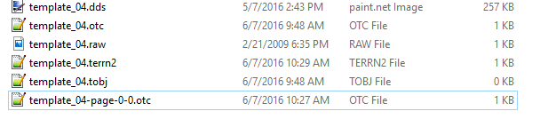

Extract the 0.3x terrain zip into that same folder. Now it should look like this:
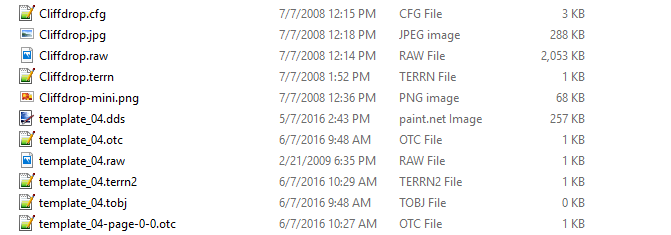

Rename the template_04 files to match your terrain's file name
**Delete the template_04.raw file first as you will get duplicate errors otherwise!**:

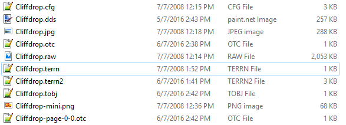

### Transfering terrain information to terrn2 terrain files
Now that you've got both the new terrn2 files and the old terrain files in the zip, I will start out by transfering the information from the .terrn file to the .terrn2 file.
If you're using Notepad++, you can open both files and have them side-by-side for easy editing:
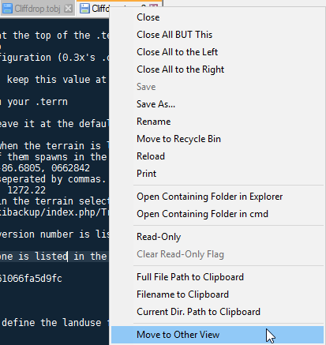
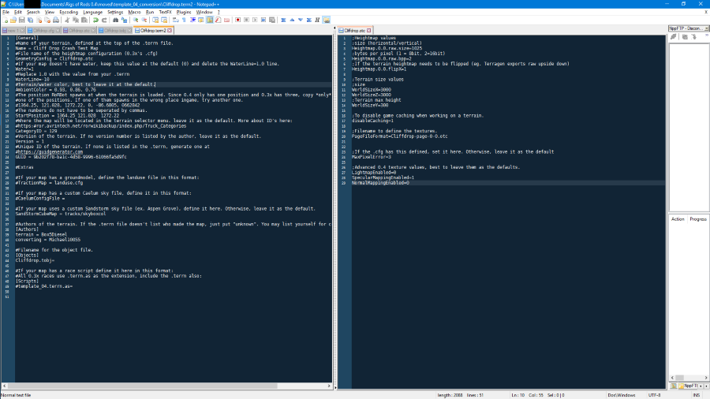
#### .terrn -> .terrn2

```
[General]
#Name of your terrain, defined at the top of the .terrn file.
Name = Cliff Drop Crash Test Map
#File name of the heightmap configuration (0.3x's .cfg)
GeometryConfig = Cliffdrop.otc
#If your map doesn't have water, keep this value at the default (0) and delete the WaterLine=1.0 line. 
Water=0
#Replace 1.0 with the value from your .terrn 
#WaterLine=1.0
#Terrain/water color, best to leave it at the default.
AmbientColor = 0.93, 0.86, 0.76
#The position RoRBot spawns at when the terrain is loaded. Since terrn2 only has one position and 0.3x has three, copy *only* 
#one of the positions. If one of them spawns in the wrong place ingame, try another one.
#1364.25, 121.028, 1272.22, 0, -86.6805, 0662842
#The numbers do not have to be seperated by commas.
StartPosition = 1364.25 121.028  1272.22
#Where the map will be located in the terrain selector menu. leave it as the default. More about ID's here:
#https://archives.rigsofrods.org/wiki/index.php/Truck_Categories
CategoryID = 129
#Version of the terrain. If no version number is listed by the author, leave it as the default.
Version = 1
#Unique ID of the terrain. If none is listed in the .terrn, generate one at
#https://guidgenerator.com
GUID = 9b202f78-ba1c-4d58-9996-61066fa5d9fc

#Extras

#If your map has a groundmodel, define the landuse file in this format:
#TractionMap = landuse.cfg

#If your map has a custom Caelum sky file, define it in this format:
#CaelumConfigFile =

#If your map uses a custom Sandstorm sky file (ex. Aspen Grove), define it here. Otherwise, leave it as the default.
SandStormCubeMap = tracks/skyboxcol

#Authors of the terrain. If the .terrn file doesn't list who made the map, just put "unknown". You may list yourself for converting the terrain.
[Authors]
terrain = Box5Diesel
converting = CuriousMike

#Filename for the object file. 
[Objects]
Cliffdrop.tobj=

#If your map has a race script define it here in this format:
#All 0.3x races use .terrn.as as the extension, include the .terrn also:
[Scripts]
#template_04.terrn.as=


```

#### .cfg -> .otc

```
;Heightmap values
;size (horizontal/vertical)
Heightmap.0.0.raw.size=1025
;bytes per pixel (1 = 8bit, 2=16bit)
Heightmap.0.0.raw.bpp=2
;If the terrain heightmap needs to be flipped (eg. Terragen exports raw upside down)
Heightmap.0.0.flipX=1

;Terrain size values
;size
WorldSizeX=3000
WorldSizeZ=3000
;Terrain max height
WorldSizeY=300

;To disable game caching when working on a terrain. 
disableCaching=1

;Filename to define the textures.
PageFileFormat=Cliffdrop-page-0-0.otc


;If the .cfg has this defined, set it here. Otherwise, leave it as the default
MaxPixelError=3

;Advanced terrn2 texture values, best to leave them as the defaults.
LightmapEnabled=0
SpecularMappingEnabled=1
NormalMappingEnabled=0     
```

#### .cfg -> *.-page-0-0.otc

```
Cliffdrop.raw = Heightmap filename 
1 = Amount of layers
worldSize = X/Z value in the .otc [Has to be the same]
Cliffdrop.dds = texture name
```
```
Cliffdrop.raw
1
; worldSize, diffusespecular, normalheight, blendmap, blendmapmode, alpha
3000     , Cliffdrop.dds     ,   Cliffdrop.dds

```

#### .terrn -> .tobj


After the configuration lines in the .terrn (usually after line 4) Copy all trees, grass and object placement lines after it except "end".

```
1385.381592, 300.027374, 736.709045, 0.000000, 0.000000, 0.000000, truckshop

1388.14, 300.974, 716.53, 0, 0, 0, truck wrecker.truck
```

We're done with the text editor now.

### Removing the terrain shininess 

If you tried the terrain in-game right now, you'd see there is a bright white spot covering the terrain where the sun is. 
Using latest version of GIMP, this can be fixed by applying a black layer mask. I recommend backing up your original texture image first.

##### Open your texture in GIMP (in this case, Cliffdrop.jpg)

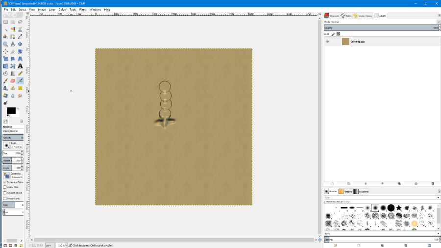

##### Go to Layer > Mask > Add Layer Mask...

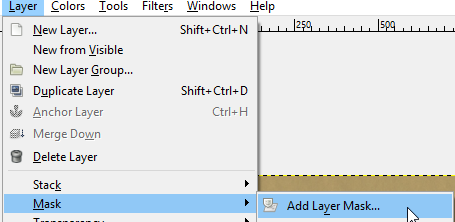

#### Select Black (full transparency) and click 'Add'

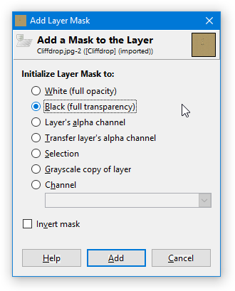

#### It should now look like this:

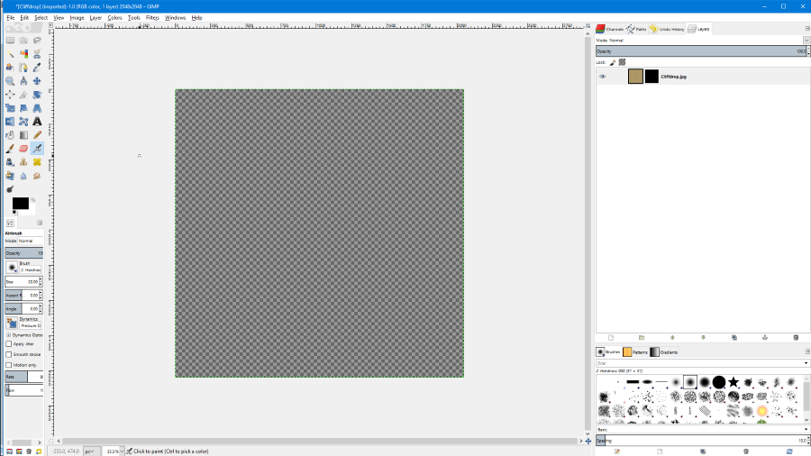

#### Go to File > Export As...

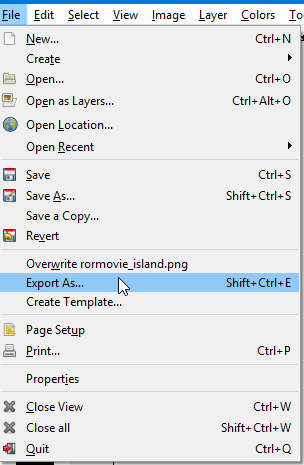

#### Set the file format to .dds

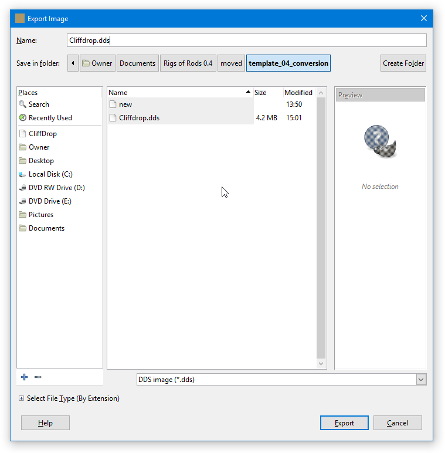

#### Set the compression type to 'BC3 / DXT5' and click 'OK'

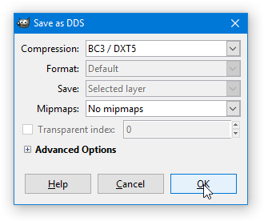

You can now close GIMP.

### Trying the terrain in-game

Now go ahead and zip all the files and place them in your `Documents\My Games\Rigs of Rods\mods` folder.

When you load the terrain in Rigs of Rods, You should now have a working terrn2 terrain!

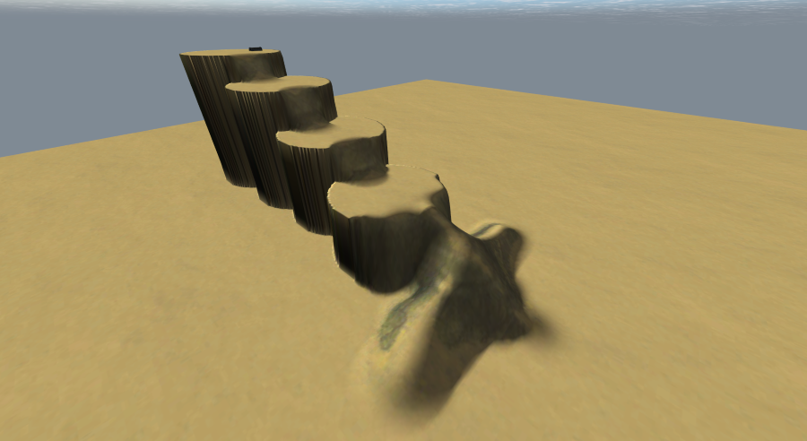

#### Download the finished terrain [here.](https://forum.rigsofrods.org/resources/cliff-drop-crash-test-map.66/)

## Removing the alpha mask 

If you want to edit an existing terrain texture or don't have the original image anymore, you can follow these steps to remove the alpha mask:

Install [paint.net](https://www.getpaint.net/) if you don't already have it.

Since paint.net does not have this functionality by default, you also need to install [dpy's Plugin Pack](https://forums.getpaint.net/topic/16643-dpys-plugin-pack-2014-05-04/).

To install the plugins, open the zip file and drag the `.dll` files inside the `dpyplugins8.1` folder into paint.net's Effects folder, usually located in `C:\Program Files\paint.net\Effects`:

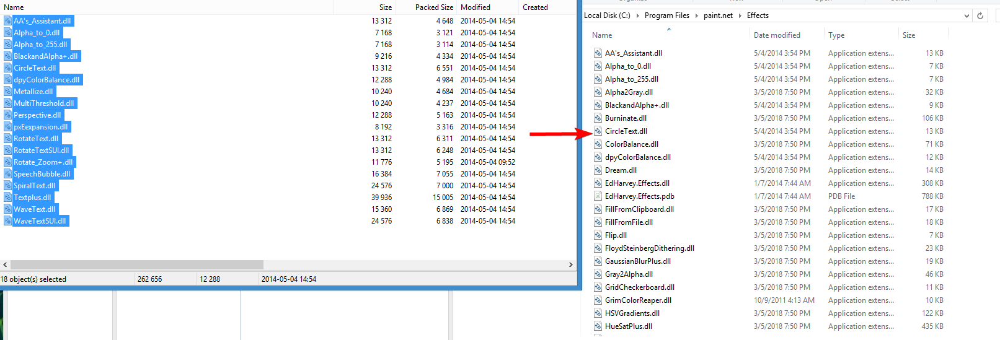

Click `Continue` when it asks for administrator permission.

Now open your `.dds` file in paint.net and navigate to `Effects -> Color -> Alpha_to_255`.

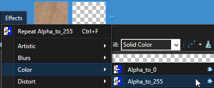

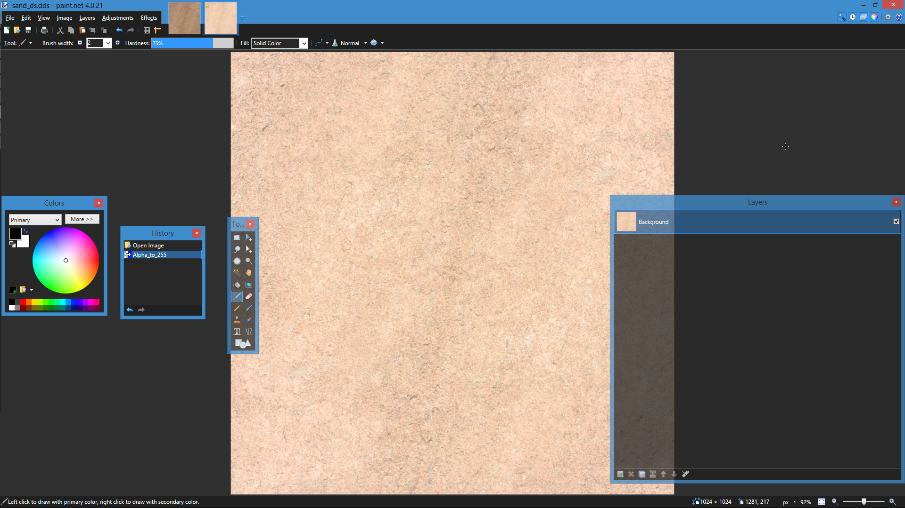

That's it! You can now edit the image and re-apply the alpha mask using the above steps once you're done.


