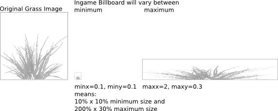
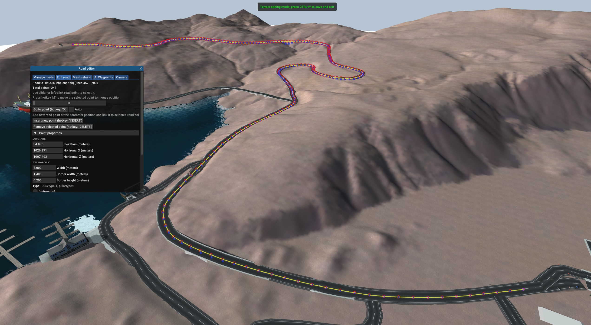
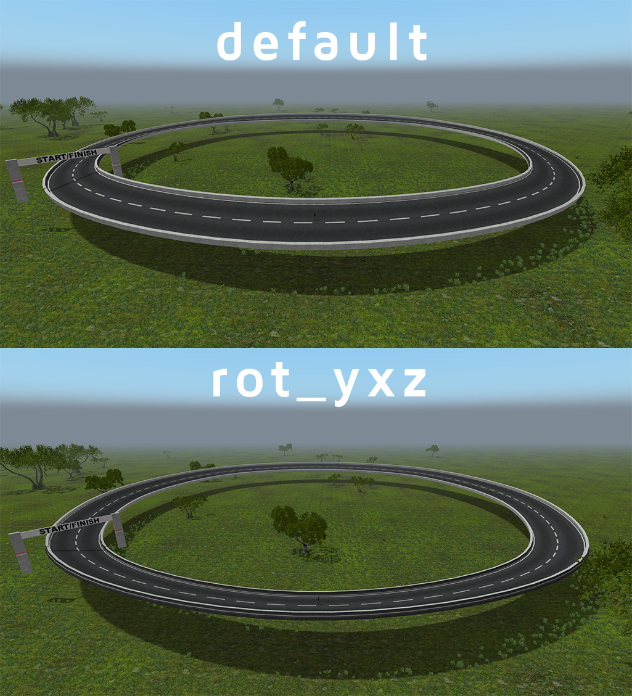

Terrain subsystem (Terrn2)
============

This is a technical reference of the 'terrn2' terrain system in Rigs of Rods introduced in version 0.4.0. This page will cover the main file types used to create a terrain:

* **.terrn2**:  Entry point, defines basic details and names of the other file types.
* **.otc**: "Ogre Terrain Config". Configures the OGRE::Terrain subsystem which RoR uses for terrain display.
* **-page-x-x.otc**: Configures the terrain's ground textures. Most terrains only have 1 page, so this file is usually named `mapname-page-0-0.otc`.
* **.tobj**: Placements for static objects/trees/grass/roads. See the [Terrain objects](#terrain-objects-tobj) section for more info.

Other optional file types used to enhance the terrain's visuals and functionality:

* **.os**: Caelum system (sky/weather) config. Visuals only. 
* **.skx**: SkyX (sky/weather) config. Visuals only. 
* **.hdx**: Hydrax config (0.4.5.0+). Water display.
* **.as**: Terrain script file, usually used for races. See [this page](scripting.md) for more info.

## Terrain 2 (.terrn2)

The entry point of a terrain. This is the only required file for a terrain to have.

Note that, there is no editor which would create these files for you. You need to copy a template and work manually from there.

Templates can be found [here](https://forum.rigsofrods.org/resources/template-raw-png-terrains.262/).

```
[General]
Name = YourMap
GeometryConfig = YourMap.otc
Water = 1
WaterLine = 6
WaterBottomLine = -150
AmbientColor = 1,1,1
CaelumConfigFile = YourMap.os
SkyXConfigFile =  YourMap.skx
HydraxConfigFile = YourMap.hdx
StartPosition = 256, 10, 256
StartRotation = 180
SandStormCubeMap = tracks/skyboxcol
Gravity = -9.81
CategoryID = 129
Version = 1
GUID = YourID
TractionMap = YourMap-landuse.cfg

[Authors]
terrain = YourName
trees&grass = OtherName
objects = YetAnotherName

[AssetPacks]
industrial-objects.assetpack=
fancy-trees.assetpack=
	
[Objects]
YourMapobj.tobj=
YourMapMoreobj.tobj=

[Scripts]
MyRaceScript.as=
 
[AI Presets]
YourMapWaypoints.json=
```

### General section 

#### Name 

<span style="color:#BD0058">(String)</span>  Name of the map, displayed in terrain selector. 

#### GeometryConfig

<span style="color:#BD0058">(FileName)</span> Name of the "Ogre Terrain Config" file used to define the terrain geometry. 

An `.otc` file is not required. You can remove the file if you are creating a meshed terrain and do not need a heightmap. 

#### Water 

<span style="color:#BD0058">(Boolean)</span> Sets if the terrain should have water.  Set to `0` to disable. 

RoR implements water as a single body covering the whole map and penetrating all objects. It's specified as "water height" attribute of the map. All areas below the specified height will be flooded.

#### WaterLine

<span style="color:#BD0058">(Real)</span> Sets the height of the water surface. Higher values = more terrain is flooded. Unused if water is disabled. 

You can change the water level in-game using the console command `waterlevel`. 

#### WaterBottomLine

<span style="color:#BD0058">(Real)</span> Sets the height of the black ground plane at the bottom of the ocean. This value should be negative. 

#### AmbientColor

!!! note 
	Unused as of RoR version 2022.04+

<span style="color:#BD0058">(RGB, float notation)</span> Sets the color of the ambient light using RGB values on a scale of 0 to 1. 

#### CaelumConfigFile

<span style="color:#BD0058">(FileName)</span> Name of a custom Caelum config file, used for the sky/weather/sun . Remove this line to use the default sky config. 

[Example `.os` file](https://github.com/RigsOfRods/rigs-of-rods/blob/master/resources/caelum/RoRSkies.os)

#### SkyXConfigFile

<span style="color:#BD0058">(FileName)</span> Same as the Caelum sky config, except for the SkyX sky type. Remove this line to use the default sky config. 

[Example `.skx` file](https://github.com/RigsOfRods/rigs-of-rods/blob/master/resources/SkyX/SkyXDefault.skx)

#### HydraxConfigFile

<span style="color:#BD0058">(FileName)</span> Name of a custom Hydrax water config file. Remove this line to use the default Hydrax config. 

[Example `.hdx` file](https://github.com/RigsOfRods/rigs-of-rods/blob/master/resources/hydrax/HydraxDefault.hdx)

#### StartPosition

<span style="color:#BD0058">(XYZ position)</span> Sets the spawn position of the player character. 

To get the position values:

- Open RoR and load your terrain. 
- Move the character where you want to spawn.
- Press the `h` key. This will log the current position to `RoR.log`.
- Close RoR and browse to `Documents\My Games\Rigs of Rods\logs` (or `~/.rigsofrods/logs` on Linux) and open the `RoR.log` file with a text editor. 
- Scroll to the bottom of the file. You should find a line similar to this:

`Position: 885.289, 113.769, 586.640, 0.0, 0.0, 0.0`

- Copy the first three position lines and paste them in the StartPosition line. Example:

`StartPosition = 885.289, 113.769, 586.640`

#### StartRotation

<span style="color:#BD0058">(degrees)</span> Sets the spawn rotation of the player character. 

By default the spawn rotation is determined by the presence of a predefined vehicle. For example, [NeoQueretaro](https://forum.rigsofrods.org/resources/neoqueretaro.246/) features a predefined Scania Wrecker.
If this vehicle is not installed the character spawns facing the gas station, otherwise it will spawn facing the opposite direction (towards the towing garage). 

#### SandStormCubeMap

<span style="color:#BD0058">(String)</span> Name of cubemap used for the Sandstorm sky type. Leave this set to `tracks/skyboxcol` to use the default cubemap. 

#### Gravity 

<span style="color:#BD0058">(Real)</span> Sets the terrain gravity. Earth gravity is `-9.81`. For moon gravity set to `-1.62`.

You can change the gravity in-game using the console command `gravity`.

#### CategoryID

<span style="color:#BD0058">(Integer)</span> The category ID used in the terrain selector. Valid values:

129 = Addon Terrains

 5000 = Official Terrains
 
#### Version

<span style="color:#BD0058">(Integer)</span> The version number of the terrain. 
 
####  GUID 

<span style="color:#BD0058">(GUID string)</span> The GUID of the terrain. It is highly recommended you set a GUID. You can generate one [here](https://guidgenerator.com/).
 
#### TractionMap

<span style="color:#BD0058">(FileName)</span> Name of the traction config. Used on terrains with different ground types (mud, dirt, snow, etc). Remove this line if you don't have a landuse file. 
 
### Authors section 

<span style="color:#BD0058">("String = String" pairs)</span> Sets the names of the users who created the terrain, appears in the terrain selector. You can add multiple lines. 

### AssetPacks section

Sets the names of asset packs, ending with `=`. 

Asset packs are separately distributed zip files that can include meshes/textures/object files/etc to be used by terrains or vehicles.

An asset pack zip file **MUST** include a text file with `.assetpack` extension containing file info:

```
assetpack_name "Industrial objects"
assetpack_description "Example asset pack"
```

### Objects section 

Sets the names of teach terrain object (tobj) file, ending with `=`. You can have multiple object files (eg. separate file for trees/grass and another for buildings).
 
### Scripts section 

Sets the names of AngelScript files associated with the map,, ending with `=`. Mostly used for races, see the [Race script generator](race-generator.md) page for more info.

### AI Presets section

Sets the name of JSON files containing waypoints for use with the [vehicle AI](../gameplay/vehicle-ai.md), ending with `=`.

## Ogre Terrain Config (.otc)

This file defines the terrain properties. Format is INI without sections, `Key=Value` pairs, NO SPACES AROUND `=`!

Boolean values can be: 1, true, yes | 0, false, no

RoR's primary mechanism for shaping a terrain are heightmaps.  8-bit or 16-bit unsigned integer RAW and PNG images are supported for the heightmap.

To use the heightmap in a terrain, you must configure it in a `.otc` and `-page-x-x.otc` file.

If you are interested in creating a heightmap, we recommend taking a look at L3DT. 
See [this page](l3dt-map-making.md) for a complete tutorial on getting a L3DT terrain into RoR.

```
PagesX=0
PagesZ=0

PageSize=1025

PageFileFormat=YourMap-{X}-{Z}.otc

Heightmap.0.0.raw.size=1025
Heightmap.0.0.raw.bpp=2
Heightmap.0.0.flipX=0
Heightmap.0.0.flipY=0

Flat=0

WorldSizeX=1024
WorldSizeZ=1024
WorldSizeY=100

LayerBlendMapSize=1024

disableCaching=1
 
## =============
## optimizations
## =============

minBatchSize=33
maxBatchSize=65

LightmapEnabled=0
SpecularMappingEnabled=1
NormalMappingEnabled=1

ParallaxMappingEnabled=0
GlobalColourMapEnabled=0
ReceiveDynamicShadowsDepth=0

CompositeMapSize=1024
CompositeMapDistance=4000
 
SkirtSize=30
 
LightMapSize=1024
 
CastsDynamicShadows=false
 
MaxPixelError=3

DebugBlendMaps=false
```

### PagesX-Z

<span style="color:#BD0058">(Integer)</span>  The number of terrain pages in X and Z (logical Y) direction. Most terrains only have one page, so keep these set to `0`. 

### PageSize

<span style="color:#BD0058">(Integer)</span> The size of a page of tiles (in vertices). Must be (2^n)+1.

### PageFileFormat

<span style="color:#BD0058">(FileName)</span> The name of the `-page-x-x.otc` file which defines the terrain textures. 

### RAW heightmap values

The following values are only used if the terrain is using a RAW heightmap image. These lines can be removed you're using a PNG image.

####  Heightmap.0.0.raw.size

<span style="color:#BD0058">(Integer)</span> The size of the heightmap image. Must be correct or else RoR will crash! 

#### Heightmap.0.0.raw.bpp

<span style="color:#BD0058">(Integer)</span> The bit depth of the RAW file. Most heightmaps are 16-bit, so set this to `2` (`1` = 8bit, `2`=16bit).

#### Heightmap.0.0.flip

<span style="color:#BD0058">(Integer)</span> If the terrain heightmap needs to be flipped on the X or Y axis (eg. Terragen exports RAW upside down).

### Flat 

<span style="color:#BD0058">(Boolean)</span> If set to `1`, no heightmap will be loaded. 

### WorldSizeX-Z

<span style="color:#BD0058">(Integer)</span> The world size of the terrain, in meters.
As this setting is independent on heightmap resolution, you can use these values to scale the terrain. 
For example, using a large heightmap with small world will yield in high-detail geometry.

### WorldSizeY

<span style="color:#BD0058">(Integer)</span> The maximum height of the terrain. Set to `0` to make the heightmap flat. 

### LayerBlendMapSize

<span style="color:#BD0058">(Integer)</span> Sets the default size of blend maps for a new terrain. This is the resolution of each blending layer for a new terrain.

Recommended to keep this value at the default (`1024`). 

### disableCaching

<span style="color:#BD0058">(Boolean)</span> By default, RoR will cache the terrain heightmap and textures to a `.mapbin` file inside the `cache` folder for faster loading times.

When creating a terrain, this value should be set to `1` to stop the game from caching the data, which will prevent you from making changes.

!!! note 
	This does not cache the static objects on the terrain.
	
### Optimizations 

The following values are advanced options to optimize your terrain heightmap. It is recommended to keep most of these values at the default.

#### minBatchSize

<span style="color:#BD0058">(Integer)</span>  Minimum and maximum batch sizes (along one edge) in vertices; must be 2^n+1. 
The terrain will be divided into hierarchical tiles, and these are sizes of one tile in vertices (at any LOD).

#### LightmapEnabled

<span style="color:#BD0058">(Boolean)</span> Whether to support a light map over the terrain in the shader, if it's present.

!!! note 
	While the terrain shader supports a lightmap, RoR currently does not. 

#### NormalMappingEnabled

<span style="color:#BD0058">(Boolean)</span> Whether to support normal mapping per layer in the shader.

#### SpecularMappingEnabled

<span style="color:#BD0058">(Boolean)</span> Whether to support specular mapping per layer in the shader.

!!! note "Important"
	Keep this enabled, otherwise  the specular map in the texture files won't be respected and your terrain will be ridiculously shiny.
	
#### ParallaxMappingEnabled

<span style="color:#BD0058">(Boolean)</span> Whether to support parallax mapping per layer in the shader.

#### GlobalColourMapEnabled

<span style="color:#BD0058">(Boolean)</span> Whether to support a global colour map over the terrain in the shader, if it's present.

#### ReceiveDynamicShadowsDepth

<span style="color:#BD0058">(Boolean)</span> Whether to use depth shadows. Disabled by default. 

#### CompositeMapSize

<span style="color:#BD0058">(Integer)</span> Sets the default size of composite maps for a new terrain.

#### CompositeMapDistance

<span style="color:#BD0058">(Integer)</span> Sets the distance at which to start using a composite map if present.

#### SkirtSize

<span style="color:#BD0058">(Integer)</span> The default size of 'skirts' used to hide terrain cracks.

#### LightMapSize

<span style="color:#BD0058">(Integer)</span> Sets the default size of lightmaps for a new terrain.

#### CastsDynamicShadows

<span style="color:#BD0058">(Boolean)</span> Whether the terrain will be able to cast shadows.

#### MaxPixelError

<span style="color:#BD0058">(Integer)</span>  Sets the maximum screen pixel error that should  be allowed when rendering.

!!! note 
	This may cause the terrain to not match the collision, see [this GitHub issue](https://github.com/RigsOfRods/rigs-of-rods/issues/1131#issuecomment-502419005) for more info. 

#### DebugBlendMaps

<span style="color:#BD0058">(Boolean)</span> Dumps the blend maps to files named `blendmap_layer_X.png`.

## Ogre Terrain Page Config (-page-x-x.otc)

The terrain consists of pages. Number of pages is defined by PagesX and PagesZ (described above). There must be at least 1 page.

For each page, there must be an .otc file. File name format is set by PageFileFormat (described above). If there's just one page, it'll be named like `MyMap-page-0-0.otc`

The page-config file specifies a heightmap to use for the page and terrain texture layers.

The system is designed for texturing by several tiling textures combined via built-in texture blending (aka texture splatting).
Other built-in effects: [normal mapping](http://wiki.polycount.com/wiki/Normal_map), specular mapping, [parallax mapping](http://wiki.polycount.com/wiki/Parallax_Map).

```
31-heightmap.png
6
; Params: [worldSize], [diffusespecular], [normalheight], [blendmap], [blendmapmode], [alpha]
; The ground layer; covers the entire terrain.
3.3  , 31-gravel_diffusespecular.dds , 31-gravel_normalheight.dds
; Other layers:
6    , 31-rock_diffusespecular.dds   , 31-rock_normalheight.dds   , 31-surfaces2.png, B, 0.9
5    , 31-sand_diffusespecular.dds   , 31-sand_normalheight.dds   , 31-surfaces2.png, G, 0.9
4    , 31-grass_diffusespecular.dds  , 31-grass_normalheight.dds  , 31-surfaces1.png, G, 0.8
3    , 31-asphalt_diffusespecular.dds, 31-asphalt_normalheight.dds, 31-surfaces1.png, R, 0.95
1024 , 31-shadow_diffusespecular.dds , 31-shadow_normalheight.dds , 31-shadow.png   , R, 0.8
```

### Format overview

-   **Line1:** Heightmap <span style="color:#BD0058">(file name)</span>. For example: my\_heightmap.png
-   **Line2:** Number of layers <span style="color:#BD0058">(integral number in range 1-6)</span> The OgreTerrain component has a limit of 6 layers (5 blendmaps)
-   **Line3 and further:** Layer definitions (see below)

### Layer definitions

-   Lines starting with semicolon ''' ' ; ' ''' are comments
-   Layer definition line has these values, separated by ''' ' , ' ''' comma :
    -   **size** <span style="color:#BD0058">(real number 1-2048)</span> The target size of the texture on the terrain
    -   **diffusespecular** <span style="color:#BD0058">(file name)</span> The filename of the texture with the following format: RGB=Diffuse Color, A=Specular map
    -   **normalheight** <span style="color:#BD0058">(file name)</span> The filename of the texture with the following format: RGB=Normal map, A=Heightmap for parallax mapping
    -   **blendmap** <span style="color:#BD0058">(file name)</span> Blendmap texture file name
    -   **blendmapmode** <span style="color:#BD0058">(One capital letter: R / G / B / A)</span> Which color channel of the blendmap use for blending this layer.
    -   **opacity** <span style="color:#BD0058">(Real number 0-1)</span> Setting to 0 makes layer invisible.

Layer at position \#0 is a ground layer - it covers the entire page and thus needs no **blendmap**. It only accepts first 3 arguments: \[size\] \[diffusespecular\] \[normalheight\]

Layers \#1 - \#5 only cover areas which have a corresponding color in the **blendmap**.

## Terrain Objects (.tobj)

Defines object or vehicle placement on terrain. 

### Static objects 

Static objects are referred to by its object definition (`.odef`) file name. This file contains names of the visual meshes 
along with collision mesh and associated friction settings.

Static objects may also trigger special events. A "truck shop" building will, when entered, will display a vehicle menu. 
A "load spawner" deck will bring up a menu with trailers and loads. And so on.

```
// x        y        z    rx  ry rz odefname
875.549, 67.6607, 1155.26, 0, 0, 0, truckshop
```

#### XYZ position

The first three values is the XYZ position of the object. The easiest way to get these values is by using the built-in object editor, see [this page](editing-terrain-objects.md) for more info.

#### Rotation

The next 3 values is the object's rotation. 
As the axises between modelling programs such as  Blender and RoR are different, 
you may notice most terrain objects are rotated 90 degrees when displayed in a model viewer.

In RoR x is front-back, y is up-down, z is side to side

In Blender x is side to side, z is up-down, y is front-back

#### Odef name 

The name of the `.odef` file without the file extension. See the [Object file format](object-format.md) page for more info.

### Special objects 

#### Overview map icons

Static objects can also have extra values after the odef name:

```
125.122070, 101.198730, 844.824219, 0.000000, 0.000000, 0.000000, a1da0UID-smallhouse hotel Elk
```

The `hotel Elk` line defines the icon and name of the object shown on the overview (TAB) map.


`hotel` is the name of the structure, it also defines the icon type. Valid types:

```
station
hotel
village
observatory
farm
ship
```

`Elk` is the name of the structure itself. 

!!! note
	The icon type and structure names are reversed in-game. `hotel Elk` appears as `Elk hotel` on the overview map.
	If no icons appear on the overview map, make sure "declutter overview map" is disabled under Settings -> Graphics.
	
#### Grid 

Allows you to add a grid, as shown on the default Simple Terrain:


```
// grid x y z 
grid 512, 0.1, 512
```

### Vehicles and dynamic objects 

Node/Beam structures (actors) such as trucks, loads, trailers, and more can be placed on a terrain. These will only appear in single player, they will not spawn in multiplayer.

```
1191.162109, 35.034180, 930.908203, 0.000000, 0.000000, 0.000000, truck wrecker.truck
1221.191406, 35.034180, 930.908203, 0.000000, 0.000000, 0.000000, load crate.load
1185.191406, 35.034180, 827.042773, 0.000000, -144.000000, 0.000000, truck an-12.airplane
332.380859, 33.032227, 1009.191406, 0.000000, 23.000000, 0.000000, boat smit.boat
```

You can also have stationary or semi-stationary objects like cranes, hall doors, bridges or wind turbines also made from dynamic physical model, 
just like vehicles, except they're completely or partially fixed to the ground.

```
1892.0000, 79.0000, 2241.0000, 0, 200.0000, 0, truck2 c821aUID_MMWT92.fixed
```

#### Type

After the position and rotation values is the vehicle type. Valid values:

```
truck
truck2 
load 
boat
machine
```

The `truck` value does not take the height position (Y value) into account, the actor will always spawn at terrain height. 
`truck2` does use the height value, this is done for backwards compatibility.

#### File name 

The file name of the actor. This usually ends with `.truck`, but could also be `.load`, `.trailer`, `.fixed` etc as well.

### Grass

This enables you to add grass to the terrain. The arguments are (all on one line!):

| Keyword           | Description                                                                                                                         | Recommended Values                        |
|-------------------|-------------------------------------------------------------------------------------------------------------------------------------|-------------------------------------------|
| grass             | Must precede other grass-related keywords                                                                                           |
| Grass Range       | Determines grass visibility range in meters                                                                                         | 80                                        |
| Sway Speed        | The rate at which the grass sways in simulated wind                                                                                 | 0.5                                       |
| Sway Length       | Length of sway displacement                                                                                                         | 0.05                                      |
| Sway Distribution | How much of the wind wave is distributed                                                                                            | 10                                        |
| Density           | Density of grass distribution. Maximum of 3.5                                                                                       | 0.3                                       |
| MinX/Y<br> MaxX/Y | Determine size of grass: 
| Fade Type         | Adjusts method of transition (via distance):<br>0 - FADETECH\_GROW = Grass will grow out of the ground, looks good with grass that has ground color<br>1 - FADETECH\_ALPHAGROW = Like 0, but with alpha blending<br>2 - FADETECH\_ALPHA = Alpha blends in/out | 0 |
| Min-Y<br>Max-Y    | Minimum/maximum appearance level. 0 for no minimum/maximum.<br>Example: `0, 10` for seagrass under the water level 10 or `10, 0` for grass above the sea level (if the sea level is 10) 
| Material          | Material file for grass appearance                                                                                                  | Listed in `/data/paged/grass.material`    |
| Color Map         | Determines grass color. Grass image *must* be gray scale! Use *none* to disable                                                     | Use terrain texture to match ground color |
| Density Map       | A gray scale image that determines density. Darker shades refer to less grass, while white refers to most grass. *None* to disable. |

For example 7 grass types plus sea grass (water level is 10):

```
// format: grass range, SwaySpeed, SwayLength, SwayDistribution, Density, minx, miny, maxx, maxy, fadetype, minY, maxY, material colormap densitymap 
grass 200, 0.5, 0.05, 10, 0.1, 0.2, 0.2, 1, 1, 1, 0, 9, seaweed none none
grass 200, 0.5, 0.05, 10, 0.3, 0.2, 0.2, 1, 1, 1, 10, 0, grass1 aspen.jpg aspen_grass_density.png
grass 200, 0.5, 0.05, 10, 0.3, 0.2, 0.2, 1, 1, 1, 10, 0, grass2 aspen.jpg aspen_grass_density.png
grass 200, 0.5, 0.05, 10, 0.3, 0.2, 0.2, 1, 1, 1, 10, 0, grass3 aspen.jpg aspen_grass_density.png
grass 200, 0.5, 0.05, 10, 0.3, 0.2, 0.2, 1, 1, 1, 10, 0, grass4 aspen.jpg aspen_grass_density.png
grass 200, 0.5, 0.05, 10, 0.3, 0.2, 0.2, 1, 1, 1, 10, 0, grass5 aspen.jpg aspen_grass_density.png
grass 200, 0.5, 0.05, 10, 0.3, 0.2, 0.2, 1, 1, 1, 10, 0, grass6 aspen.jpg aspen_grass_density.png
grass 200, 0.5, 0.05, 10, 3.3, 0.2, 0.2, 1, 1, 1, 10, 0, grass7 aspen.jpg aspen_grass_density.png
```

### Trees

```
//trees yawFrom, yawTo, scaleFrom, scaleTo, highDensity, distance1, distance2, meshName colormap densitymap 
trees 0, 360, 0.1, 0.12, 2, 60, 3000, fir05_30.mesh aspen-test.dds aspen_grass_density2.png 
trees 0, 360, 1, 3, 1, 60, 3000, tree.mesh aspen-test.dds aspen_grass_density2.png 
trees 0, 360, 1, 2, 1, 60, 3000, tree2.mesh aspen-test.dds aspen_grass_density2.png 
trees 0, 360, 0.1, 0.13, 1, 60, 3000, fir06_30.mesh aspen-test.dds aspen_grass_density2.png 
trees 0, 360, 0.1, 0.13, 1, 60, 3000, fir14_25.mesh aspen-test.dds aspen_grass_density2.png 
trees 0, 360, 0.1, 0.2, 3, 60, 3000, plant1.mesh aspen-test.dds aspen_grass_density.png 
trees 0, 360, 0.1, 0.2, 3, 60, 3000, plant2.mesh aspen-test.dds aspen_grass_density2.png
```
    
arguments:

-   yawFrom-yawTo: that is the range which the game will choose to randomly rotate the trees
-   scaleFrom-scaleTo: scaling range that the game uses randomly. 0=0%, 1=100%
-   highDensity : density factor: 0=0, 1=not much, 2=more, etc
-   distance1: distance to which the game should use the mesh instead of the billboard. This is performance critical, use low values if possible!
-   distance2: distance to which the billboard should be drawn (max sight range)
-   meshName : the mesh to use
-   colorMap : used to colorize the mesh. if your mesh is too dark check the colormap! Can be set to none to disable it.
-   densityMap: texture that determines where and how much trees are used. white = 100%, black = 0%

since 0.38.62 it has two more arguments:

-   grid spacing (0=default):
    -   negative number: set the detail level of the used grid
    -   positive number: use new tree distribution scheme: one tree in the center of a grid cell
-   collision mesh: .mesh that will be used for the collision engine

### Procedural Roads

There are two ways to add roads. One way is just by placing meshes like any other object:

```
1026.371338, 34.086056, 1007.492920, 0.000000, -144.000000, 0.000000, road
1018.273438, 34.086056, 1013.378662, 0.000000, -144.000000, 0.000000, road
```

The roads will be joined together in-game. 

The other (preferred) method is to use procedural roads:

```
begin_procedural_roads
//position x,y,z rotation rx,ry,rz, width, border width, border height, type
           0,0,0,         0,0,0,    10.0,  0,            0,             flat
           0,0,0,         0,0,0,    10.0,  0.25,         1.0,           both
end_procedural_roads
```

#### Road editor

An interactive road editor was introduced in version 2022.12.  The [2022.12 release trailer](https://youtu.be/OagiMx2zwTA) features a demo of the initial version. 

In the current stable release (2022.12) the road editor is accessed by opening the console (Top Menubar -> `Tools` -> `Show console` or press the tilde key), type `loadscript road_editor.as` and press Enter.

Starting with 2025.03 RC1, the road editor is now available as a gadget (a self-contained script). 
Gadgets are loaded through the Top Menubar -> `Tools` -> `Browse gadgets...`,  from here the road editor can be selected.



#### Road types

-   `flat`
-   `left` - Only left border
-   `right` - Only right border
-   `both` - Both borders
-   `bridge`
-   `bridge_no_pillars`
-   `monorail`
-   `monorail2`

As of version 0.4.0.7 all roads are automatically converted into procedural roads. 

#### Hints 

The format of procedural roads is: 

`//position x,y,z rotation rx,ry,rz, width, border width, border height, type`

Playing with the "border width" and "border height" settings, you can make ie. sidewalks or sound barriers. 

You can adjust the width of the road by changing the "width" value. This allows you to make 4-lane motorways. Normal road width is `10.0`.

If you're making a long straight road, you only need the first and the last object, example:
```
1128.017578, 60.892349, 1728.071899, 0.000000, -136.000000, 2.000000,10.0,  0,            0,             flat
1120.828613, 61.241344, 1735.014282, 0.000000, -136.000000, 2.000000,10.0,  0,            0,             flat -
1113.639648, 61.590340, 1741.956665, 0.000000, -136.000000, 2.000000,10.0,  0,            0,             flat   \
1106.450684, 61.939335, 1748.899048, 0.000000, -136.000000, 2.000000,10.0,  0,            0,             flat    | you don't need these
1099.261719, 62.288330, 1755.841431, 0.000000, -136.000000, 2.000000,10.0,  0,            0,             flat   /
1092.072754, 62.637325, 1762.783813, 0.000000, -136.000000, 2.000000,10.0,  0,            0,             flat -
1084.883789, 62.986320, 1769.726196, 0.000000, -136.000000, 2.000000,10.0,  0,            0,             flat
```

You need only the first and the last object, the rest of the road will be generated between these two objects. 
This makes the terrain file smaller but you still get the same result. 
Please note that the rotation of the road blocks must be the same, otherwise the loading times will be much longer.

#### rot_yxz

A self-contained line that can be placed anywhere in the terrain object file. When used it changes how road roll angles are processed, making it possible to create correctly banked roads.

Example usage from the [Stunt Rally track pack](https://forum.rigsofrods.org/threads/stunt-rally-130-tracks-converted-for-ror.4205/) (TestC1-Circle):



### set_default_rendering_distance

This directive sets the rendering distance of all objects that are defined after it, useful for optimization.

```
; limit distance to 500 meters
set_default_rendering_distance 500

2490, 0.1, 2164, 0, 0, 0, truckshop sale Mainbase-Truck
2490, 0.1, 2183, 0, 0, 0, myhangar2 repair Mainbase
2490, -0.1, 2253, 0, -90, 0, hangar sale Mainbase-Aircraft
2349, 0, 2105, 0, 0, 0, load-spawner sale Mainbase-Cargo
2507, 0, 2162, 0, 90, 0, f4afUID-lab

; reset to infinite distance
set_default_rendering_distance 0
```