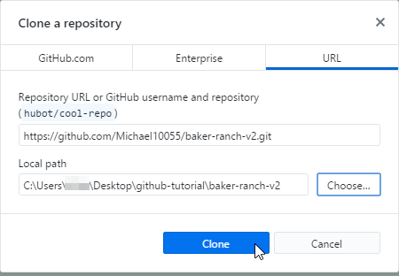

How to contribute to community projects using GitHub
============


## Preparation

This tutorial assumes you already have:
* A registered [GitHub Account](https://github.com/join)
* [GitHub Desktop](https://desktop.github.com/) downloaded and installed
* You are logged into GitHub
  
## Forking the repository

Go to the [Rigs of Rods community website on GitHub](https://github.com/RigsOfRods-Community). Click on the project you want to work on (`baker-ranch-v2` in this example). 
  


You will now see the projects repository. The repository contains all assets bound to this project (e.g. terrain configuration files, textures and meshes for maps).


Click the `Fork` button at the top right


The repository should now fork to your profile. Once it's done, you should be redirected to your new fork:


Verify you are viewing your own repository (indicated by `your username`/`project name` with `forked from ...` subtitle)

## Cloning your local repository

Click on `Clone or download` then `Open in Desktop`:
  


After you click on `Open in Desktop` a dialog will appear. This dialog will be different depending on the web browser you are using. 

Make sure `GitHubDesktop.exe` is highlighted and hit `Open link`.

If you have no option here you need to install GitHub Desktop (see [Preparation](#preparation)). 
  


GitHub Desktop will open and ask you where it should put the files so you can work on them. 

Select the place where you'd like to have them (Desktop in this example). 



Click `Clone` then wait for the download to finish. 


After the download is finished, open the project's folder by clicking `Repository` -> `Show in Explorer`
  


## Making changes

In this folder you work on the project like you would usually do.
 
## Committing to your local repository

This step assumes you are done with your changes and made sure they work and are bugfree.

So far all changes are offline on your computer. To contribute to the project you have to upload (commit) them.

1. Open GitHub Desktop. It will show the changes you have made. Check/uncheck the changed files you want to upload in one commit (it's good practice to do one commit per change. If you don't understand what this means yet don't worry, it will come with time).

2. Enter a commit message explaining your change(s). If your changes are big or you want to add a comment use the description field for additional information. This is usually not necessary.

3. Click on `Commit to master` 


Your changes are now saved into the git subsystem but they are still offline...


## Uploading to GitHub

You'll see a confirmation that your commit has been saved. Notice your changes are now in the `History` tab.

To upload your changes click on `Push origin`:


## Creating a pull request

Now your changes are online but they are not in the central repository just yet. 

As of now they are only stored in your personal repository. 

To contribute to the project they have to be "merged" into the central repository.

Open your personal repository on GitHub in your browser by clicking `Repository` -> `View on GitHub`.

Notice it's telling you your branch is `x commits ahead of y`. This means you have changes which are not in the central repository yet.

3. Click on `New pull request`
  


On the next page you can review your changes again and start a pull request. Click `Create pull request`
  


1. Enter a description for your pull request
2. Since pull request can contain multiple commits and changes you may want to deliver more information in the description section (optional) 
3. Click "Create pull request"
  


You just created a pull request. 

Your changes will be reviewed by the project's admins to ensure the overall quality of the project and to prevent trolls.
You can review the status of your request at your pull request page. 

* open (= pending)
* merged (= merged into central repository) 
* closed (= not accepted)

Often there will be a discussion about your changes. Admins will inform you about bugs, things they don't like etc. You should listen to them and adapt your changes accordingly.

If someone replied to your pull request you will be notified by the GitHub interface. The GitHub icon at the top right of the page will have a blue dot to inform you about replies (similar to Facebook or Google+).
  
## Keeping your local repository updated

To keep your local repository updated with the main repository:

First, you'll need to get the url for the main repository. 

To do this, go to the repository you forked from (In this example `RigsOfRods-Community/baker-ranch-v2`) then click `Clone or download`.

The url that appears under `Clone with HTTPS` is the url. Save this as you'll need it later.


In GitHub Desktop, click `Repository` -> `Open in Command Prompt`


A Command Prompt window will open. 

Type these commands one at a time:

```
git remote add upstream url

git fetch upstream

git merge upstream/master --no-commit
```

`url` being the url you found earlier. Example: `https://github.com/RigsOfRods-Community/baker-ranch-v2.git`

The `master` branch name might be different depending on the repository. For example the Community Map's default branch is `Default`.

Then in GitHub Desktop click `Push to origin`. After it's done, when you check your repository on GitHub it should now say `This branch is even with RigsOfRods-Community:master.`:


