Visual editors
============

## Introduction

While it is possible to create a node/beam completely using a text editor, it is not recommended as an n/b can get quite complex. 

These are programs that help you visualize and edit a node/beam.

## Truck file template

To help you get started with creating a new node/beam, you can download this truck file template which contains all the required sections.

[Blank Truck File](https://forum.rigsofrods.org/threads/blank-truck-file.8/)

## Blender

As of November 2018, Blender supports creating/editing Node/Beam structures with a plugin created by Ulteq.

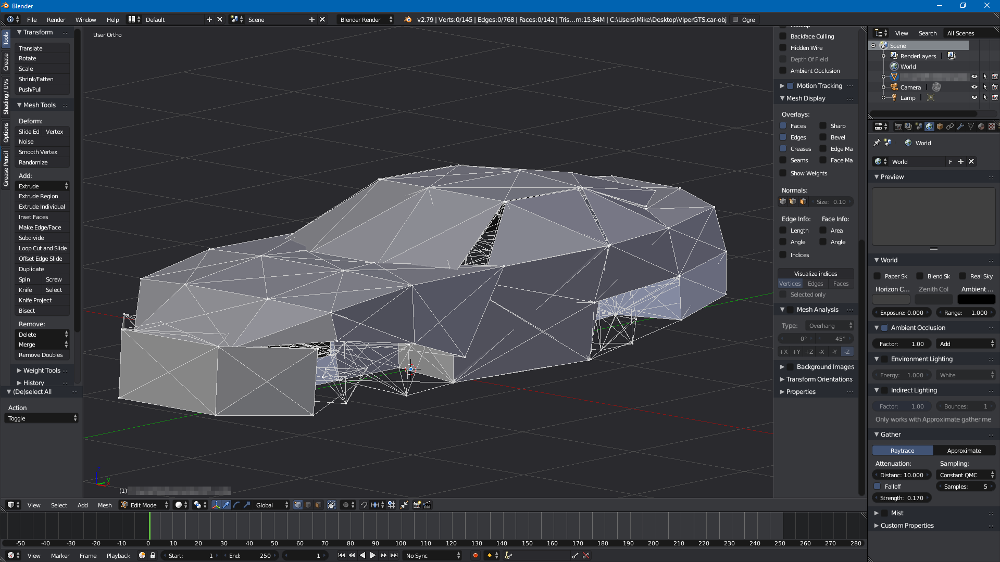

Features:

- Full vertex group support

- Automatic column alignment

- Sophisticated vertex position rounding

- Full preservation of the original truck file

- Automatic beam sorting based on the vertex groups

- All node, beam and cab options are preserved during import / export

- All `set_node_defaults`, `set_beam_defaults` and `set_beam_defaults_scale` entries are preserved


### Download

First, download the correct version of the plugins from the [Repository](https://forum.rigsofrods.org/resources/blender-n-b-import-export-plugin.25/). 

For Blender 2.79, download `blender_NB_plugin_2.79.zip`.

For Blender 2.8 and newer, download `blender_NB_plugin_2.8.zip`.

**Do not extract.**

### Installation

#### 2.79

Go to `File` -> `User Preferences`:


Click `Add-ons` -> `Install from File`:


Select the `blender_NB_plugin_2.79.zip` file you downloaded earlier. 

Type "RoR" into the search bar and both add-ons should appear:

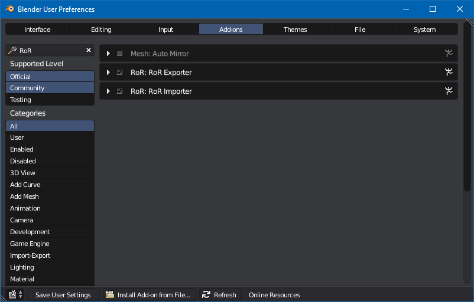

Once both plug-ins are enabled by clicking the checkbox, select `Save User Settings`. 

You can now close the `User Preferences` window.

The plugins are now available in `File` -> `Import` and `Export` -> `Truck (.truck)`.

#### 2.8 and newer

Go to `Edit` -> `Preferences`:

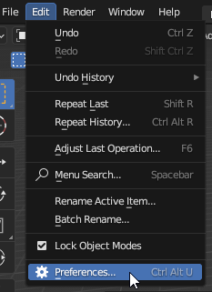

Click `Add-ons` -> `Install`:

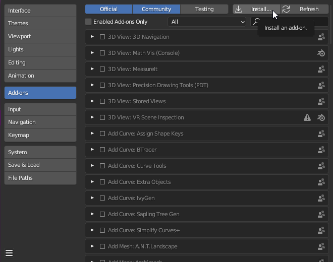

Select the `blender_NB_plugin_2.8.zip` file you downloaded earlier. 

Type "RoR" into the search bar and both add-ons should appear:

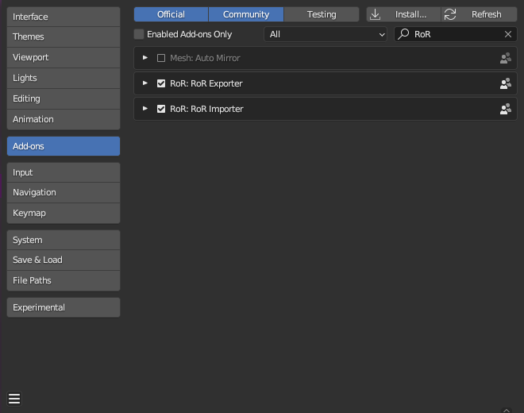

Enable both `RoR Exporter` and `RoR Importer` addons, then close the Preferences window. 

The plugins are now available in `File` -> `Import` and `Export` -> `Truck (.truck)`.

### Node visualization

To view the node numbers, follow the steps below for your Blender version.

#### 2.79

By default, the plugin will enable Blender's debug mode which provides node ID visualization, however they are usually difficult to read. 

To fix this, download [this plugin by GitHub user zeffii](https://gist.github.com/zeffii/9451340) ([mirror](../download/view3d_idx_view.py)) 

Install it following the above instructions:


To enable it, go to the top right and find the little plus icon, or press `N` to open it:


While in edit mode, open the `Mesh Display` menu and select `Visualize indices`:

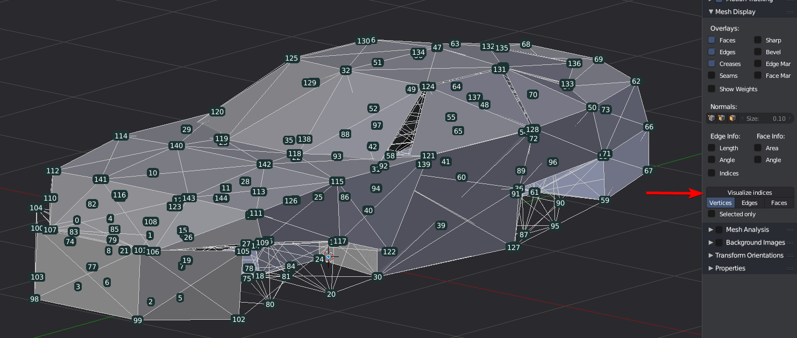

You should now have readable node IDs. 

#### 2.8 and newer 

Make sure `Developer Extras` is enabled in `Edit` -> `Preferences` -> `Interface`:

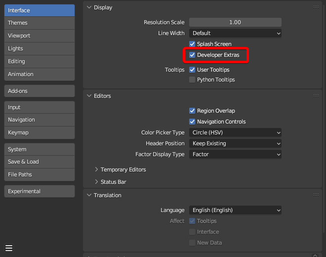

Now open the Overlays menu, located in the top right:

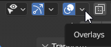

Enable `Indices` under `Developer`:

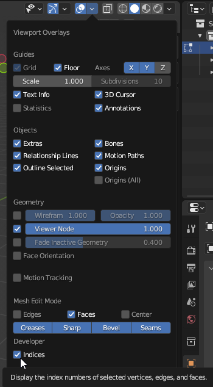

Node numbers should now be visible.

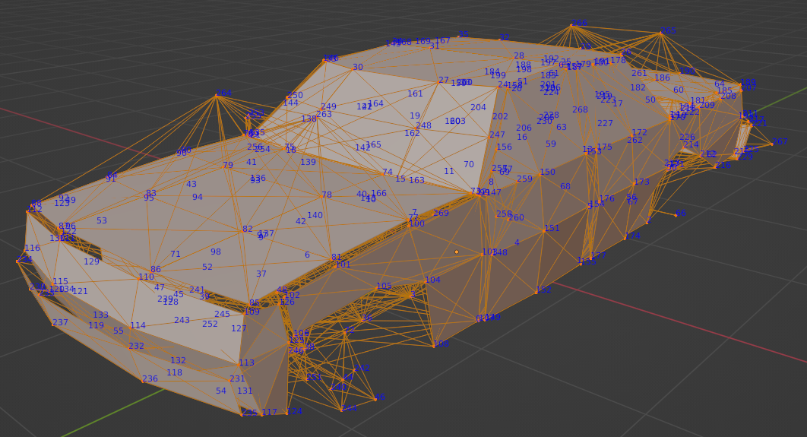

### Notes and known issues

- You can use [vertex groups](https://docs.blender.org/manual/en/latest/modeling/meshes/properties/vertex_groups/index.html) to organize your structure. In the `.truck` file, a "vertex group" starts with `;grp:`.
- Due to how the plugin reads/writes the `.truck` file, it is recommended to remove and reimport your N/B if you want to make more changes in Blender, otherwise changes you've made in the `.truck` file after exporting will be reverted.
 
Known issues:

- If the `.truck` file contains [detacher_group](../vehicle-creation/fileformat-truck.md#detacher_group) sections, they must be commented `;` out 
otherwise not all beams will import correctly. See this [GitHub issue ticket](https://github.com/RigsOfRods/rigs-of-rods/issues/3002) for more information.


## TruckViewer

A Java program made by Gouranga designed for viewing a node/beam structure.

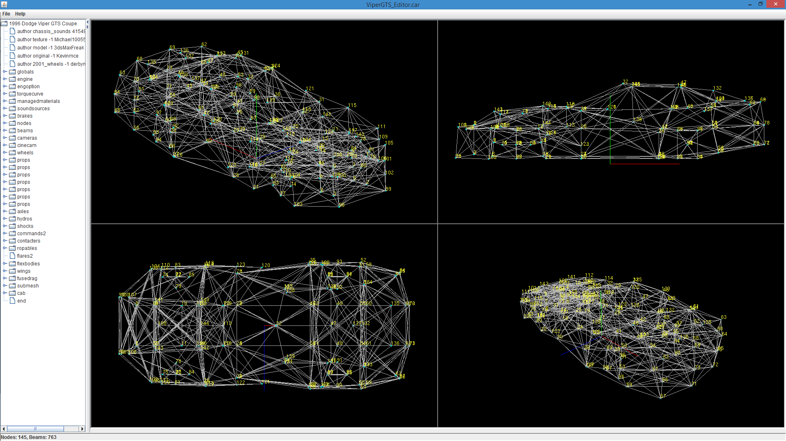

Pros:

- Auto-reloading of the file

- Supports nodes2

- 4 independent views, each can be either be rotated in 3d or snapped to the front/sides/back.

Cons:

- Only displays pure nodes and beams.

- Cannot edit the n/b structure, it is designed only for viewing it.

### Download 

[Download here](https://forum.rigsofrods.org/resources/truckviewer.19/)

## Editorizer

!!! warning
	This program is very old and thus shouldn't be used to edit existing vehicles. It is recommended to create N/Bs using [Blender](#blender) instead.


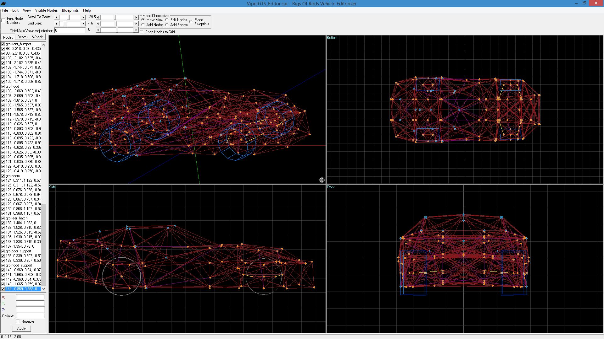


The Editorizer is a free program written by Ben for making vehicles. Contributions: Tuusita (Comments, Structure, Connect To).

It's a fairly old and simple program. Note you can't use it to create a new vehicle from scratch, you need to manually create a _.truck_ file with a basic structure. A  _.truck_ file with the basic structure has been included to get you started.

Pros:

- Designed for editing node/beam, very feature-rich

- Colors can be changed to suit your liking

Cons:

- Does not support newer [truck](../vehicle-creation/fileformat-truck.md) sections (such as `set_node_defaults`). These sections will have to be commented out otherwise the Editorizer fails to open the file.

It is recommended to make a copy of the truck file made for editing, then copy the changes over to your main truck file.

### Download and run on Windows

[Download here](https://forum.rigsofrods.org/resources/editorizer.20/) (ZIP archive)

Run as administrator! (only needed on the first run or if you move Editorizer's directory)

#### Troubleshooting

If you don't run Editorizer as administrator for the first time, or you subsequently move it's directory, you may encounter this error:
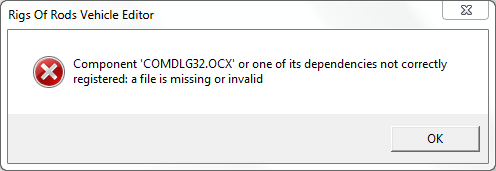

To resolve this, try running as administrator again, and if it doesn't help, try these steps:

-   Find comdlg32.ocx and mscomctl.ocx in Editorizer's directory.
-   On 32-bit Windows:
    -   Move comdlg32.ocx and mscomctl.ocx to _C:\\Windows\\system32_.
    -   Open a command line window and run following commands:
    
        ```
        regsvr32 c:\Windows\system32\comdlg32.ocx
        regsvr32 c:\Windows\system32\mscomctl.ocx
        ```
-   On 64bit Windows:
    -   Move comdlg32.ocx and mscomctl.ocx to _C:\\Windows\\SysWOW64_
    -   Open a command line window and run following commands:
    
        ```
        regsvr32 c:\Windows\SysWOW64\comdlg32.ocx
        regsvr32 c:\Windows\SysWOW64\mscomctl.ocx
        ```

### Download and run on MacOSX

[Download here](http://www.mediafire.com/download/ji2edf2ng4rcy9b/MAC%20RoR%20Editorizer.zip) (ZIP archive)

Requires MacOSX Snow Leopard or Higher.

The mac port is standalone with all the files needed built into the app, Huge thanks to MothBird.

Warning: the file is quite large (209.92MB) because of all of the required frameworks.


### Using blueprints

Blueprints are technical drawings of vehicles and machinery, very useful as reference. Many good blueprints can be found on the internet.

To load a blueprint, find _Blueprints_ in the top toolbar, and load in the files.

To adjust blueprints, click on _Place Blueprints_ on the far right, and place your blueprints in a desired position .

### Editing Nodes

When you want to add nodes, just click on _Add Nodes_ up in the right. Click where you want the node to go, either in the Top Left, Bottom Left or Botton Right areas. If you want to make the node only get placed on the "grid" that divides the areas up-check the "snap nodes to grid" box.
Special Nodes

Check [truckfile reference](../vehicle-creation/fileformat-truck.md) for special node types.

If you want to give your nodes these special options, just click on the _Nodes_ tab, pick the one you want to change, and put the corresponding node option in the options part.

### Editing Beams

When you want to add beams, just click on the _Add Beams_ up in the right. Click the first node where you want the beam to start. Click the second node which is where you want the beam to end.

Check [truckfile reference](../vehicle-creation/fileformat-truck.md) for special beam types.

If you want to give your beams these special options, just click on the _Beams_ tab, pick the beam you want to change, and put the corresponding beam option in the options box, along with any variables for that type of beam.

### Wheels

To add wheels, look at this example. Just click on the Wheels tab and add in the correct information in the correct spaces.

FRONT WHEELS(Steering wheels):

```
wheels
; EXAMPLE: 
0.5,0.1,12,33,34,9999,1,1,32,350.0,300000,4000, tracks/wheelface tracks/wheelband1
; EXAMPLE2: 
0.5,0.1,12,35,36,9999,1,1,31,350.0,300000,4000, tracks/wheelface tracks/wheelband1 
```

REAR WHEELS:

```
wheels
;EXAMPLE: 
0.5,0.1,12,12,13,14,1,1,10,350.0,300000,4000, tracks/wheelfaceb tracks/wheelband1
;EXAMPLE2: 
0.5,0.1,12,14,15,-12,1,1,9,350.0,300000,4000, tracks/wheelfaceb tracks/wheelband1 
```

### Scaling

To scale your vehicle if you find it a little bit too big, just go to the Visible Nodes tab at the very top. Click on Scale..., then put in decimal numbers from 0.01 to 0.99 in the X,Y,Z lines to scale it down, put in decimal numbers from 1.0 and up(experiment) to scale it up.

### Tools to avoid

In the _Visible Nodes_ tab at the top, I would advise to not use the _Interconnect_ or _Variable Interconnect_ options with any vehicle as it can mess up the structure and other things. Basically these options will join every node to every other node in the object... 
