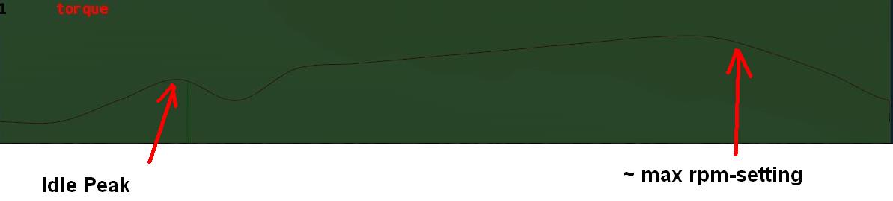

Engine
============


The engine sections are used for vehicles which are driven through their wheels (trucks). Together, they specify the type of engine being used (truck or car), the power of that engine and the gear ratios for the truck 


This section specifies torque, gearing and RPM ranges of the engine being used. 

## Settings  

See [fileformat-truck#engine](http://docs.rigsofrods.org/vehicle-creation/fileformat-truck/#engine) for reference manual.

## Torque  

Tuning torque in RoR is a tricky topic, since the current air resistance simulation is overstrong. Setting torque to provide realistic acceleration at low speeds results in severely stunted top speeds. Setting it to provide higher top speeds results in very strong acceleration.

Engine Inertia also has a **VERY** important role in engine behavior since this value also determines how fast a vehicle can accelerate

### Differential ratio  

Differential ratio represents gear reduction ratio between input pinion gear and the ring gear of the differential. This parameter acts as global gear conversion ratio. 

It means that if, lets say first gear has ratio `13.86` and differential ratio is `2.0`, actual first gear reduction is `27.72` `(2.0 * 13.86)`. If you are using real gearbox parameters, bear this in mind and look for real differential ratios too.

### Gear ratios

Gear ratios of forward gears. For every turn of the wheel must engine turn this many times (not counting the differential ratio). When setting various gear ratios, try to make smaller difference between higher gears.

Please note that in sample gear setting the difference (ratio) between first and second gear is approx. 45%, but difference between the fifth and sixth gear is about 19%. This allows smoother gearbox performance. 

There must be between 3 and 15 forward gears. **The last gear must be followed by a `-1` value.**

### More information 

A great source of practical gear ratios is from [Eaton Fuller](http://www.roadranger.com/Roadranger/productssolutions/transmissions/index.htm).

To see the ratios, click the name of the transmission and find **Product Specifications Guide**. 

If your vehicle decelerates in a gear you may not have enough power, or too high a gear. 

**NOTE: the value of this site is unknown. RoR's poor air resistance simulation probably invalidates the use of any real life gear ratios: It's always best to make sure a truck can sensibly use all the gears it has.**


If you know a little about vehicles there is a [Gear Ratio Guide](http://www.grimmjeeper.com/gears.html), but a decent knowledge of transmissions, transfer cases, underdrives and correct rear end gears is highly recommended.

## Engoption 
 
This optional section allows the user to specify whether the engine is for a car or heavy truck and the engine inertia of the vehicle.

### Settings  
 See [fileformat-truck#engoption](http://docs.rigsofrods.org/vehicle-creation/fileformat-truck/#engoption) for reference manual.

### Engine Inertia  

The default game value is `10.0`, which is correct for a large diesel engine, Use higher values to make engines accelerate more slowly and stall more difficultly, which may be useful for vehicles towing large masses. This value should be lowered for smaller, light engines (Is the multiplier different for car and truck engines?)

With a high value of inertia the engines RPM is not likely to change when resistance is met. As an example, when changing gears a high inertia will cause the wheels to slip, while a lower value will cause the engine RPM to change and prevent the wheels from slipping. However, with a low inertia and a high brake value, the engine will stall more easily since the brakes can change the RPMs more easily.

If your engine doesn't change its RPM's during gear change, your engine inertia is too high.

If a vehicle is feeling sluggish, and hard to brake, it is better to decrease the inertia than increase the brake force, and torque.

### Engine Type  

Using `c` for cars or `t` for trucks specifies characteristics of the engines. 

Car engines use a different sound to truck engines and have no turbocharger. They also have less inertia by default. (t) is the default.


### Torque Curve 

This section allows you to define a torque curve for your vehicle. It is optional.

This allows you to assign predefined torque curves or your own custom curves to a truck. 

Predefined options are: `default`, `diesel`, `turbodiesel`, `gas`, `turbogas`, `wheelloader`, `compacttractor`, `tractor`, `hydrostatic`.

Predefined Curve Example:
```
    torquecurve
    turbogas
```

The first number is RPM where the power begins, and the second defines power as a percent of total torque.

It's suitable to define the torque to the engine RPM set in the engine definition plus 25% ( multiply the value with 1.25) to get the overrev area defined.

The following example would be good for a maximum engine RPM set to `2800`.

Custom curve example:
```
    torquecurve
    0,0
    1000,0.79
    1500,0.9
    2000,0.97
    2500,0.99
    3000,0.9
    3500,0.77
```

Engine dying in idle and first gear? Just define a single higher peak value where you want the engine to idle..like adding: 

```
    ...
    700, 0.2
    800, 0.6
    900, 0.4
    ...
```




To the example above in the right spot will result the engine idle a little bit higher then 800 rpm in first gear. 

The example to the left shows a screenshot of a torquercurve made for a small diesel engine:

Idle: `~600` RPM

Max:  `1900` RPM

Slight and constant torque increase over the used RPM bandwidth, hard torque dropoff in the overrev area.

