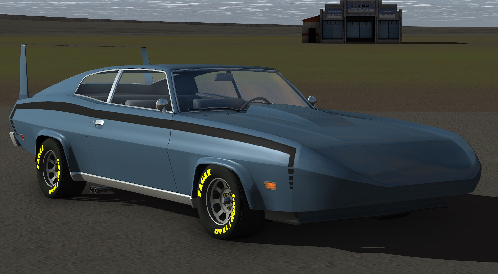
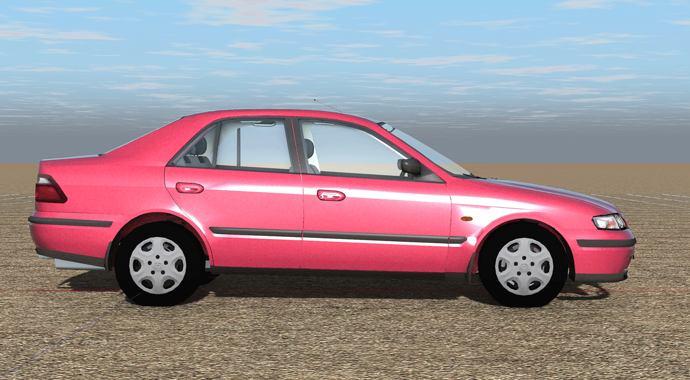
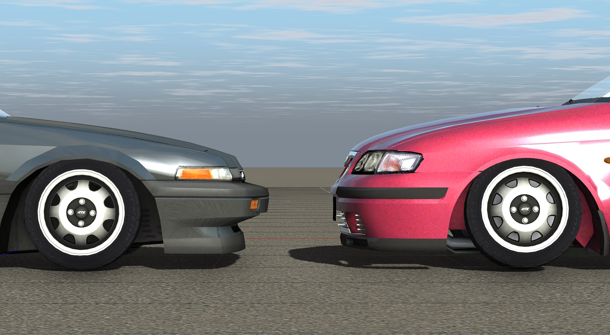
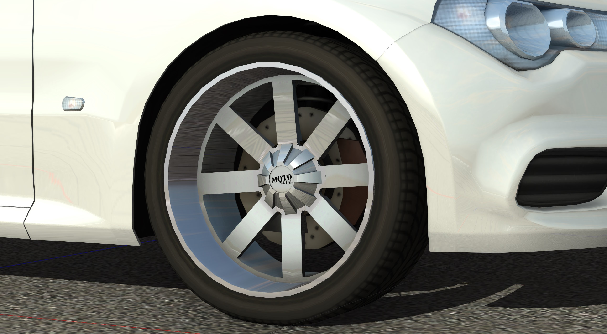

Addonpart file format
============

This page serves as a technical overview of the `.addonpart` file format. It is a new text-based file format that enables easy vehicle customization without manually editing a `.truck` file.

For an overview of the Tuning menu, see: [Tuning](/gameplay/tuning)

## Features

- Add or replace meshes (props/flexbodies)
- Hide unwanted meshes
- Change wheels and tires
- Move existing nodes 
- Add new flares 
- Hide unwanted flares
- Hide unwanted exhaust smoke particles
- Change or remove managedmaterial textures
- Supports preview images, same as truck files and skins
- Save and load `.tuneup` presets, these are stored in the `projects` directory and can be included with uploaded mods.

## Limitations

These features are not currently supported. They may be added in a future RoR release.

- Multiplayer support. The addonpart system is exclusive to single player for now.
- Adding new nodes and beams 
- Engine tweaking 
- Adding or changing sounds
- Moving cinecams
- Adding new animated props (replacing existing prop works)
- Any other truck file sections not listed here

## Parameters 

### Required sections 

#### addonpart_name

Required, the name of the addon. Shown in Tuning menu and parts selector. 

#### addonpart_description

Required, addon description. Shown in part selector.

#### addonpart_guid 

The [GUID](/vehicle-creation/fileformat-truck/#guid) of the truck the addonpart is intended for. Parts that match the GUID of the current active vehicle are shown in the Tuning menu.

Multiple GUIDs can be defined, these are only hints as players can force installation of any addon to any vehicle.

Optional, omitting this section requires the part to be installed manually through the parts selector.

#### addonpart_filename

Optional. Restricts an addonpart to specific truck file(s), useful if multiple trucks share the same GUID.

```
addonpart_guid "db30c00b-021f-416a-92a7-3218374dbba2"
addonpart_filename "BoxDodgeRam.truck"
addonpart_filename "1994DodgeRam12V.truck"
addonpart_filename "1994DodgeRam12VConstruction.truck"
addonpart_filename "1994DodgeRam12VGuard.truck"
```

!!! note
	Specifying only `addonpart_filename` will not work on its own, a matching GUID must also be present!

### Visual elements

#### Managedmaterials

Materials can be defined in two ways, either through the [managedmaterials](/vehicle-creation/fileformat-truck/#managedmaterials) section or with a [material file](https://wiki.ogre3d.org/Materials).

```
managedmaterials
;new_material    effect               parameters...
mainbody mesh_standard    mytruckbody.png mytruckbody-spec.png
```

Addon meshes that share a managedmaterial with the base mod do not need to be redefined. However, any `.material` files must be copied to the addon directory.


#### Props and flexbodies

Props and flexbodies are defined using the same syntax as in a [truck file](/vehicle-creation/fileformat-truck/#props).

In order to be parsed correctly, flexbody forset lines **MUST** be surrounded by quotes , mesh will not appear otherwise!

```
props
;ref,  x,  y, offsetx, offsety, offsetz, rotx, roty, rotz, mesh
93, 95, 92,    0.50,    0.37,     0.0,   90,    0,    0, airintake.mesh

flexbodies
;ref,  x,  y, offsetx, offsety, offsetz, rotx, roty, rotz, mesh
3,  4, 19,       0,       0,   0.027,   90,    0,   90, dodgecharger.mesh
"forset 0-16, 23-24, 31, 54-125"
```

#### Flares

Flares are defined using the same syntax as in a [truck file](/vehicle-creation/fileformat-truck/#flares). All flares sections (`flares`/`flares2`/`flares3`) are supported.

```
flares
;RefNode,  X,  Y, OffsetX, OffsetY, Type, ControlNumber, BlinkDelay, size MaterialName
51,  1, 79,    0.23,    0.50,    b,            -1,          0,   -1 default
```

### Element removal (unwanted)

#### addonpart_unwanted_prop

Specifies a prop which should be hidden. IDs are shown in the Tuning menu, starting at `0`.

```
; syntax: addonpart_unwanted_prop <prop ID>
addonpart_unwanted_prop 3
```

#### addonpart_unwanted_flexbody

Specifies a flexbody which should be hidden.

```
; syntax: addonpart_unwanted_flexbody <flexbody ID>
addonpart_unwanted_flexbody 2
```

#### addonpart_unwanted_flare

Specifies a flare which should be hidden.

```
; syntax: addonpart_unwanted_flare <flare ID>
addonpart_unwanted_flare 4
```

#### addonpart_unwanted_exhaust

Specifies a exhaust smoke which should be hidden. Useful for custom exhaust parts.

```
; syntax: addonpart_unwanted_exhaust <exhaust ID>
addonpart_unwanted_exhaust 0
```

#### addonpart_unwanted_managedmaterial

Specifies a managedmaterial which shouldn't be rendered. Will be replaced by a transparent red material (`tracks/transred`) instead.

Currently not very useful, exists for consistency.

```
; syntax: addonpart_unwanted_managedmaterial <material name>
addonpart_unwanted_managedmaterial 0d570UID-dodgecharger
```

### Element tweaking 

#### addonpart_tweak_wheel

Changes wheel parameters. 

- **Wheel ID**: The wheel number, with the first defined wheel starting at `0`.
- **Media1**: Wheel mesh name. 
- **Media2**: Wheelband material name for `wheels`/`meshwheels`, or tire mesh name for `flexbodywheels`. 
For wheels with pre-mounted tires this should be set to `tracks/trans`. To use the base mod's wheelband or mesh, set an empty string `""`.
- **Wheel side**: Direction the wheel is facing, `l` or `r`. Swap these values if your wheel is mounted backwards. This can be changed on-the-fly in the Tuning menu.
- **Radius**: Optional. The radius of the wheel, in meters.
- **Width (ignored)**: - Optional. Use any number, wheel width is auto-calculated from distance between node1 and node2.

```
; basic example, uses base mod's wheelband material
; syntax: addonpart_tweak_wheel <wheel ID> <media1> <media2> <wheel side> <radius><width>
addonpart_tweak_wheel 0 "5SpokeMBWheel.mesh" "" l

; example for a wheel with pre-mounted tire, makes wheelband invisible and sets radius to 0.32
addonpart_tweak_wheel 0 "AeroRaceWheel_Tire.mesh" "tracks/trans" l 0.32
```

#### addonpart_tweak_node

Allows for moving existing nodes. Currently doesn't support node options. 

- **Node ID**: Node number to be moved.
- **X position (in meters)**: Node's X coordinate.
- **Y position (in meters)**: Node's Y coordinate.
- **Z position (in meters)**: Node's Z coordinate.

```
; syntax: addonpart_tweak_node <node ID><x><y><z>
addonpart_tweak_node  5, 0.63, 0.36, 1.84
```

#### addonpart_tweak_prop

Enables the moving or replacing of props. Shares most syntax with [props](/vehicle-creation/fileformat-truck/#props).

- **Prop ID**: The prop number, starting at `0`.
- **x\_offset**:  The amount the prop should be moved in the X direction from the **reference node**. The distance it is moved depends on the distance between the **Reference node** and the '''X direction node '''(it's proportional): (0) leaves the prop on the reference node, (1) moves it all the way to the **X direction node**, and (0.5) puts the prop half-way between the two
- **y\_offset**:  The amount the prop should be moved in the Y direction from the **reference node**. Like the **X direction offset**, the amount it is proportional to the distance between the **reference node** and the **Y direction node**.
- **z\_offset**:  Imagine a surface which the X and Y directions pass straight through. If looking along that surface is the forwards direction, then this field moves the prop straight up. Unlike the **X direction offset** and the **Y direction offset**, the amount for the straight up offset is measured in meters
- **x\_axis\_rotation**:  The amount the prop should be rotated about the X axis
- **y\_axis\_rotation**:  The amount the prop should be rotated about the Y axis
- **z\_axis\_rotation**:  The amount the prop should be rotated about the 'straight up' axis
- **mesh\_name\_or\_special\_prop**: The name of the Ogre3D mesh object used for the prop.
    If the mesh name starts with one of the keywords defined on the [truck file format page](/vehicle-creation/fileformat-truck/#props), it will have special behavior.

!!! note
	To move an existing mesh, the name MUST contain an empty string `""`! This tells the game to use the existing mesh from the base mod.

```
; basic example, moves a prop:
; syntax: 'addonpart_tweak_prop <prop ID> <offsetX> <offsetY> <offsetZ> <rotX> <rotY> <rotZ> <media1> <media2>'
addonpart_tweak_prop 0 0.50,    0.37,     0.0,   90,    0,    0, ""

; example for replacing a steering wheel dashboard prop:
addonpart_tweak_prop 0 0,  0.38,  -0.06,  -10,  0,  180, "",DB_classic_swheel.mesh 0, 0, 0, 500
```


#### addonpart_tweak_flexbody

Enables the moving or replacing of flexbodies. Shares most syntax with [flexbodies](/vehicle-creation/fileformat-truck/#flexbodies).

- **Flexbody ID**: The flexbody number, starting at `0`.
-   **x\_offset**: The amount the prop should be moved in the X direction from the **reference\_node**.
-   **y\_offset**: The amount the prop should be moved in the Y direction from the **reference\_node**.
-   **z\_offset\_meters**:  Moves the flexbody "straight up". Unlike the **x\_offset** and the **y\_offset**, the distance is measured in meters.
-   **x\_axis\_rotation**: The amount the flexbody should be rotated about the X axis
-   **y\_axis\_rotation**: The amount the flexbody should be rotated about the Y axis
-   **z\_axis\_rotation**: The amount the flexbody should be rotated about the 'straight up' axis
-   **mesh\_name**: The name of the Ogre3D mesh object used for the flexbody.

```
; basic example, moves a flexbody:
; syntax: addonpart_tweak_flexbody <flexbody ID><offsetx><offsety><offsetz><rotx><roty><rotz><mesh>
addonpart_tweak_flexbody 0 0.5, 0.3,   0.027,   90,    0,   90, ""

; example for replacing a flexbody:
addonpart_tweak_flexbody 22 -0.165, 0.5, -0.21, 0.0, 90.0, 0.0, spoiler-wing.mesh
```

#### addonpart_tweak_managedmaterial

Allows for replacing managedmaterial textures. This can be used to override a vehicle's skin (e.g. a taxi sign addon could add a taxi livery).

- **Name**: The material name.
- **Type**: The name of the effect you want to use. Valid names are defined in the [truck file format page](/vehicle-creation/fileformat-truck/#managedmaterials).
- **Media1-3**: Diffuse, specular, damage texture filenames.

```
; syntax: addonpart_tweak_managedmaterial <name> <type> <media1> <media2> [<media3>]
addonpart_tweak_managedmaterial DodgeViperBody mesh_standard DodgeViperBody_myawesomeskin.dds DodgeViperBody_myawesomeskin_s.dds
```

## Examples

### Adding new flexbodies

Most basic part example, adds a new flexbody (rear spoiler) to the Gavril MV4:

```
addonpart_name "Gavril MV4 - Dura-Built D1 Spoiler"
addonpart_description "Add-On by Charger, for use with Gavril MV4"

; GUIDS

;addonpart_guid  ~ multiple GUIDs can be specified, these are only hints, user can force installation of any addon to any vehicle.
;MV4
addonpart_guid "8733b9a9-b662-46b3-ac4d-c9b6974aa1cf"
;MV4S
addonpart_guid "de88a97c-086e-446b-bdbd-81bb41ef54ae"
;MV4R
addonpart_guid "a56e33dd-587e-48be-9ee8-675b57efc57b"


; Install instructions - usually props/flexbodies and managedmaterials
; Format is exactly the same as in truck-definition fileformat.
; IMPORTANT: `forset` line must be a single string as-is because it's wicked.
; ---------------------------------------------------------------------------

managedmaterials
;new_material    effect               parameters...
DB_D1 mesh_standard DB_D1.png DB_D1_s.png

flexbodies
;ref,  x,  y, offsetx, offsety, offsetz, rotx, roty, rotz, mesh
10,11,26,0.5,-1.17,-0.27,-90,180,0,DB_D1.mesh
"forset 222-237"
```


### Tweaking existing flexbodies

This addon uses `addonpart_tweak_flexbody` to replace the grille and spoiler on the Gavril Bandit, 
along with `addonpart_unwanted_flexbody` to hide the front bumper and `addonpart_unwanted_flare` to hide the now covered headlights:

```
addonpart_name "Gavril Bandit - Daytona Kit (Default Silver)"
addonpart_description "Add-On by Charger, for use with Gavril Bandit 400GT/Extreme/Off-Road"

; GUIDS

;addonpart_guid  ~ multiple GUIDs can be specified, these are only hints, user can force installation of any addon to any vehicle.
;200/Stripped/300
;addonpart_guid "f4366e54-e74c-45bc-8482-c8524dd7b682"
;400GT/Extreme/Off-Road
addonpart_guid "ac2382e6-29b5-47b5-9e93-235ceaa27aa2"


; Install instructions - usually props/flexbodies and managedmaterials
; Format is exactly the same as in truck-definition fileformat.
; IMPORTANT: `forset` line must be a single string as-is because it's wicked.
; ---------------------------------------------------------------------------

managedmaterials
Bandit_daytona mesh_standard Bandit_daytona_Silver.png Bandit_daytona_s.png

; syntax: addonpart_unwanted_flexbody <flexbody ID>
addonpart_unwanted_flexbody 19

; syntax: addonpart_unwanted_flare <flare ID>
addonpart_unwanted_flare 10
addonpart_unwanted_flare 11
addonpart_unwanted_flare 12
addonpart_unwanted_flare 13

; syntax: addonpart_tweak_flexbody <flexbody ID><offsetx><offsety><offsetz><rotx><roty><rotz><mesh>
addonpart_tweak_flexbody 17 0.5,-4.45,0.08,-90,180,0, Bandit_daytona_nose.mesh
addonpart_tweak_flexbody 24 0.5,-4.45,0.08,-90,180,0, Bandit_daytona_wing.mesh
```



### Moving nodes

Using `addonpart_tweak_node`, it's possible to move the suspension nodes on a vehicle:

```
addonpart_name "Mazda 626 - Lowered Suspension - Stage 1"
addonpart_description "For use with Mazda 626 GF"

addonpart_guid "mazda626gf"

 ; NODE TWEAKS
 
; syntax: addonpart_tweak_node <node ID><x><y><z>

;grp: front axle hubs
addonpart_tweak_node  77,    0.920,    0.388,   -0.836
addonpart_tweak_node  78,    0.770,    0.288,   -0.626
addonpart_tweak_node  79,    1.070,    0.288,   -0.626
addonpart_tweak_node  80,    0.920,    0.538,   -0.626
addonpart_tweak_node  81,    0.920,    0.388,   -0.626
addonpart_tweak_node  82,    0.920,    0.288,   -0.626
addonpart_tweak_node  83,    0.920,    0.388,    0.836
addonpart_tweak_node  84,    0.770,    0.288,    0.626
addonpart_tweak_node  85,    1.070,    0.288,    0.626
addonpart_tweak_node  86,    0.920,    0.538,    0.626
addonpart_tweak_node  87,    0.920,    0.388,    0.626
addonpart_tweak_node  88,    0.920,    0.288,    0.626
;grp: rear axle hubs
addonpart_tweak_node  92,    3.500,    0.343,   -0.836
addonpart_tweak_node  93,    3.400,    0.243,   -0.626
addonpart_tweak_node  94,    3.650,    0.243,   -0.626
addonpart_tweak_node  95,    3.500,    0.493,   -0.626
addonpart_tweak_node  96,    3.500,    0.343,   -0.626
addonpart_tweak_node  97,    3.500,    0.243,   -0.626
addonpart_tweak_node  98,    3.500,    0.343,    0.836
addonpart_tweak_node  99,    3.400,    0.243,    0.626
addonpart_tweak_node 100,    3.650,    0.243,    0.626
addonpart_tweak_node 101,    3.500,    0.493,    0.626
addonpart_tweak_node 102,    3.500,    0.343,    0.626
addonpart_tweak_node 103,    3.500,    0.243,    0.626
```




### Wheels 

Wheels with pre-mounted tires. These wheels can be installed onto any vehicle with mesh wheels:

```
addonpart_name "StanceWerkz -ATS Cup Wheels"
addonpart_description "Wheels for all vehicles. By FreeFall, ported to addonpart by CuriousMike"

; WHEEL TWEAKS

; syntax: addonpart_tweak_wheel <wheel ID> <media1> <media2> <wheel side> <radius><width>
addonpart_tweak_wheel 0 "ATSCup.mesh" "tracks/trans" r 0.29
addonpart_tweak_wheel 1 "ATSCup.mesh" "tracks/trans" l 0.29
addonpart_tweak_wheel 2 "ATSCup.mesh" "tracks/trans" r 0.29
addonpart_tweak_wheel 3 "ATSCup.mesh" "tracks/trans" l 0.29

; MANAGED MATERIALS

managedmaterials
;new_material    effect               parameters...
ATSCup			        mesh_standard	        ATSCup.png		ATSCup_s.png
Tire                            mesh_standard		Tire.png
```



Advanced wheel example, specifically made to fit the Gavril MV4S. Features `addonpart_tweak_prop` to move the brakes and calipers:

```
addonpart_name "Gavril MV4S - MotoMetal 962 Wheels"
addonpart_description "Add-On wheels by Charger, for Gavril MV4S"

; GUIDS

;MV4S
addonpart_guid "de88a97c-086e-446b-bdbd-81bb41ef54ae"

; PROP TWEAKS

; move brakes inwards a bit so they don't clip
; syntax: 'addonpart_tweak_prop <prop ID> <offsetX> <offsetY> <offsetZ> <rotX> <rotY> <rotZ> <media1> <media2>'
;; calipers (orig offset X: 0.65)
addonpart_tweak_prop 11    0.31,0,0,   65,0,180, ""
addonpart_tweak_prop 12    0.31,0,0,   225,0,180, ""
addonpart_tweak_prop 13    0.32,0,0,   -90,0,180, ""
addonpart_tweak_prop 14    0.32,0,0,   30,0,180, ""
;; brake discs (orig offset X: 0.65)
addonpart_tweak_prop 15    0.31,0,0,   0,180,0, ""
addonpart_tweak_prop 16    0.31,0,0,   0,180,0, ""
addonpart_tweak_prop 17    0.32,0,0,   0,180,0, ""
addonpart_tweak_prop 18    0.32,0,0,   0,180,0, ""

; WHEEL TWEAKS

; syntax: addonpart_tweak_wheel <wheel ID> <media1> <media2> <wheel side> <radius><width>
addonpart_tweak_wheel 0 "MotoMetalF.mesh" "" l
addonpart_tweak_wheel 1 "MotoMetalF.mesh" "" r
addonpart_tweak_wheel 2 "MotoMetalR.mesh" "" l
addonpart_tweak_wheel 3 "MotoMetalR.mesh" "" r 
	

; MANAGED MATERIALS

managedmaterials
MotoMetal mesh_standard MotoMetal_962.dds MotoMetal_962_s.dds
```




