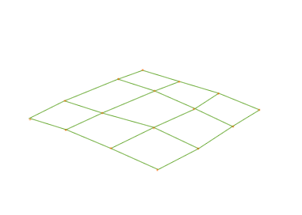
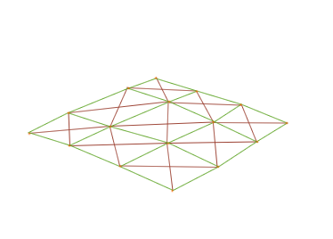
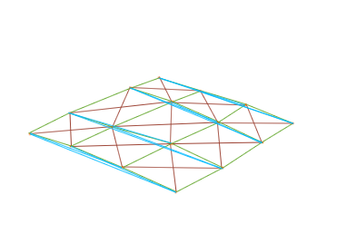
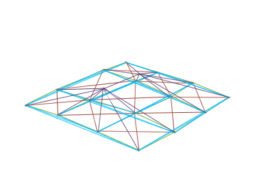
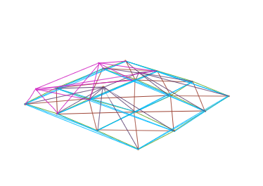
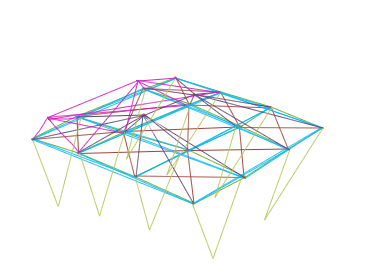
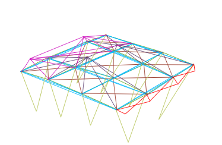

# Flexbody deforming/detaching parts

This is pretty simple, actually. I prefer to use notepad with the Editorizer just as a viewer, since the Editorizer tends to screw things up when you save with it. Excuse the crap drawings; hopefully this will still be helpful. 

## Instructions

First start by making a grid of nodes however many segments long and wide you need it to be (recommend at least 4 nodes wide and 4 nodes long for a hood) and fitting the shape of your body panel (this is for a hood or trunk; I'll talk about bumpers in a bit). Connect all of them together lengthwise/widthwise only. Give them a set_beam_defaults such that they can't deform or break at all (make the deform and break thresholds very high). These define the basic shape of the body part so they can't deform or break or you'll get weird glitchy stuff going on. 

 

Then make the 'crossing' beams. These are the beams that form an X inside each square and keep the shape together. These should have a set_beam_defaults making them unbreakable and hard to deform (deform value in the hundreds of thousands range for light cars) 

 

Now make the deformer beams. These hold the shape together rigidly and also keep it in a deformed shape when it bends. Do them like this, lengthwise and widthwise, between every other node and also between the back and front nodes. Set them to be unbreakable but with a pretty low deformation threshold. It'd be a good idea to put the lengthwise and widthwise deformers under separate set_beam_defaults values, so you can tweak individually the strength in both directions. 

 

Now if your body panel is pretty flat, like this, it's going to flop all over the place unless you support it from underneath. The best way to fight this is with stabilization nodes. Usually two nodes floating about 0.3 meters above or below are a good way to do it. Connect both of those nodes to every single node of your body panel and each other, and make those beams unbreakable but easy to deform. I haven't drawn about half of them because the image would get too cluttered. You can also get away with having just one stabilization node. 

 

Next is the hinge. Attach all of the nodes of the back two rows (closest to the hinge) to two nodes you can hinge from on your main body. Set these beams to be fairly stiff but also breakable (deform & break values in the hundred thousand range for light cars). 

 

Now you need to support the hood/trunk from underneath so it doesn't fall inwards. Make beams going downwards from each hood node to the bottom of your frame/body, and give them the "s" flag so they resist compression but not extension. This allows the hood/trunk/whatever to push upwards/pop open but doesn't let it fall inwards into the body. Make sure the set_beam_defaults damping is set to 1 or 0 for the support beams, so when a part detaches it doesn't get dragged along with the car for a ways until the support beams break. These should be pretty easy to deform (around 50000) but harder to break (they break automatically when they reach 4x their length, so if your hood or whatever falls off, you don't need to worry about making these easy to break). 

 

Finally, the latch. This will keep the hood (or whatever it is you're doing) completely locked in place to the body until the latch breaks, at which point it'll pop open and swing on its hinges. Make downwards beams attaching the frontmost nodes of the panel to the closest frame/body nodes. These should be easy to deform and have a break threshold only slightly above the deform. These might not be rigid unless you also attach them to a second segment of nodes (either the next one on the hood or a segment below on the body). 

 

Bumpers are a similar deal, but the 'hinges' should be at both corners, and the node/beam should obviously be shaped like a bumper. Bumpers should also be less susceptible to deformation, since they're usually made of plastic or spring steel. 

This also works for doors (replace latch with commands if you want them to be openable) 

One final note: if your body panel shape is quite curved and convex/concave, you probably won't need the stabilization nodes/beams. My '49 Ford hood has no stabilization nodes because the shape is curved enough to be rigid on its own. 

## Credits

This was originally written by Gabester.