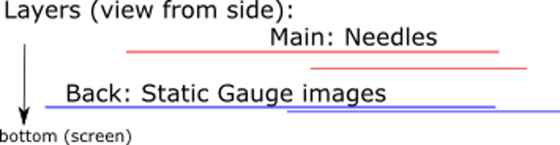
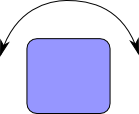
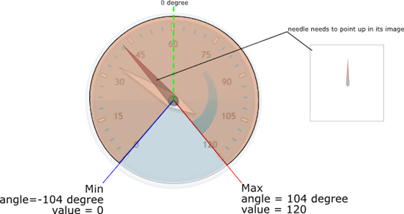
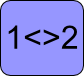
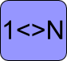
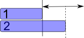
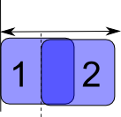
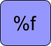
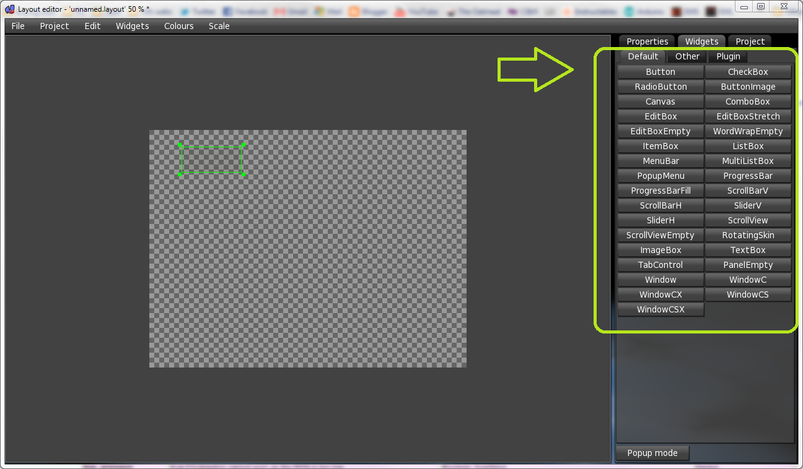
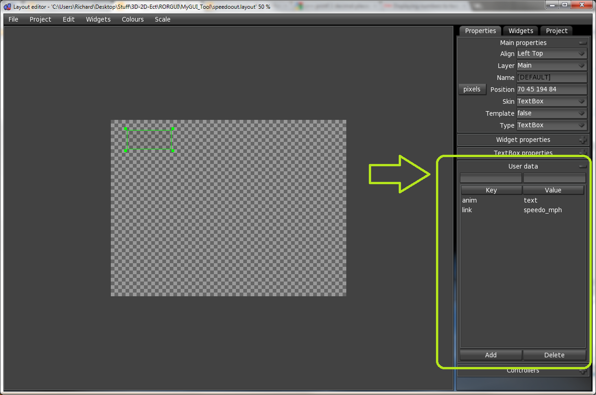

Creating custom HUD
============

The GUI is described in a Layout file (*.layout). It is an XML file format.

The Layout Files should be edited by the provided GUI Editor

The GUI is *linked* with RoR over "User Data" Strings. 
These are Strings that can be set-up in the LayoutEditors Widget Properties. 
A link is a connection between the GUI Elements and RoR game values.

The controls are separated via Layers, so they can overlap each other in a defined way:



Needles should go on top (*Main* Layer), static background images to the bottom (*Back* Layer)

## Required Software

[GUI Editor 4](http://sourceforge.net/projects/rigsofrods/files/rigsofrods/0.38-dev/MyGUI_Tools_4.zip/download)
    
(old version: [GUI Editor 2](http://sourceforge.net/projects/rigsofrods/files/rigsofrods/0.38-dev/MyGUI_Tools_2.zip/download))

!!! note
	Some animations do not work exactly like in RoR.

## Workflow

1. Create graphics of gauges and needles
2. Start GUIEditor and create the controls using your graphics 
3. Save the .layout and image files in your truck zip and use [`guisettings`](fileformat-truck.md#guisettings) to integrate it with your vehicle.
4. Test in RoR and fix in GUIEditor

## Available animations

### rotate



Rotates a single image around its center

- Input type: float (real number)
- FPS impact: light
- Internals: based on MyGUI control 'RotatingSkin'



Arguments:

- **min** - the minimum rotation angle
- **max** - the maximum rotation angle
- **vmin** - the value at the minimum angle
- **vmax** - the value at the maximum angle

Example for a simple speedo gauge:

```
anim=rotate
min=-104
max=110
vmin=0
vmax=120
link=speedo_kph
```

### lamp

Switches between two images



- Input type: boolean (true/false)
- FPS impact: light
- Internals: based on MyGUI control 'ImageBox'

Arguments:

- **texture** - the base name of the texture to use
The resulting images are called [texture]-on.png and [texture]-off.png

Example for a simple clutch lamp (images are clutch-on.png and clutch-off.png):

```
anim=lamp
texture=clutch
link=clutchLamp
``` 

Lamps can have conditions on when they switch states. 
Currently there is only support for &lt; and &gt; comparisons. 
For example this lamp will be "on" for speeds over 50kph:

```
anim=lamp
texture=clutch
link=speedo_kph&gt;50
```

### series

Switches between N images



- Input type: integer (whole number)
- FPS impact: light
- Internals: based on MyGUI control 'ImageBox'

Arguments:

- **texture**- the basename of the texture to use
The resulting images are called &lt;texture&gt;-&lt;number&gt;.png

Example for a simple secured lamp (images are secured-0.png, secured-1.png and secured-2.png):

```
anim=series
texture=secured
link=ties_mode
```

### scale

Scales one image



- Input type: float (real number)
- FPS impact: heavier
- Internals: based on MyGUI control 'ImageBox'

Arguments:

- **min** - the minimum size to add
- **max** - the maximum size to add
- **vmin** - the value at the minimum size
- **vmax** - the value at the maximum size
- **direction** - what side to scale up. possible values:
 up, down, left, right
 
Example for a simple speedo bar (which is 200 pixels width):

```
anim=scale
min=-200
max=0
vmin=0
vmax=120
direction=right
link=speedo_kph
```

### translate

Moves around one image



- Input type: float (real number)
- FPS impact: heavier
- Internals: based on MyGUI control 'ImageBox'

Arguments:

- **min** - the minimum size to translate
- **max** - the maximum size to translate
- **vmin** - the value at the minimum translation
- **vmax** - the value at the maximum translation
- **direction** - what side to move to. possible values:
 up, down, left, right
 
Example for a simple speedo bar:

```
anim=translate
min=0
max=200
vmin=0
vmax=120
direction=right
link=speedo_kph
```

### textstring / textformat

Displays text



- Input type: text (max 250 characters)
- FPS impact: light
- Internals: based on MyGUI control 'TextBox'

Arguments:

- **format** - (optional) the display format that should be used, 
[See here for more info](https://cplusplus.com/reference/cstdio/printf/).

Example for a simple speedo display:

```
anim= textstring or textformat
format=%04.0f km/h
link=speedo_kph
```

## Input sources

| <div style="width:165px">Method</div> | Description                                                                       | Type / Values / Ranges                       | Active when    |
| ------------------------- | --------------------------------------------------------------------------------- | -------------------------------------------- | -------------- |
| `rpm`                     | Engine RPM                                                                        | Float: 0 - max truck RPM                     | Engine exists  |
| `speedo_kph`              | Wheel Speed in kilometer per hour                                                 | Float: unlimited, minus if driving backwards | Always         |
| `speedo_mph`              | Wheel Speed in miles per hour                                                     | Float: unlimited, minus if driving backwards |Always|
| `engine_turbo`            | Engines Turbo PSI value                                                           | Float: unlimited                             |Engine exists|
| `engine_ignition`         | true if engine has contact, false if not                                          | Boolean: true or false                       |Engine exists|
| `engine_battery`          | true if engine has contact and is nor running, false if not                       | Boolean: true or false                       |Engine exists|
| `engine_clutch_warning`   | true if engine torque is greater than the clutch force, false if not              | Boolean: true or false                       |Engine exists |
| `engine_gear`             | Number of available gears, does not change            | Integer: -1 for first reverse gear, 0 for neutral, 1 for first gear, etc | Engine exists  |
| `engine_num_gear`         | Gear number, negative for reverse                                                 | Integer: i.e. 6 for six usable gears         | Engine exists  |
| `engine_gear_string`      | String that shows the gears in relation to the number of gears                    | Character: "<current gear> / <num gears>" or "N" or "R"| Engine exists  |
| `engine_auto_gear`        | Automatic gear (R/N/D/1/2)                                                        | Integer: same as gear but for automatic  |Engine exists|
| `engine_clutch`           | Current clutch value                                                              |Float: 0 (not pressed) to 1 (fully pressed down)|Engine exists|
| `brake`                   | Current brake value                                                               |Float: 0 (not pressed) to 1 (fully pressed down)	|Always|
| `accelerator`             | Current accelerator value                                                         |Float: 0 (not pressed) to 1 (fully pressed down)	|Engine exists|
| `roll`                    | Current cabin roll - values represents angle in degree                            |Float: unlimited	|Always|
| `roll_corr`               | Current cabin roll targeted by active shocks - values represents angle in degree  |Float: unlimited	|Always|
| `roll_corr_active`        | true when the active shocks are working                                           |Boolean: true/false	|Always|
| `pitch`                   | Current cabin pitch - values represents angle in degree                           |Float: unlimited	|Always|
| `parkingbrake`            | true if parking brake is on                                                       |Boolean: true/false	|Always|
| `locked`                  | true if any hooks are locked to something                                         |Boolean: true/false	|Always|
| `low_pressure`            | true if hydraulics cannot work as the RPM is too low                              |Boolean: true/false	|Always|
| `headlights`                  | true if headlights (low beams) are on                                                         |Boolean: true/false	|Always|
| `highbeams`                  | true if headlights (high beams) are on                                                         |Boolean: true/false	|Always|
| `foglights`                  | true if fog lights are on                                                                  |Boolean: true/false	|Always|
| `sidelights`                  | true if running lights are on                                                        |Boolean: true/false	|Always|
| `lights`                  | legacy source, now alias of `sidelights`                                          |Boolean: true/false	|Always|
| `brake_lights`                  | true if brake lights are on                                                       |Boolean: true/false	|Always|
| `reverse_light`                  | true if reverse lights are on                                                  |Boolean: true/false	|Always|
| `signal_turnleft`         | left turn signal is lit.                                                         	          |Boolean: true/false	|Always|
| `signal_turnright`        | light turn signal is lit.                                                                   |Boolean: true/false	|Always|
| `signal_warning`          | warning signal is lit.                                                                    |Boolean: true/false	|Always|
| `beacons`                  | true if beacons are on                                                                     |Boolean: true/false	|Always|
| `custom_lightN`          | user controlled light is lit (N = control number 1-10).                                                            |Boolean: true/false |Always|
| `tractioncontrol_mode`    | Traction Control (TC) mode                                                         |Integer: 0-3: 0 = not present, 1 = off, 2 = on, 3 = active	|Always|
| `antilockbrake_mode`      | Anti-lock Brakes (ABS) mode                                                      |Integer: 0-3: 0 = not present, 1 = off, 2 = on, 3 = active	|Always|
| `ties_mode`               | Ties locking state                        |Integer: 0-2: 0 = not tied, 1 = prelock (currently tightening), 2 = tied (locked)	|Always|
| `screw_throttle_X`        | Boat Screw Throttle. X from 0 to 5 (DD_MAX_SCREWPROP)                             |Float: unlimited	|Screwprop exists|
| `screw_steer_X`           | Boat Screw Steering direction. X from 0 to 5 (DD_MAX_SCREWPROP)                   |Float: unlimited, -1 = left, +1 = right?	|Screwprop exists|
| `water_depth`             | Depth of water below lowest node                                                  |Float: unlimited	|Screwprop exists|
| `water_speed`             | Speed on water in knots (1 Nautical Mile/Hour)                                    |Float: unlimited	|Screwprop exists|
| `aeroengine_throttle_X`   | Airplane Engine Throttle. X from 0 to 5 (DD_MAX_AEROENGINE)                       |Float: 0-1	|Aeroengine exists|
| `aeroengine_failed_X`     | Airplane Engine Failure. X from 0 to 5 (DD_MAX_AEROENGINE)                        |Boolean: true if failed	|Aeroengine exists|
| `aeroengine_rpm_X`        | Airplane Engine RPM. X from 0 to 5 (DD_MAX_AEROENGINE)                            |Float: 0 to aeroengine max RPM	|Aeroengine exists|
| `airspeed`                | Speed above ground in knots/hour                                                  |Float: unlimited	|Aeroengine or wing exists|
| `wing_aoa_X`              | Wings Angle of Attack. X from 0 to 5 (DD_MAX_WING)                                |Float: unlimited	|Wing exists|
| `altitude`                | Altitude above ground                                                             |Float: unlimited	|Aeroengine or wing exists|
| `altitude_string`         | Altitude above ground - string                                                    |Characters: three character altitude display: "000"|Aeroengine or wing exists|

## Quickstart

Perhaps the easiest thing to add is a text readout, here we will add a simple readout that shows the speed of a vehicle in MPH.

**1. Load up the layout editor and add a TextBox.**

You can do this by opening the Widgets tab, and under default you will find TextBox. Drag a TextBox out on the canvas as shown:



**2. Change the properties of the TextBox.**

Do this in the Properties tab as shown. Align should be to a corner of the screen (Left Top here) and Layer should be "Main". Also add the user data properties:

```
anim=text
link=speedo_mph
```

put the keyword (e.g. "anim") into the box above "Key" and put the value (e.g. "text") above the box marked "Value." 
Then click on "Add" and repeat this step for all the user data properties. In the end you should have these properties for the TextBox:



**3: Save the layout as "namehere.layout" and put the layout with the vehicle's .truck file.**

In the .truck file add the following lines:

```
guisettings
dashboard namehere.layout
```

**4: Test your readout!**

Extra: Add these user values to format the display like this: "xxxx.xx MPH"

```
format=%.2f MPH
```

Now you have the basics of the layout editor, move on to more advanced readouts. Let's now create a simple speedo gauge:

!!! important
	Put your graphics into the YourMedia sub folder, so the editor can use it.

1. Open the layout editor.
2. Add an ImageBox in the same way that you added a TextBox in the first part of this quickstart.
3. Go into the ImageBox's properties and put the gauge texture into the ImageTexture field.
4. Add a RotatingSkin widget  add your needle texture to it in the same way as you did previously.
5. Add these values to the RotatingSkin as User data:
```
anim=rotate
min=-104
max=110
vmin=0
vmax=120
link=speedo_kph
```
6. Save your .layout file, and move it and the images to your truck folder, and add the truck&lt;--&gt;.layout linkage 
 as you did earlier in the quickstart.
7. Test out your gauge, and make modifications as necessary.

## Dashboard mods

Introduced in version 2025.03 RC1, the dashboard mod type enables players to easily install and create different default HUDs without having to edit game files.

Just like vehicles and terrains, a dashboard mod zip file is placed inside the `mods` folder.

The dashboard can then be selected in `Settings` -> `UI` -> `Default truck/boat dashboard`.

### Folder layout

A dashboard mod contains:

- `*.dashboard` file(s).
- MyGUI `*.layout` file(s)
- Textures
- (optional) Preview (`filename-mini`) images

### Dashboard file format

A `*.dashboard` file is the main entry point, contains file info for the selector.

Example from [Modern Analog Gauges](https://forum.rigsofrods.org/resources/modern-analog-gauges.1010/):

```
dashboard_name "Modern Analog Gauges"
dashboard_description "Semi-transparent blue-tinted analog gauges with a digital speedo"
dashboard_author "graphics" 899 "Mark" "example@example.com"
dashboard_author "layouts" 899 "Mark" "example@example.com"
dashboard_category 201
```

#### dashboard_name

<span style="color:#BD0058">(String)</span> Name of the dashboard. 

#### dashboard_description

<span style="color:#BD0058">(String)</span> Description/tag line, pretty self-explanatory.

#### dashboard_author 

<span style="color:#BD0058">(String: credit) (Int: forum ID) (String: name) (String: email))</span>

- Credit: Tells what the author referenced did.
- Forum ID:  ID of the author's RoR Forum account. To get your ID, view your forum profile and check the number shown in the URL. For example: 

https://forum.rigsofrods.org/members/curiousmike.5831/

`5831` would be the ID. 

- Name: The name of the author.

- Email: Author's email address. Optional, not shown in the selector.

#### dashboard_category

<span style="color:#BD0058">(Int)</span> Dashboard type. Accepted categories:

- `200` - Generic
- `201` - Truck
- `202` - Boat

### Layout file names

The MyGUI `*.layout` files **MUST** be named the same as the `*.dashboard` file. For example:

```
modern_analog_gauges.dashboard
modern_analog_gauges_3500rpm_kph.layout
modern_analog_gauges_3500rpm_mph.layout
modern_analog_gauges_7000rpm_kph.layout
modern_analog_gauges_7000rpm_mph.layout
```

Optional file name tags:

-  `_Nrpm` - N is the redline RPM. The layout will be used if the engine RPM meets or is below this limit. If RPM exceeds available dashboards' RPM, the closest match will be used.
- ` _Xph` - X is units `k`= Kilometers or `m`= Miles
