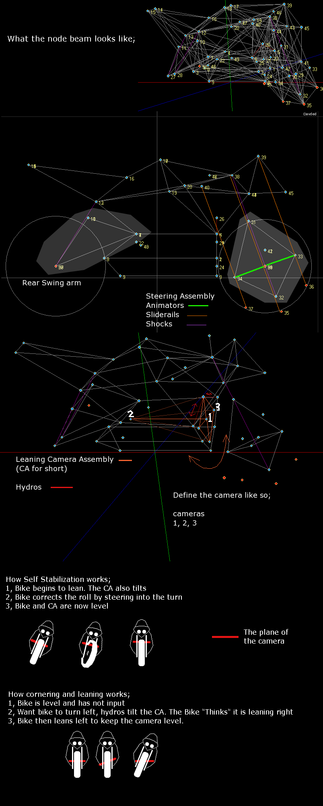
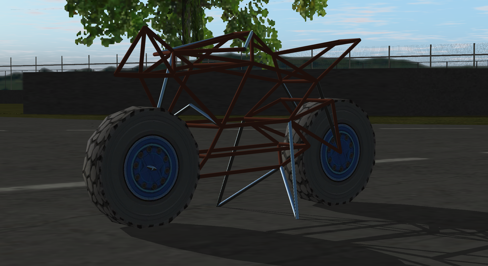

Motorbikes
============


This tutorial covers the theory and concepts used to build real 2-wheeled vehicles in Rigs of Rods.

Based off [this archived forum thread](http://archives.rigsofrods.net/old-forum/forums/120-Mod-tech/95634/page-0001.html).

## Theory

Motorbikes are counter-intuitive, to turn left, you must steer right a little first and vice-versa. It is because of this that the player cannot control the steering directly (with hydros) because the response time is too long and there is no feedback like when you ride a bicycle. So you must use [animators](fileformat-truck.md#animators) and the `roll` option. This is what we use to turn the front wheel.

The roll means the angle between the camera plane and the ground plane, so you can adjust it by rotating the camera. This is the main way of controlling the bike, you essentially trick the bike into thinking its falling onto one side and it will always try to be level. In other words, you're not steering, just controlling the lean angle.



## Construction
To make a motorcycle or similar you need to have good knowledge about node-beam systems and have experience of vehicle creation. A lot of details will not be covered because it should be obvious to an experienced user.

The image above shows how the motorbike operates, note how the front wheel is able to slide up and down on four [slidenodes](fileformat-truck.md#slide-nodes).


## Wheels
The wheels should be as thin as possible and be made very stiff to stop flexing and be sure to only power the rear wheel. I added a snode out to the side for both front (`n51`) and back (`n50`) wheels to stop them form flexing so much. These snodes must be contactless, so use the node option `c`, instead of the usual `n`.

I used wheels that were 0.1m thick at the front and 0.12m thick at the back.

I cheated and increase the grip for both wheels, because RoR is designed for heavy trucks.

```
set_node_defaults -1, 3, -1, -1
```

Was inserted before the wheels section, stops wheel spin and although drifting in the bike was amazing, it wasn't good for control or cornering

```
wheels
0.31, 1, 12, 27, 28, 50, 1,    1,	 43, 	 35.0, 80000.0, 600.0, tracks/daffwheelface tracks/dafwheelband
0.29, 1, 12, 29, 30, 51, 1,    0,	 45, 	 35.0, 60000.0, 500.0, tracks/daffwheelface tracks/dafwheelband 
```


### How to only power the rear wheel

This bit is important, you **must** define an [axle](fileformat-truck.md#axles),
making sure the differentials are set to split "d(s)" and only the rear wheel is powered.
```
axles
w1(27 28), w2(29 30), d(s)
```


## Steering

The steering assembly is able to move up and down with the suspension on slide nodes and controls the balance of the bike.

I used 3 slide rails and 4 slide nodes so it is as rigid as possible. The nodes at the bottom of the frame should have the option "c", so they are contactless.

There are four animators that form a sort to diamond shape they are defined something like this;
```
29, 34, 1, roll | shortlimit: 0.15 | longlimit: 0.15
```

Note how the short and long limit are quite small, you don't need a large number because the castor angle on the front wheel helps the bike turn when it is in a lean.

See [animators](fileformat-truck.md#animators).

## Camera

You can control the lean angle of the bike by controlling the lean angle of the camera, and you do this using [hydros](fileformat-truck.md#hydros) as usual, just make sure they turn the camera assembly the opposite way from where you want the bike to go. I recommend trying about 20 deg then gradually increasing until a balance between control and stability is found. Offroad bikes should have less because of lower grip.

## Mass

Due to RoR I didn't bother trying to get my bike too light, It wasn't a key issue. 
If you want to get a realistic weight the biggest issue will be the wheels, 
they are designed to work best on trucks and if your bike is 100kg, then there is clearly going to be a problem.

## Engine

The bike I have provided is sort of a low geared, lightweight racing bike, enough power to pop a wheelie in first gear if you drop the clutch but will top out at about 200kph.

Note that high speeds and the corresponding vibrations and shaking are not good for control.

```
engine
2000.0, 5000.0, 120.0, 3, 6, 99, 3.2, 2.23, 1.71, 1.35, 1.24, -1.0
```

And: 
```
engoption
0.02, c, 100.0, 0.1, 0.2, 0.1
```

## Suspension

Should be quite stiff with high damping to stop the bike bouncing and jiggling around. Any shaking is bad for the stabilization and control.

## Example Bike



[Polaris_GP2.5.0.truck](../download/Polaris_GP2.5.0.truck)


## Conclusion

Hopefully this page will be updated as motorbikes are further developed.
Future development will probably look into adding riders and expanding into special types of bikes.

Easy riding,

Davded

