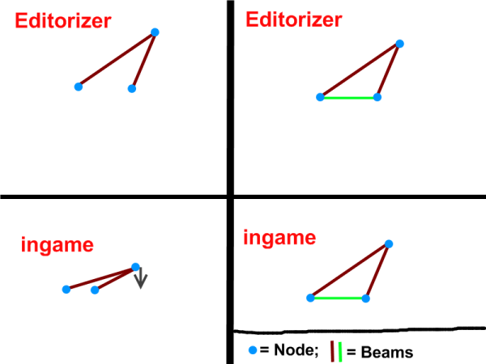

Vehicle concepts
============

**Rigs of Rods (RoR)** is not your typical vehicle simulator. Other vehicle simulators use fake suspension, mesh-based vehicles with no mass distribution, predetermined damage from collisions, and approximated fuzzy-dice sway models. 

Rigs of Rods uses a very unique way to simulate a truck. In fact, <b>it does not simulates a truck at all</b>... It only simulates a set of points, called **Nodes** interconnected by **Beams**. Assembling these elements to form the structure of a truck makes a truck. But you could also assemble them to do a car, a bike, a giant robot, a boat, a plane, a building, a bridge, anything, and it would be simulated the same way. 

To grasp the idea, take a look at these games that use the same construction logic:

-   [Geomag](https://www.geomagworld.com/en/) is a real-world construction game that uses metallic balls and magnets.
-   [Bridge Construction Set](http://www.chroniclogic.com/pontifex2.htm) is a video game where you build and test bridges.

To build a truck in Rigs of rods, you need to design a structural chassis composed of a lattice of rods. You have to define :

-   **Nodes**: these are the points of interconnection of rods (the same as the balls in Geomag). For the physics engine, these nodes are the only concrete elements of the truck: they have a mass and can collide with other elements, but they are dimensionless.
-   **Beams**: (or rods): they interconnect nodes. For the physics engine they are massless and are composed of a spring and a damper, so their length can change depending on the forces it bears. They are monodimensional - they have length, but no thickness.

Also, if you want to "dress" the chassis with a texture, you can "fill" any node triangle with a polygon (like the panels in geomag, but in RoR they deform like if they were made of rubber). This is what the <b>submesh</b> section if for.

One important thing is that the interconnection of beams to nodes uses what is known as a <b>ball joint</b>. That means that no force opposes a change of angles between two beams connected to the same node. It may sound abstract, but in practice you will immediately see the result : <b>anything that is not triangulated will fold</b>. To design rigid bodies you must have triangles everywhere, in any direction. So for example, if you have a cubic structure, you must add diagonal rods in all the faces. If you let a square somewhere it will fold, or it will be a soft zone (it will stay rigid because of other parts of the geometry, adding strains to this part).

Why did we chose ball joints? Because:

-   It requires less computation to simulate, and keep the physics simple (because of this, the simulated elements are dimensionless, that means that a lot of physics law are irrelevant and do not need to be simulated. The good news is that the laws we ignored (as rotation momentum, center of gravity, centripetal force...), are here anyway, as you can observe, because they emerge from the complex interaction between beams)
-   It can be used to build almost any kind of joint. By assembling rods in certain way, you can constraint movements and synthesize most useful joints. For example the suspensions and direction of trucks uses such construction techniques to limit movements only in certain directions.

A note on beam strength: A beam's length changes depending on the forces (compressive or extensive) it bears. When the forces are gone, it returns to its original length (elastic deformation). If the forces are too strong, it will not return to its original length (plastic deformation). If the forces are even stronger, it will snap and disappear!
